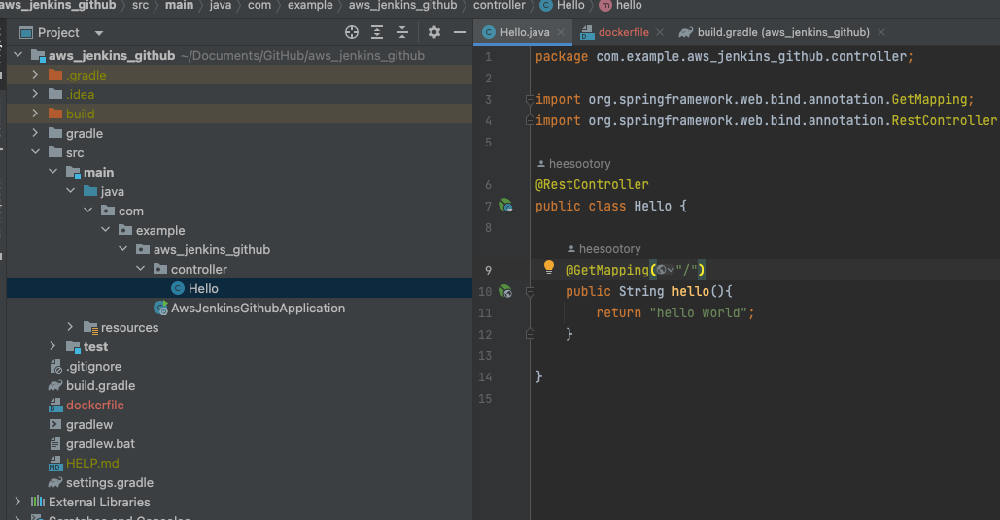
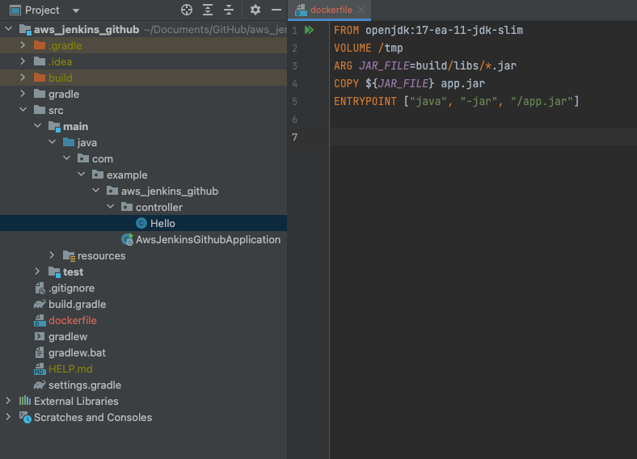
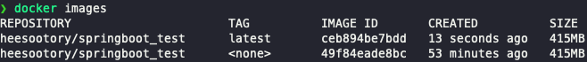

# Springboot image 생성하기


<br>
<br>
<br>
<br>


## 🌈 간단한 스프링부트 예제 만들기





<br>
<br>
<hr>
<br>
<br>

## 🌈 gradle로 build하기

* gradlew 이 존재하는 디렉토리에서

```zsh
./gradlew clean build
```


* build 파일이 생성되고, build/libs 아래에 빌드파일인 .jar 이 생성된다.
    - 추후 dockerfile 을 작성할때 이 경로를 적어줘야 한다.(JAR_FILE)


<br>
<br>
<hr>
<br>
<br>

## 🌈 dockerfile 작성하기

* 프로젝트 최상위 디렉토리에 dockerfile을 추가한다.




* FROM 
    - 현재 자바 11버젼으로 프로젝트를 만들었으므로, open-jdk 11번젼의 image를 베이스로 image layer를 쌓아 만들어 갈 것이다.

* ARG 
    - 아까 gradle로 빌드해서 만들어진 .jar 파일이 있는 위치를 변수로 지정한다.

* COPY 
    - 빌드 파일(.jar)를 app.jar라는 파일로 복사해서 집어 넣는다.

* ENTRYPOINT 
    - 빌드파일을 실행시키기 위한 명령을 집어 넣는다.
        ```zsh
        java -jar /app.jar
        ```
<br>
<br>
<hr>
<br>
<br>

## 🌈 docker image로 build하기

* dockerfile이 존재하는 최상위 디렉토리로 가자.

* docker image build 명령어
    - -t 혹은 -tag
    - . 이 현재 디렉토리를 말한다.


    ```zsh
    docker build -t [heesootory/springboot_test] .
    // 호환성 문제 해결 
    docker build --platform linux/amd64 -t heesootory/springboot_test .
    ```

### 🔥 trouble shooting!!! 
> m1과 ec2 ubuntu 간의 빌드 플랫폼이 달라 호환성 문제가 생길수 있다.(url)


<br>
<br>
<hr>
<br>
<br>

## 🌈 docker hub 로 생성된 image 올리기.

* 올리기 전에 dockerhub에 로그인이 되어 있나 꼭 확인하자.
    - 로그인이 되어 있어야 내 리포지토리로 해당 image가 올라감.
    - 1. docker desktop에서 확인.
    - 2. 명령어로 로그인
        ```zsh
        docker login
        ```

* docker hub 로 push

```zsh
docker push [해당 image명]
```


<br>
<br>
<hr>
<br>
<br>

## 🌈 동일한 이름의 다른 이미지 build 파일을 push 하면 어떻게 될까??


* hello controller를 조금만 수정하고, 다시 gradle 빌드 후, image 생성해보자.
    - 기존의 image는 TAG가 none으로 변경되고, 방금 만든 image 파일이 latest가 붙는다.




* 그대로 docker hub에 push 하면 자동으로 최신 image가 리포지토리에 저장된다.(변경된다.)
