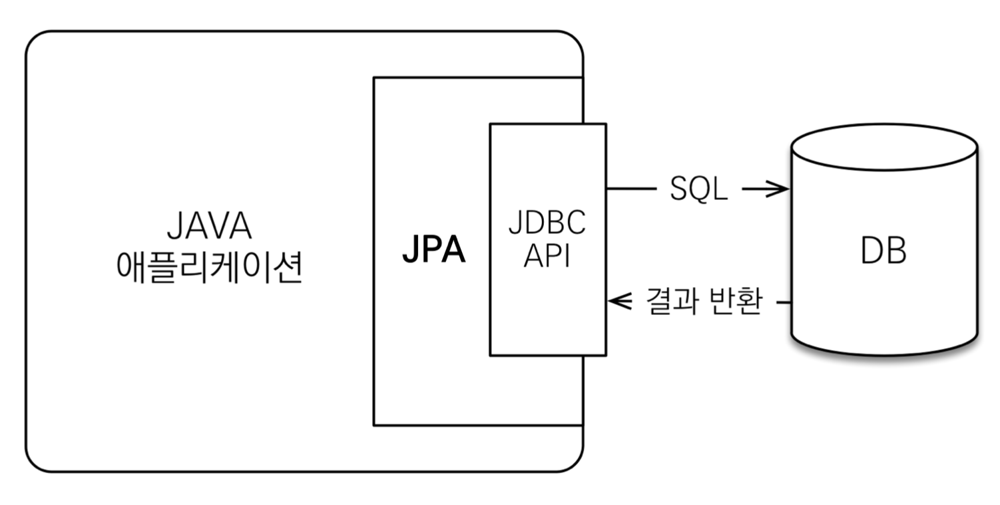
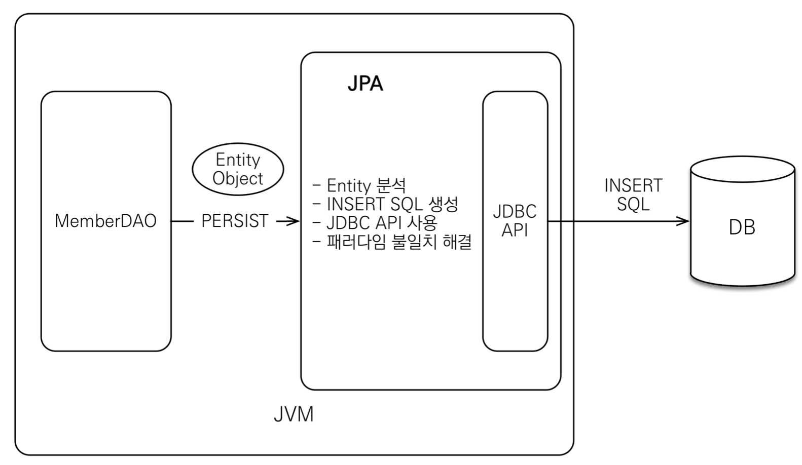
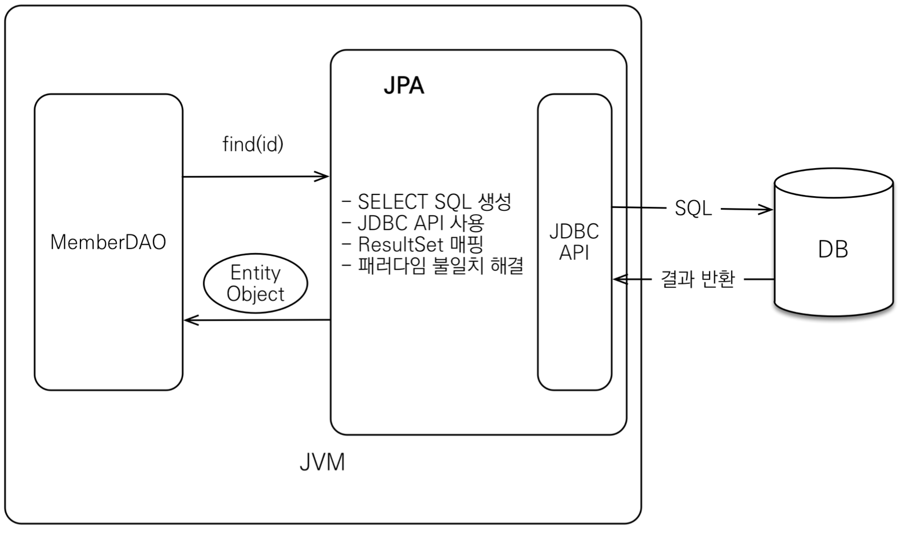

# JPA 소개


## SQL 중심적인 개발의 문제점
 
1. 지루하고 반복적인 sql작성의 연속.

2. 사용할 객체(대표적으로 dto)의 필요한 정보가 바뀌면, sql까지 전부 바꿔야 하는 불편함.

3. 객체의 상속관계를 sql로 표현하기가 매우 까다로움.
    - 상속관계를 구현한다고 쳐도 자식 객체를 불러올 때마다 부모와 자식 객체를 join해서 찾아와야하므로, 매우 귀찮은 작업.

4. 객체는 자유롭게 객체 그래프를 탐색할 수 있어야 한다.
    - 모든 객체를 미리 로딩할 수 없다.(모든 sql조회를 해놔?? ❌)
    - 결국 처음 실행하는 sql에 따라 탐색의 범위가 제한됨.

5. 객체는 같은 id에도 불구하고, 다른 인스턴스가 생성되게 된다.
    - 데이터는 같지만, 다른 인스턴스 ㅠ

```java
/* 테이블 사용시 */
Member member1 = memberDAO.getMember(memeberId);
Member member2 = memberDAO.getMember(memeberId);
member1 != member2 
// 같은 아이디면 같은 객체로 비교가 되야 정상!!
```

```java
/* 객체 사용시 */
Member member1 = list.get(memberId);
Member member2 = list.get(memberId);
member1 = = member2 
```

> 결국 sql에 의존적인 개발을 피할 수 없다. 

> 객체답게 모델링 할수록 매팡 작업만 늘어나게 된다!!

> 계층형 아키텍쳐에서 진정한 의미의 계층 분할이 어렵다!

<br>
<br>
<br>
<br>


## 객체와 관계형 데이터베이스의 차이

* 상속
* 연관관계
    - 객체는 서로 참조를 이용하여 연결.
    - 테이블은 외래키를 이용해 연결.
* 데이터 타입
* 데이터 식별 방법


<br>
<br>
<hr>
<br>
<br>
<br>


# JPA 란??

* Java Persistence API.
* 자바 진영의 ORM 표준 기술.

## ORM 이란??

* Object-relational mapping. (객체 관계 매핑)
* 객체는 객체대로 설계.
* 관계형 데이터베이스는 관계형 데이터베이스대로 설계.
* ORM 프레임워크가 중간에서 매핑.
* 대중적인 언어에는 대부분 ORM 기술이 존재.


### JPA는 애플리케이션과 JDBC 사이에서 동작.




### JPA 동작 - 저장 




### JPA 동작 - 조회




### JPA와 패러다임의 불일치 해결

* JPA와 상속
* JPA와 연관관계
* JPA와 객체 그래프 탐색.
* JPA와 비교하기 (2개의 같은 데이터 다른 인스턴스)
    - 동일한 트랜잭션 안에서 꺼낸 엔티티는 같음을 보장.
<br>
<br>
<br>

## JPA를 왜 사용해야 하는가??

* SQL 중심적인 개발에서 객체 중심적인 개발
* 생산성
* 유지보수
* 패러다임의 불일치 해결
* 성능
* 데이터 접근 추상화와 벤더 독립성
* 표준


