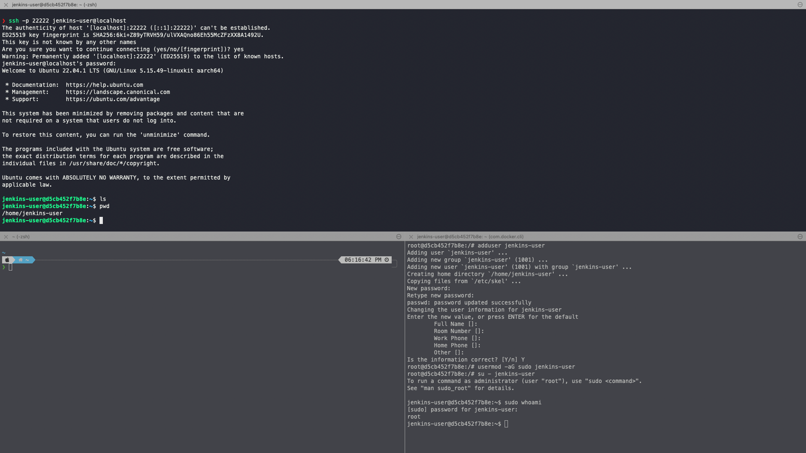
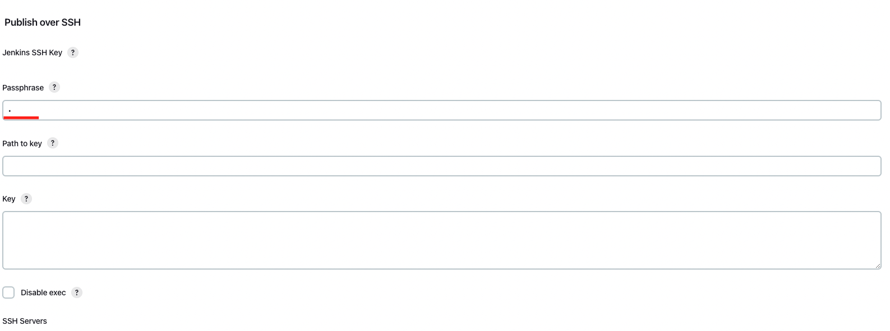
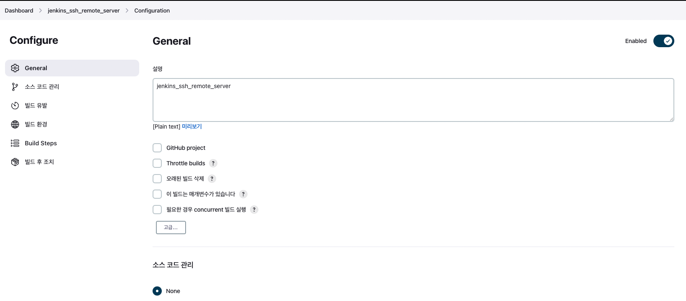

# jenkins로 remote server 원격접속 (ssh 사용) - 2023.1.7


<div style = "text-align:center">
    
</div>


<pre>.           ## Localhost.  </pre>

## 목적

* jenkins는 자동 배포(deploy)/ 통합(integration => package)를 도와주는 툴이다.

* 배포와 통합 모두 로컬환경에서 할 줄아는 상황에서, 젠킨스의 기능 중에 가장 핵심이 되는 요소는 ? 
    - git과 같은 버젼관리 도구와 연동해서 새로운 버젼을 바로바로 build시켜준다.
    - build된 파일을 해당 원격 서버로 전송하고, 명령어를 통해 실행시켜준다.

* 위의 두 가지를 하나씩 해보면, 그냥 연결만 하면 되는 것 아닌가??

* 따라서, 일단 젠킨스를 이용해서 ssh로 원격서버에 접속하고, 명령어를 실행하는 예제를 해봤다.
    - 명령어만 되면, 파일도 쉽게 보내지고 안된다면 git clone 떠서라도 배포 + 실행 할수 있을 것이라 생각.
    - 자동 원격접속만 가능하면, 가지고 놀기 쉽다. ✌️

<br>
<br>
<br>

## 🌈 docker로 jenkins와 ubuntu 띄우기

* jenkins 실행
```zsh
$ docker run -d -p 8080:8080 --name jenkins_ssh_test jenkins/jenkins
```

* Ubuntu 실행
    - docker는 vm과 유사하지만, 차이가 있다.
    > docker는 가상환경을 명령어 기반으로 실행하므로, 아파치 서버나 nginx서버와 달리, 기본 우분투 운영체제를 실행할 때, 해당 docker에서 계속 돌아가는 프로세스가 없다면 실행 즉시 종료된다. <br>
    다시말해, 정말 실행만 한번 시키는 명령이므로, 아래와 같이 -it명령어를 사용해서 백그라운드에서 계속 돌게 실행하여야 host 프로세스에서 계속 돌아갈 수 있다.

    - 여기서는 ssh를 이용해 ubuntu서버에 접속할 예정이므로, ubuntu서버는 ssh가 들어올 22번 포트이고, host는 22번을 계속 사용해야하므로, 충돌이 일어나지 않게 22222(임의의 번호)로 지정해주자.

```zsh
$ docker run -d -p 22222:22 -it --privileged --name ubuntu ubuntu:latest
```

* ubuntu 서버에 접속허기
    - bash쉘로 실행.

```zsh
$ docker exec -it ubuntu /bin/bash
```

* zsh 상단화면 -> host 
* zsh 하단 왼쪽 -> jenkins server
* zsh 하단 오른쪽 -> ubuntu server


## 🌈 우분투 세팅

* 기본 설치

```zsh
$ apt-get update
$ apt-get upgrade
$ apt-get install net-tools     // ifconfig를 확인할 수 있는 네트워크 도구 설치.
$ apt-get install systemd       // 프로세스 관리 도구 설치.
$ apt-get install sudo          // sudo 설치.
$ apt-get install vim           // vim 설치(혹시 이걸로 편집할 수도 있으니까) - 설치 안해도 무방.
$ apt-get install openssh-server -y     // ssh접속을 위해 ssh서버 설치.
$ /etc/init.d/ssh start         // ssh 서버 실행.
$ /etc/init.d/ssh status        // ssh 서버 상태 확인.
```


* 원격접속이 가능한 사용자 등록(zsh 하단 왼쪽 화면)
    - jenkins에서 사용할 jenkins-user라는 사용자를 등록하기.

```zsh
$ adduser jenkins-user        // 비번 설정(추후 jenkins에서 사용함)
$ usermod -aG sudo jenkins-user       
// jenkins-user를 sudo 그룹으로 등록(jenkins를 이용해 아무명령어나 해보고 혹시 막하는게 없게)
$ su - jenkins-user     // jenkins-user로 전환.
$ sudo whoami           // 권한 확인(root로 나와야 sudo그룹에 정상 등록.)
```

* 외부에서 접속해보자(zsh 상단 화면)    
    - 리눅스 시스템에서는 해당 사용자로 로그인시 /home/[해당 사용자] 디렉토리가 생성되고 거기가 바로 그 사용자의 루트 디렉토리.

```zsh
$ ssh -p 22222 jenkins-user@localhost       // 해당 사용자로 원격접속
```





## 🌈 젠킨스로 접속해 ssh 등록 + 자동 원격접속 설정

* 젠킨스에 접속해서 로그인 + 설치 후


> 새로운 item으로 들어가서 프로젝트 만들기(이미 두개 있는거 무시)


> maven이나 git을 사용하는거 아니고 그냥 원격접속만 할꺼니까 프리스타일로~ 해도 무관.


> Dashboard > Jenkins 관리 > 플러그인 관리<br>
> publish Over SSH 설치.



> Dashboard > Jenkins 관리 > 시스템 설정(가장 하단으로 ㄱㄱ)<br>
> ssh 를 설정하기.


> 접속할 serve명 적고(아무거나 상관없음)<br>
> 현재 ip주소<br>
> 우분투 서버에 아까 등록한 jenkins-user사용자로 접속할 것 명시.


> port 번호 지정 -> docker ubuntu 로 포트포워딩해논 포트로 지정.


> 프록시는 설정 ❌<br>
> test configuration 을 눌렸을 떄, Success가 나오면 접속 완료.


> 다시 프로젝트로 들어가서.


> 구성 ㄱ -> 이제 이 프로젝트(item)에서 어떤 작업을 할지 설정.



> 설명은 아무말 대잔치.


> 여기서 크게 빌드 유발/ 빌드 환경/ 빌드 step / 빌드 후 조치가 있는데.

* 빌드 유발 - 추후 깃헙과 연동시키면, 깃헙 commit시 빌드를 자동으로 진행하게 설정하는 곳.

* 빌드 환경 - jenkins server 상에서 빌드를 어떻게 할지 설정.

* 빌드 step - 빌드를 할 시점에 어떤 설정을 할지.(jenkins server 내에서 진행)

* 빌드 후 조치 - 빌드 파일이 만들어지고 난 다음 할 행동 -> 여기서 다른 서버로 ssh 접속을 한뒤 명령어를 실행할 것임.


> build step에서는 jenkins server내에서 /var/jenkins_home/workspace/[프로젝트 명] 디렉토리에서 행해질 행동.

> 빌드 후 조치에서는 ssh 접속 + 명령

> 두가지를 해보겟다.


> build step 선택.


> 빌드 후 조치 선택.

> send build artifacts over ssh 로 선택해야 원격접속을 해서 뭐든 한다.


> Exec commend에 내멋대로 명령 실행.

> "hello 😁 remote server I'm jenkins!!!💁🏻🐳" 라고 쓴 heesoo 파일을 만들기.

> apply -> 저장


> "지금 빌드" 실행!


> 초록불이 뜨면 빌드 성공 -> 초록불 누르고 들가면, 빌드 상황이 모두 log로 남음.


> 콘솔을 확인해보자 (이건 jenkins 내에서의 log)


> 빌드가 성공되었으니, 해당 원격서버(우분투)애서 명령이 실행됬을 듯.

> 다시 우분투 서버로 가서, 확인해보면 성공!!!!✌️

> 추가로, jenkins server (하단 오른쪽창)을 확인해보면, 
> /var/jenkins_home/workspace/ 아래에 방금 생성한 item(프로젝트)명의 dir가 생성된 걸 확인할 수 있다.(추후 여기에 git을 연결 or 볼륨마운트를 이용해 spring 파일을 올리고, 자동 빌드 -> 빌드 파일 이동 -> 배포 가능)
