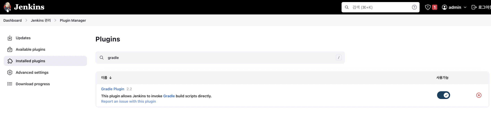
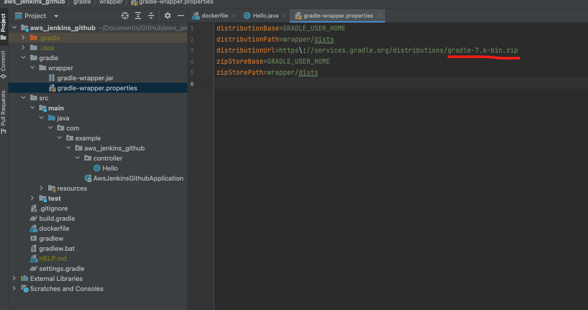
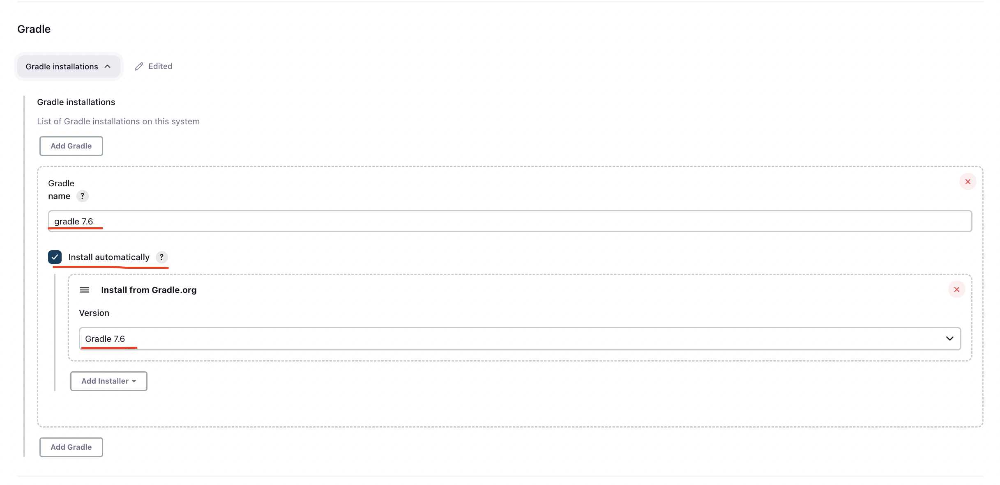
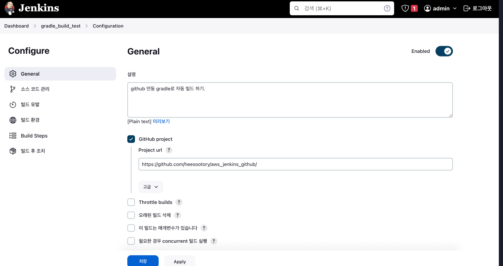
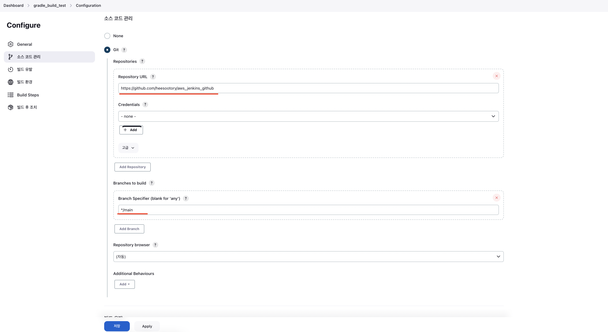

# jenkins에 github 연동하기
(23.01.07 기준)

 
 
 

## 🌈 public github Repository 기준 
    * springboot 프로젝트
    * gradle로 빌드

 
 
 

### 🐳 gradle 로 빌드하기 위한 설정.

* jenkins 관리 > Plugin Manager
    - Gradle Plugin 설치하기. (최신 버젼은 이미 설치 되어있음.)

* jenkins 관리 > Global Tool Configuration
    - gradle 버젼 설정 + 자동 설치.
    - 해당 프로젝트의 gradle 버젼 정보를 확인하려면
        - springboot project > gradle > gradle-wrapper.properties

 
 
 

### 🐳 jenkins item 생성 & 구성 정보.

* General
    - GitHub project : 작업 중인 프로젝트의 레포지토리 등록.

* 소스 코드 관리
    - Git > Repositories
        - 작업 중인 프로젝트의 레포지토리 한번 더 등록.
        - branch 설정

> apply + save -> 등록완료.

> "지금 빌드"!!!

 

 

## 🚀 완료!!

 

### 🐳 빌드된 .jar 파일 확인경로

> /var/jenkins_home/workspace/[jenkins item명]

