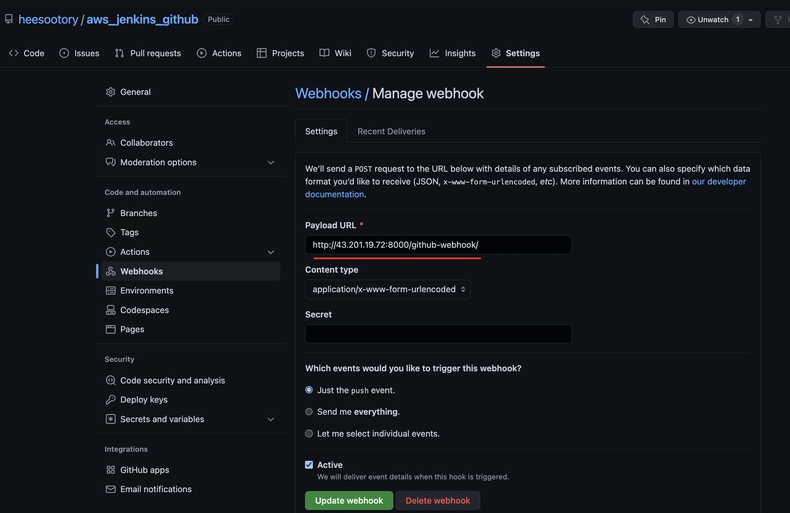
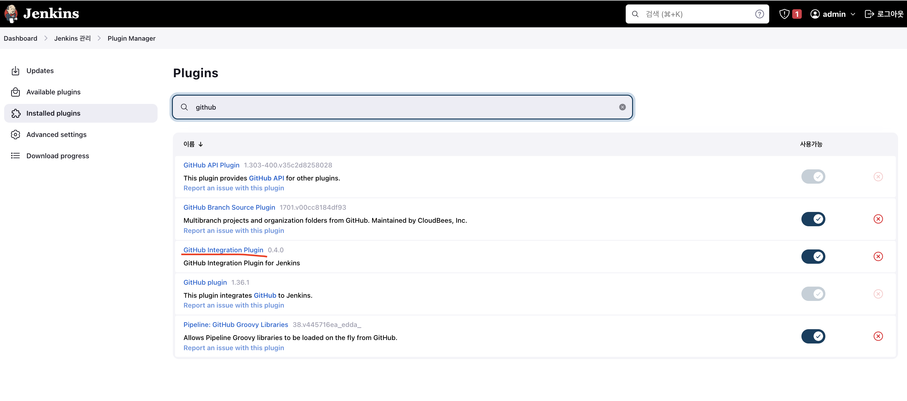
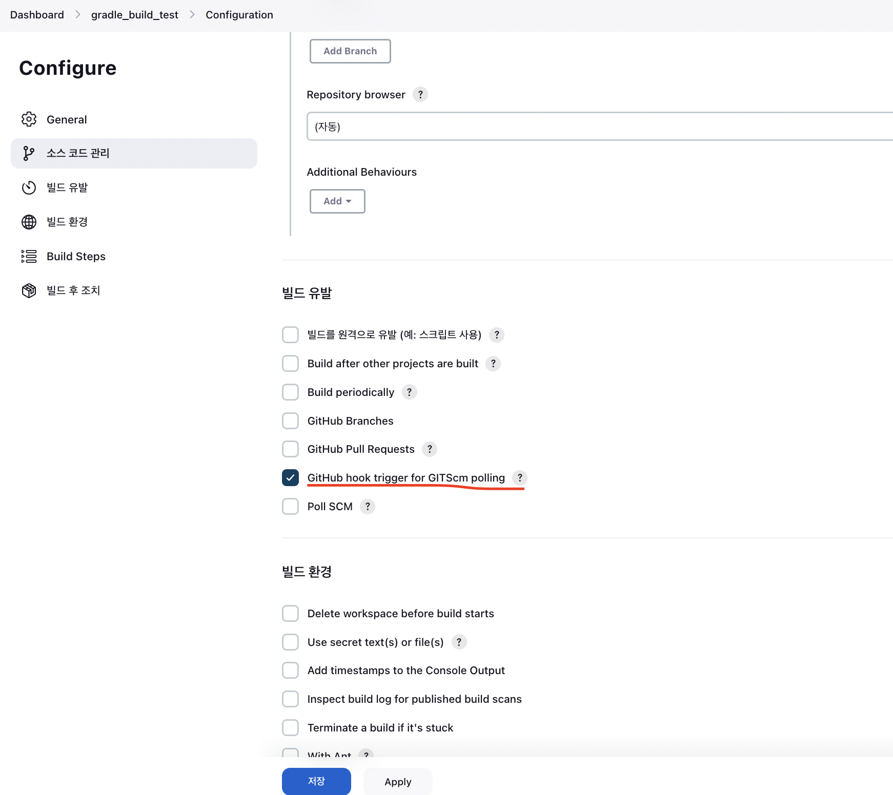

# jenkins, git push 시, 자동 빌드화 시키기
(23.01.07 기준)

 
 
 
 

## 🌈 github repository webhook 설정.

* webhook 설정
    - PayLoad URL : http://[jenkins서버주소]/github-webhook/

* 주의점!!
    - 현재 aws에 docker위에서 돌아가는 jenkins로 진행중인데, aws의 포트가 외부에서 접속이 가능하게 열려 있어야 한다.(특히 22번 포트)
    - 방화벽이 있을 경우, ip허용을 해주기.

## 🌈 Github Integration 설치

* github을 jenkins와 연동하려면, Github Integration Plugin을 설치 해야함.
    - Jenkins 관리 > Plugin Manager

## 🌈 빌드 유발을 설정.

* github hook에 대한 빌드 유발을 설정하자.
    - 해당 item 구성 정보 > 빌드유발

 
 
 

## 🚀 완료!!

> 이제 git push 를 할때마다 자동으로 빌드를 하게된다.

