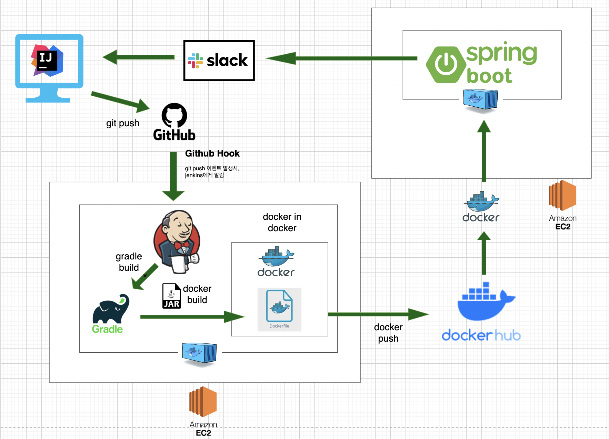
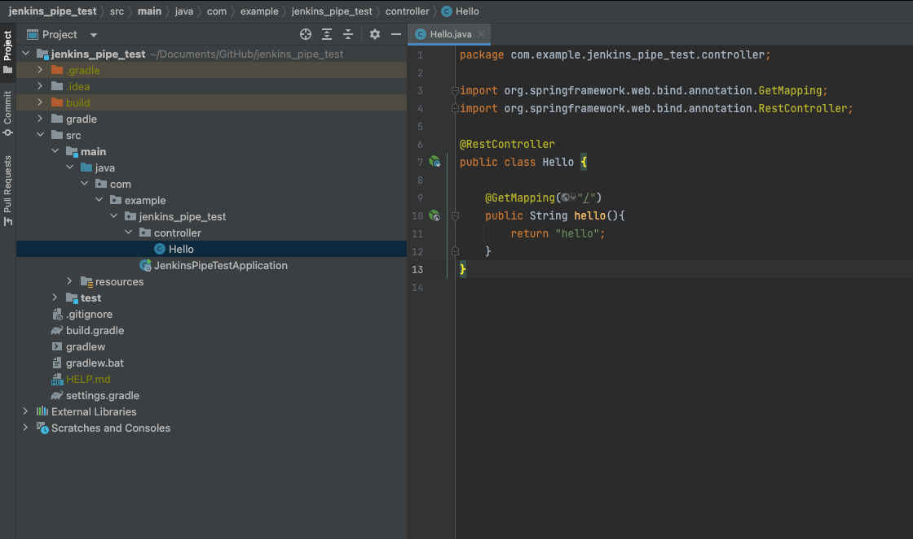
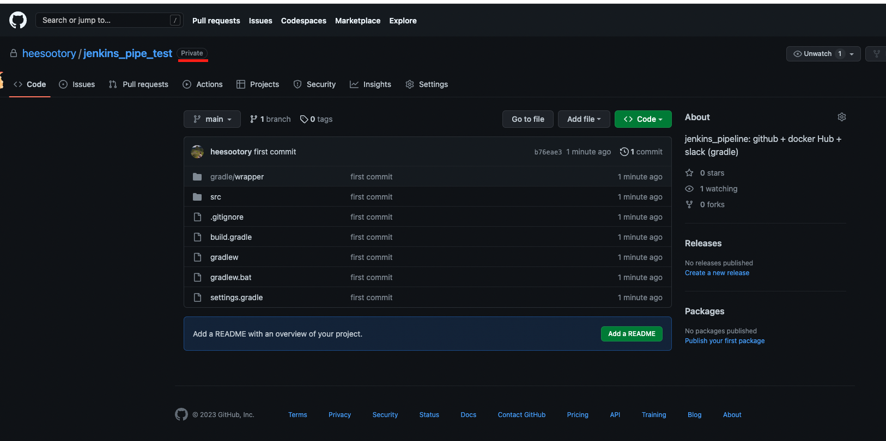

# jenkins pipeline(github + dockerhub + slack 연동)

<br>
<br>
<br>

## 🌈 설계 구조도




<br>
<br>
<br>

## 🌈 구성 요소

* Jenkins server: AWS EC2 Ubuntu 20.04
* Deploy server: AWS EC2 Ubuntu 20.04
* Github Repository
* Docker Hub Repository
* Slack

<br>
<br>

## 🌈 진행 과정


<br>
<br>
<hr>
<br>
<br>

## 🌈 CI/CD 를 구축하기 전 초기 세팅

<br>
<br>

### 🐳 간단한 springboot 프로젝트 생성 & git repo와 연결




### 🐳 jenkins server 와 deploy server 공통 초기 세팅

### 🎯 1. EC2 초기 세팅

* 최신화

```zsh
$ sudo apt update
$ sudo apt upgrade -y
```

* 네트워크 관련 툴 설치

```zsh
$ apt-get install net-tools
```

* build에 필수적인 세팅들 설치(jenkins server만 해당)

```zsh
$ sudo apt install build-essential
```


### 🎯 2. docker 설치

* apt가 HTTPS를 통해 저장소를 사용할 수 있도록 패키지 설치.

```zsh
$ sudo apt install apt-transport-https ca-certificates curl 
$ software-properties-common
```

* 자동 설치 스크립트 활용
    - 리눅스 배포판 종류를 자동으로 인식하여 Docker 패키지를 설치해주는 스크립트를 제공

```zsh
$ sudo wget -qO- https://get.docker.com/ | sh
```


### 🎯 3. docker 서비스 실행 및 부팅 시 자동 실행 설정

```zsh
$ sudo systemctl start docker
$ sudo systemctl enable docker      // 활성화
$ sudo service docker status        // 상태 확인
```


### 🎯 4. 도커 그룹에 현재 계정을 추가

* sudo 사용하지 않고 docker 사용 가능하게 ubunut 사용자를 도커 그룹에 추가한다.
* docker 그룹은 root권한과 동일하므로, 꼭 필요한 계정만 등록.

```zsh
$ sudo usermod -aG docker ${USER}
// sudo usermod -aG docker ${ubuntu}
$ sudo systemctl restart docker
```

* 위의 작업 진행 후, 현재 계정에서 로그아웃 후 다시 로그인 했을 때 적용.

### 🎯 5. docker 설치 확인

```zsh
$ docker -v
```


<br>
<br>
<hr>
<br>
<br>


### 🐳 jenkins server 세팅.

### 🎯 jenkins 설치

* jenkins image pull
    - 현재(23.01.20 기준 lts 버젼 다운)
```zsh
$ docker pull jenkins/jenkins:lts-jdk11
```

* jenkins container 띄우기
    - 포트포워딩 
        - 8080 : 8080
        - 50000 : 50000
    
    - 볼륨 마운트()
        - /home/ubuntu/.ssh : /root/.ssh
        - /var/run/docker.sock : /var/run/docker.sock
        
```zsh
$ docker run -d -p 8080:8080 -p 50000:50000 -v /jenkins:/var/jenkins -v /home/ubuntu/.ssh:/root/.ssh -v /var/run/docker.sock:/var/run/docker.sock --name jenkins -u root jenkins/jenkins:lts-jdk11
```


