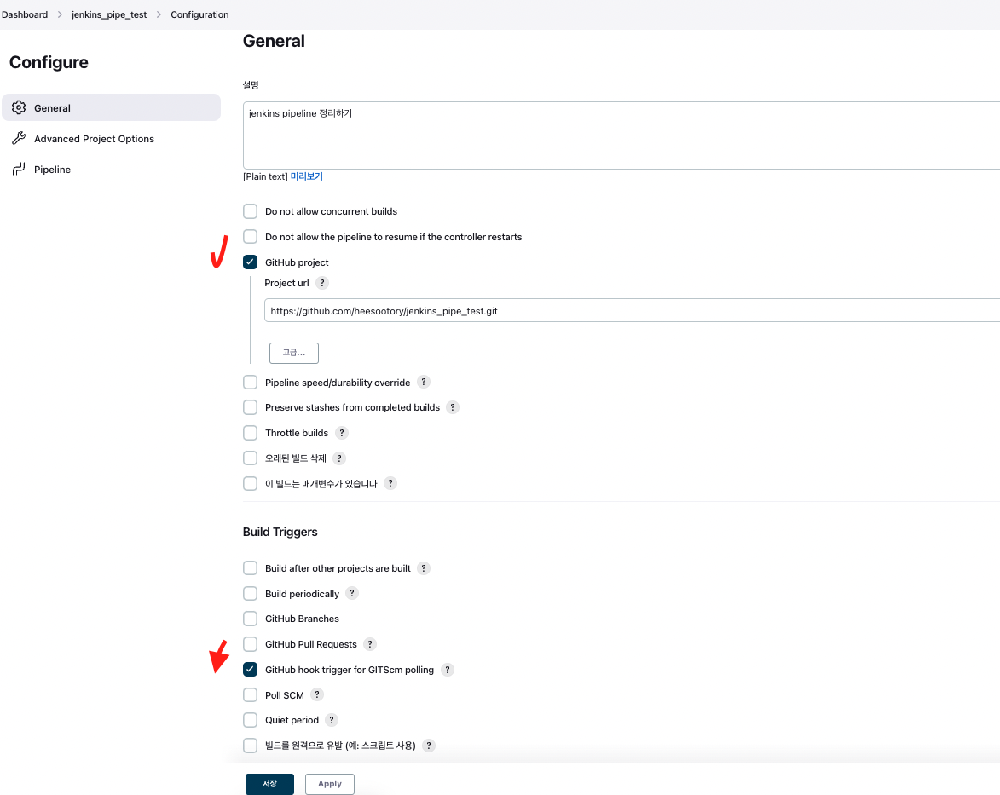
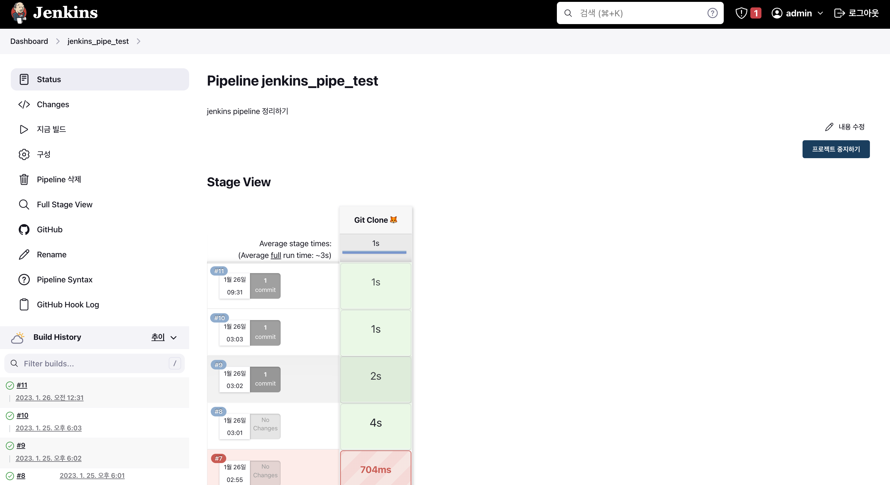

# jenkins pipeline(github + dockerhub + slack 연동)

<br>
<br>
<br>

## 🌈 설계 구조도

> 도전!!!


<br>
<br>
<br>

## 🌈 구성 요소

* Jenkins server: AWS EC2 Ubuntu 20.04
* Deploy server: AWS EC2 Ubuntu 20.04
* Github Repository
* Docker Hub Repository
* Slack

<br>
<br>

## 🌈 진행 과정


<br>
<br>
<hr>
<br>
<br>

## 🌈 0. CI/CD 를 구축하기 전 초기 세팅

<br>
<br>

### 🐳 간단한 springboot 프로젝트 생성 & git repo와 연결


### 🐳 jenkins server 와 deploy server 공통 초기 세팅

### 🎯 1. EC2 초기 세팅

* 최신화

```zsh
$ sudo apt update
$ sudo apt upgrade -y
```

* 네트워크 관련 툴 설치

```zsh
$ apt-get install net-tools
```

* build에 필수적인 세팅들 설치(jenkins server만 해당)

```zsh
$ sudo apt install build-essential
```


### 🎯 2. docker 설치

* apt가 HTTPS를 통해 저장소를 사용할 수 있도록 패키지 설치.

```zsh
$ sudo apt install apt-transport-https ca-certificates curl 
$ software-properties-common
```

* 자동 설치 스크립트 활용
    - 리눅스 배포판 종류를 자동으로 인식하여 Docker 패키지를 설치해주는 스크립트를 제공

```zsh
$ sudo wget -qO- https://get.docker.com/ | sh
```


### 🎯 3. docker 서비스 실행 및 부팅 시 자동 실행 설정

```zsh
$ sudo systemctl start docker
$ sudo systemctl enable docker      // 활성화
$ sudo service docker status        // 상태 확인
```


### 🎯 4. 도커 그룹에 현재 계정을 추가

* sudo 사용하지 않고 docker 사용 가능하게 ubunut 사용자를 도커 그룹에 추가한다.
* docker 그룹은 root권한과 동일하므로, 꼭 필요한 계정만 등록.

```zsh
$ sudo usermod -aG docker ${USER}
// sudo usermod -aG docker ${ubuntu}
$ sudo systemctl restart docker
```

* 위의 작업 진행 후, 현재 계정에서 로그아웃 후 다시 로그인 했을 때 적용.

### 🎯 5. docker 설치 확인

```zsh
$ docker -v
```


<br>
<br>
<hr>
<br>
<br>


### 🐳 jenkins server 세팅.

### 🎯 jenkins 설치

* jenkins image pull
    - 현재(23.01.20 기준 lts 버젼 다운)
```zsh
$ docker pull jenkins/jenkins:lts-jdk11
```

* jenkins container 띄우기
    - 포트포워딩 
        - 8080 : 8080
            - 젠킨스 gui 컨트롤 포트.
        - 50000 : 50000
    
    - 볼륨 마운트()
        - /home/ubuntu/.ssh : /root/.ssh
            - 추후 SSH 로 deploy server에 접속하기 위한 RSA 키를 jenkins server(ubuntu)와 jenkins container에서 공유하기 위한 마운트.
        - /var/run/docker.sock : /var/run/docker.sock
            - docker in docker 를 사용하기 위한 마운트.
```zsh
$ docker run -d -p 8080:8080 -p 50000:50000 -v /jenkins:/var/jenkins -v /home/ubuntu/.ssh:/root/.ssh -v /var/run/docker.sock:/var/run/docker.sock --name jenkins -u root jenkins/jenkins:lts-jdk11
```


### 🎯 swap 메모리 할당하기

> jenkins 가 빌드를 진행시, 자주 죽게되는 문제를 겪게 되는데, 프리티어 버젼이 기본 RAM이 1GB 여서 생기는 문제이다.

* 2GB(128MB * 16) swap 파일을 만들어 할당하자.

```zsh
$ sudo dd if=/dev/zero of=/swapfile bs=128M count=16
$ sudo chmod 600 /swapfile
$ sudo mkswap /swapfile
$ sudo swapon /swapfile
$ sudo swapon -s
$ sudo vi /etc/fstab
// 위의 파일에 추가하기 -> /swapfile swap swap defaults 0 0
```


<br>
<br>
<hr>
<br>
<br>


## 🌈 1. Git hub 연동(Git hub hook + Git clone)

<br>
<br>

### 🐳 Plugin 설치

> Github Integration 플러그인을 설치.

<br>
<br>


### 🐳 SSH 자동접속을 위한 rsa 키 등록.

> RSA 인증키를 이용해서, jenkins server에서 git hub 원격저장소에 접근할 수 있도록 설정.

<br>


#### 🎯 jenkins server(EC2 내에서) SSH키를 생성.

* 현재 EC2의 사용자가 ubuntu로 되어있으므로, /home/ubuntu/.ssh 에 SSH 키(id_rsa, id_rsa.pub)가 생성된다.

```zsh
$ ssh-keygen
// 설정은 모두 enter 치고, default로 설정.
```

#### 🎯 git repository의 deploy key 등록.

* Github Repository > Settings > Deploy Keys > Add deploy key
* Title은 (jenkins) 아무거나 지어줌.
* key 부분에 jenkins server가 생성한 public key(id_rsa.pub)를 넣어준다.

```zsh
$ cd /home/ubuntu/.ssh
$ cat id_rsa.pub        // 공개키
```

#### 🎯 jenkins credentials 등록하기.
(이 방법 말고, 실제로는 Username with password 방식으로 연동됨.)

* Jenkins 대시보드 > Jenkins 관리 > Manage Credentials > Credentials

* Global credentials (unrestricted) 에 Add credentials를 이용해 credentials를 추가.


* New credentials 내용
    - kind : SSH Username with private key
    - ID : github_key(Pipeline Script 작성 시 credentialsId로 사용될 이름.)
    - Username : root(default)
    - Private Key
        - Enter directly > key : 이곳에 github에 공개한 키의 반대인 개인키를 넣자.
        ```zsh
        $ cd /home/ubuntu/.ssh
        $ cat id_rsa
        ```

<br>
<br>

### 🐳 git-hub web hook 추가.

* Github Repository에서 Settings > Webhooks > Add Webhook 

* Payload URL
    - [Jenkins Server URL]:[Jenkins Server 포트]/github-webhook/

* Content type
    - application/x-www-form-urlencoded

<br>
<br>

### 🐳 pipeline 작성

<br>
<br>

#### 🎯 구성 정보



* Github project 설정
    - Pipeline 구성 화면 > General 영역에서 Github project를 선택. Project url에 본인의 Github Repository Url을 입력(이 때 Repository Url은 Clone 시 사용하는 HTTPS Url(.git으로 끝남)을 입력)

* Build Triggers 설정
    - Pipeline 구성 화면 > Build Triggers 영역에서 GitHub hook trigger for GITScm polling을 선택.


#### 🎯 pipeline script

```groovy
pipeline {
    agent any

    stages {
        stage('Git Clone 🦊') {
          steps {
            git url: 'https://github.com/heesootory/jenkins_pipe_test.git',
                branch: 'main',
                credentialsId: 'github_token'
            }
        }
    }
}
```





