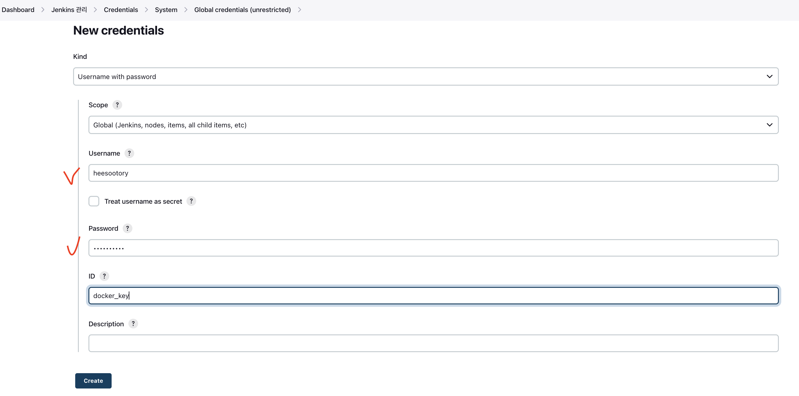
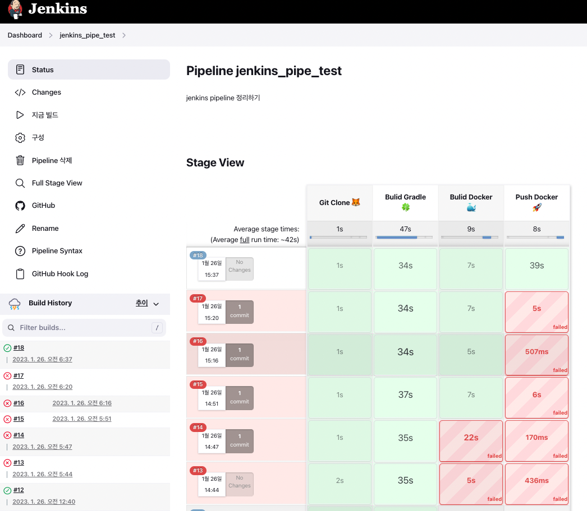

# docker image 만들고, dockerhub로 push. - 23.01.17 기준

<br>
<br>
<br>

## 🌈 jenkins container 내 docker 설치

<br>
<br>

### 🐳 설치 툴

```zsh
$ apt update
$ apt-get install sudo
$ apt-get install wget
```

<br>

### 🐳 플러그인 설치.

* docker, docker pipeline 설치.

<br>
<br>


## 🌈 docker hub credential 등록.

<br>

* Username : docker hub의 내 계정 ID.

* Password : docker hub 내 계정 pwd.

* ID : pipeline에서 사용할 docker credential의 alias.



<br> 

## 🌈 pipeline script

<br>

* environment(script 내 환경변수 등록)
    - imagename : 만들 image의 이름.
    - registryCredential : docker hub와 연동시킨 credential

```groovy
pipeline {
    agent any
    
    environment {
        imagename = "heesootory/jenkins_pipe"
        registryCredential = 'docker_hub'
        dockerImage = ''
    }

    stages {
        stage('Git Clone 🦊') {
            steps {
                git url: 'https://github.com/heesootory/jenkins_pipe_test.git',
                    branch: 'main',
                    credentialsId: 'github_token'
            }
        }
        
        stage('Bulid Gradle 🍀') {
            steps {
                echo 'Bulid Gradle'
                dir('.'){
                    sh './gradlew clean build'
                }
            }
        }
        
        stage('Bulid Docker 🐳') {
            steps {
                echo 'Bulid Docker'
                script {
                    dockerImage = docker.build imagename
                }
            }
        }

        stage('Push Docker 🚀') {
            steps {
                echo 'Push Docker'
                script {
                    docker.withRegistry( '', registryCredential) {
                        dockerImage.push() 
                    }
                }
            }
        }
    }
}
```

<br>
<br>
<br>
<br>

> docker push 까지의 jenkins stage view




