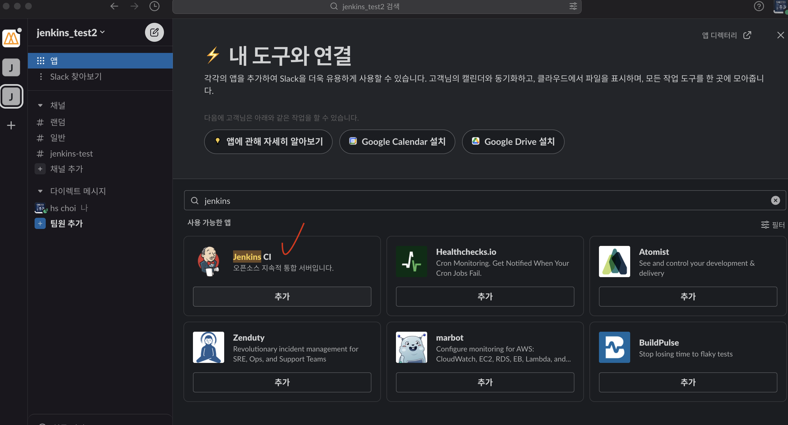
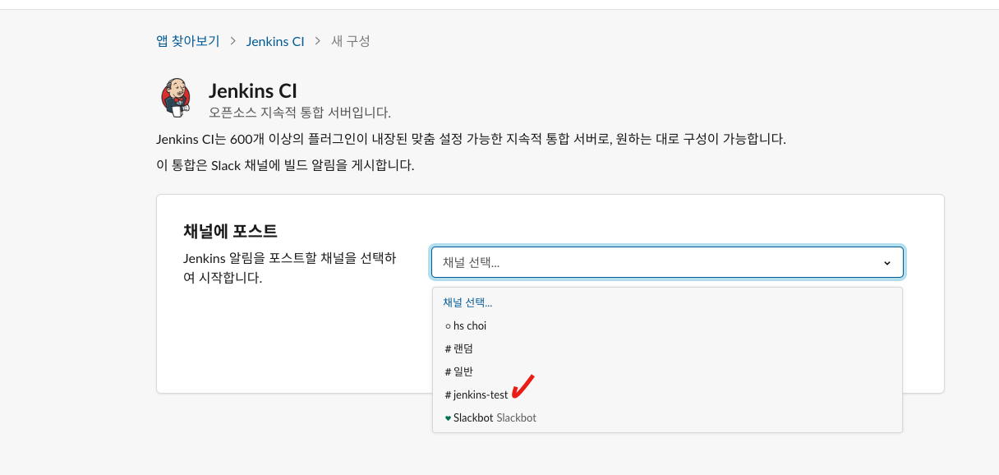
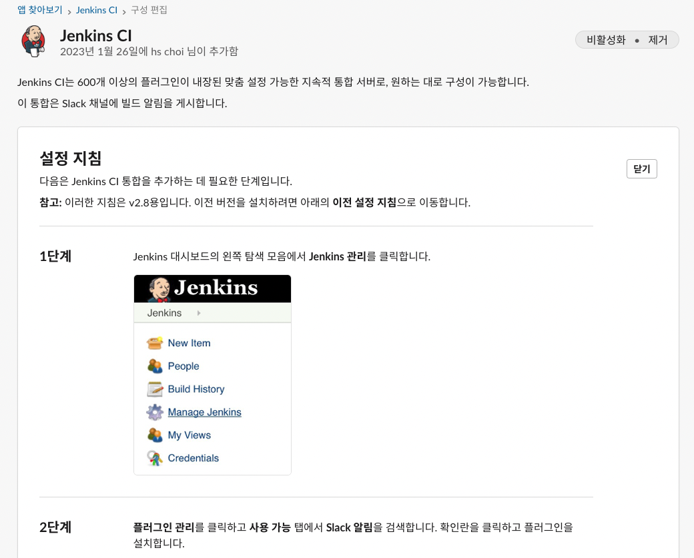
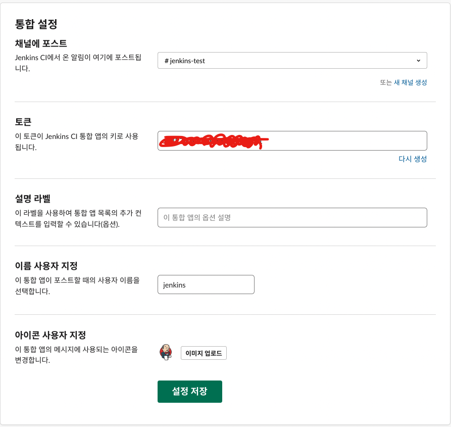
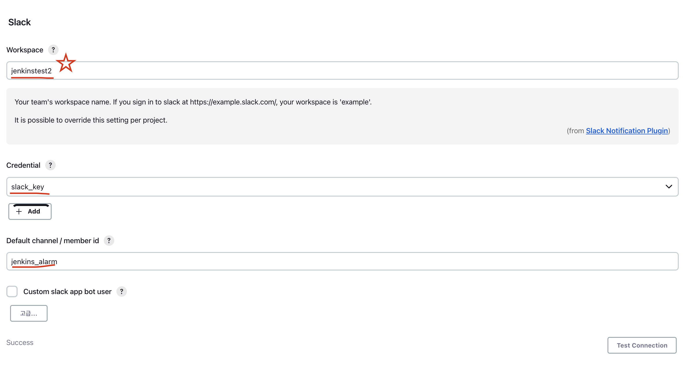
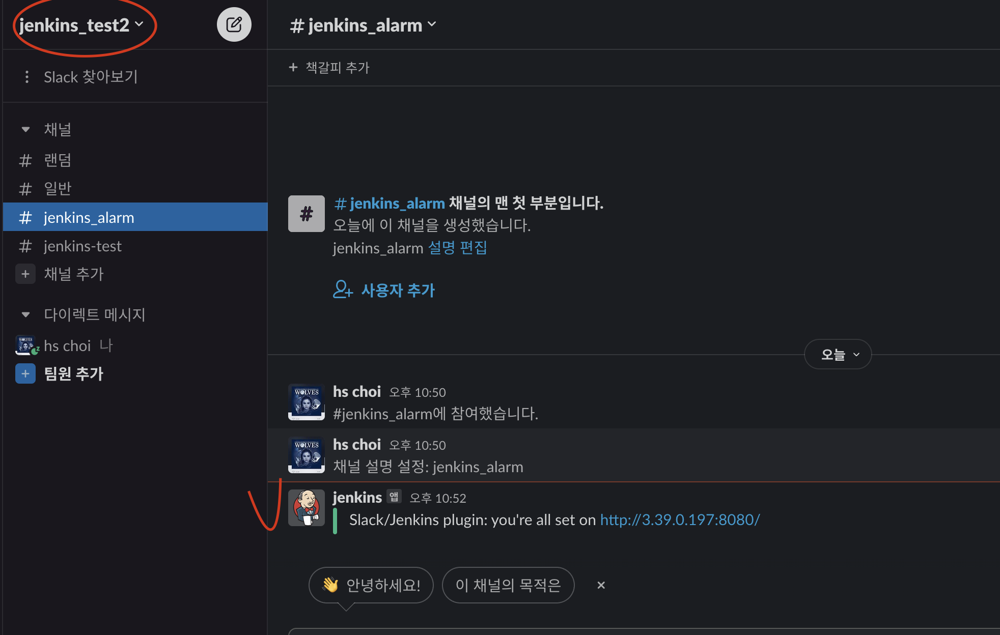
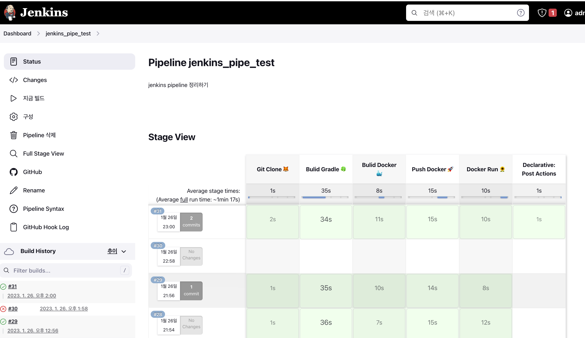

# jenkins pipeline - slack 연동


<br>
<br>
<br>

## 🌈 Slack 설정

<br>
<br>

### 🐳 jenkins 앱 설치

<br>

### 🐳 slack token 생성.

* 1. 워크스페이스 생성

* 2. Slack 찾아보기 > 앱 > jenkins 검색 > 추가



* 3. 해당 워크스페이스 선택



* 4. 설정 지침 방법이 나오는데 -> 가장 하단에 토큰 복사.





## 🌈 jenkins 설정

<br>

<br>

### 🐳 플러그인 설치

> "Slack Notification" 플러그인을 설치.

<br>


### 🐳 slack credentials 등록

* kind : Secret text
* Scope : Global
* Secret : Slack에서 얻은 토큰
* ID : pipeline에서 구별할 alias (아무거나 가능)

<br>
<br>

### 🐳 jenkins 시스템 설정

> Jenkins 대시보드 > Jenkins 관리 > 시스템 설정에서 Slack 영역을 설정



* workspace : 🔥 내가 생성할 때 적은 workspace 명이 아니라, url로 바꼈을때 가운데 부분에 들어가는 이름을 적기!!

* credentials : 등록한 slack_key 등록.

* default channel/member id : 알림 받을 채널명.

* test Connection! ->  success 시, slack에 알림옴!

    


### 🐳 pipeline script - 완성본

```groovy
pipeline {
    agent any
    
    environment {
        imagename = "heesootory/jenkins_pipe"
        registryCredential = 'docker_hub'
        dockerImage = ''
        containerName = 'spring'
        noneFile = '"dangling=true"'
    }

    stages {
        stage('Git Clone 🦊') {
            steps {
                git url: 'https://github.com/heesootory/jenkins_pipe_test.git',
                    branch: 'main',
                    credentialsId: 'github_token'
            }
        }
        
        stage('Bulid Gradle 🍀') {
            steps {
                echo 'Bulid Gradle'
                dir('.'){
                    sh './gradlew clean build'
                }
            }
        }
        
        stage('Bulid Docker 🐳') {
            steps {
                echo 'Bulid Docker'
                script {
                    dockerImage = docker.build imagename
                }
            }
        }

        stage('Push Docker 🚀') {
            steps {
                echo 'Push Docker'
                script {
                    docker.withRegistry( '', registryCredential) {
                        dockerImage.push() 
                    }
                }
            }
        }
        
        stage('Docker Run 🌻') {
            steps {
                echo 'Pull Docker Image & Docker Image Run'
                sshagent (credentials: ['ssh_key']) {
                    sh "ssh -o StrictHostKeyChecking=no ubuntu@43.200.252.25 'docker pull ${imagename}'" 
                    sh "ssh -o StrictHostKeyChecking=no ubuntu@43.200.252.25 'docker ps -q --filter name=${containerName} | grep -q . && docker rm -f \$(docker ps -aq --filter name=${containerName})'"
                    sh "ssh -o StrictHostKeyChecking=no ubuntu@43.200.252.25 'docker run -d --name ${containerName} -p 8080:8080 ${imagename}'"
                    sh "ssh -o StrictHostKeyChecking=no ubuntu@43.200.252.25 'docker rmi -f \$(docker images --filter ${noneFile} -q)'"
                }
            }
        }
    }
    
    post{
        success {
            slackSend (channel: 'jenkins_test2', color: '#00FF00', message: "SUCCESSFUL: Job '${env.JOB_NAME} [${env.BUILD_NUMBER}]' (${env.BUILD_URL})")
        }
        failure {
            slackSend (channel: 'jenkins_test2', color: '#FF0000', message: "FAILED: Job '${env.JOB_NAME} [${env.BUILD_NUMBER}]' (${env.BUILD_URL})")
        }
    }
}
```


<br>
<br>
<br>
<br>

> 완료된 jenkins stage view

