# jenkins GitLab 연동 + WebHook


<br>
<br>
<br>


## 🌈 GitLab 연동.

> 기본적으로 github 방법과 거의 일치하고, 용어가 조금 다를뿐이다!

<br>
<br>

### 🐳 플러그인 설치.

<br>


> GitLab 플러그인을 설치.

<br>
<br>
<br>


### 🐳 gitLab에서 "내 계정"에 접속을 할 수 있게 하는 jenkins credential 만들기.

<br>

> github 로 연동시 했던 "username with password" 방법을 사용하는 것과 동일하다.

* personal Access Token 을 부여받기.
    - select scopes : api와 read에 관련된 것만 모두 선택해줌.(잘 이해 못함. 공부 필요.)

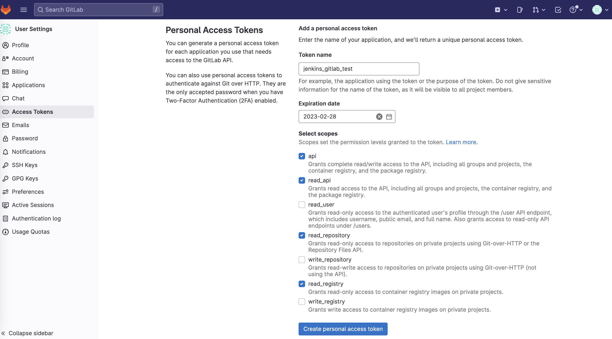

* jenkins credentials 등록.
    - kind : Username with password
    - Username : GitLab에서 사용하는 username을 사용한다.  
        - 이메일 앞부분❌.
            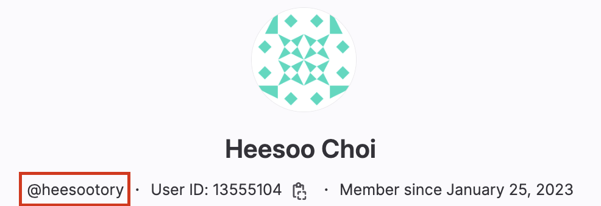
    - Password: 방금 생성한 personal Access Token 을 입력.
    - ID : pipeline에서 실제로 구별하기위해 사용할 credentialsID가 될 Alias.

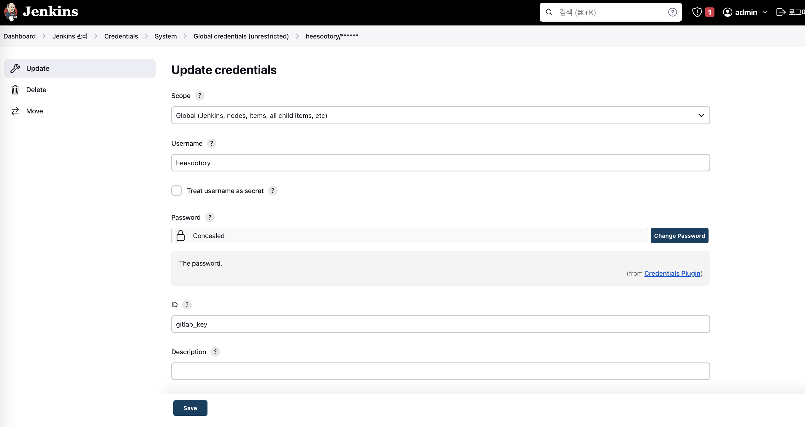


<br>
<br>
<br>

### 🐳 실제 프로젝트와 연결.

* jenkins 관리 > Configure System(시스템 환경설정) > Git Lab
    - Connection name : 아무말(item 구성에서 설택하게 됨.)
    - GitLab host URL : Git Lab의 경우, 무조건 걍 https://gitlab.com으로 적음.(ssafy에서는 https://lab.ssafy.com/였음.....ㅠ)
    - Credentials : 개인 레포와 연결할 수 있는 토큰 등록하기.

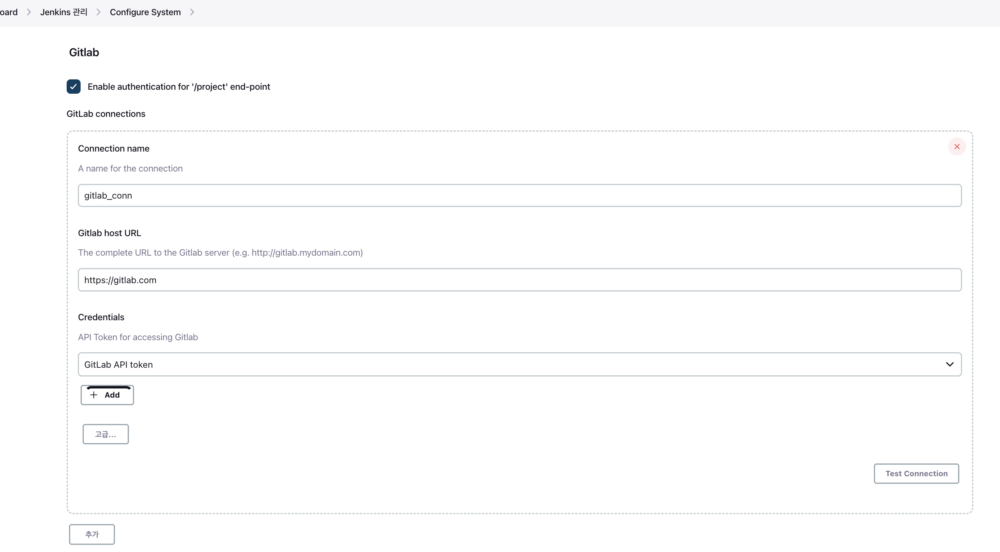

* credentials
    - kind : GitLab API token
    - API token : 레포지토리의 "Project access token".
    - ID : 아무말.

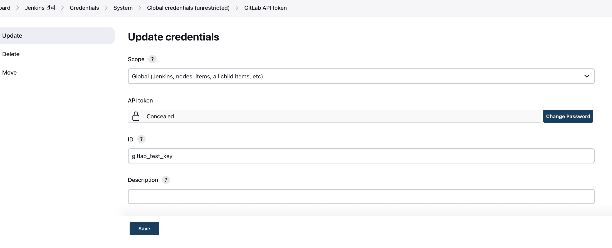


* Project access tokens
    - Token name : 아무말.
    - 만료날짜 : 넉넉히
    - Select a role : Owner
    - Select scopes : 이또한 api와 read관련 모두 선택.

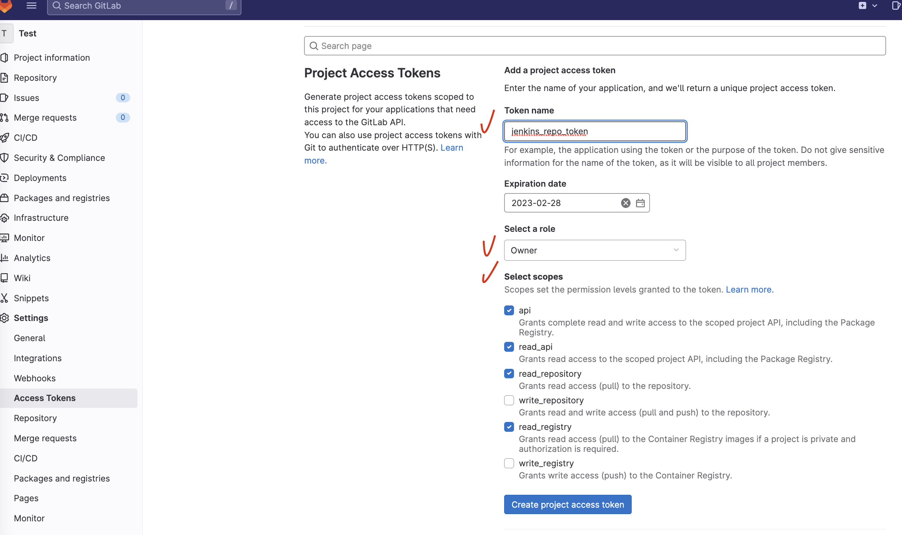


<br>
<br>
<br>
 
### 🐳 item pipeline script


* GitLab Connection
    - 바로 앞에서 등록한 레포 관련 connection을 선택.

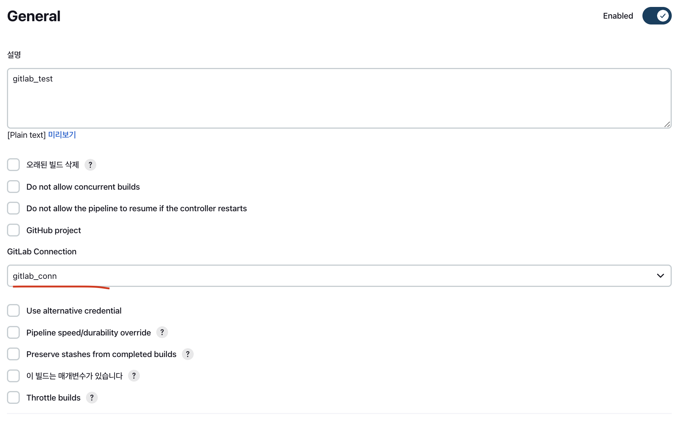


* pipeline script

    - credentialsId: 내 계정에 들어갈수 있게 해주는 token/key 등록.
    - url : git clone시 따는 https url.

```groovy
pipeline{
    agent any
    
    stages{
        stage('git clone'){
            steps{
                git credentialsId: 'gitlab_key', 
                branch: 'main',
                url: 'https://gitlab.com/heesootory/test'
            }
        }
    }
}
```


## 🌈 Web Hook

<br>
<br>


### 🐳 jenkins 설정.

* item 구성 > Build Triggers > build when a change is pushed GitLab.
    - 체크시, 나오는 url (1) 알아두기.
    - 고급탭 > 가장 하단의 token을 생성해서 (2) 알아두기.

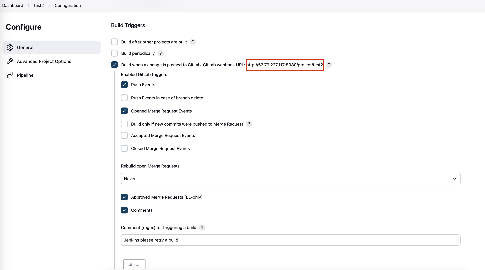
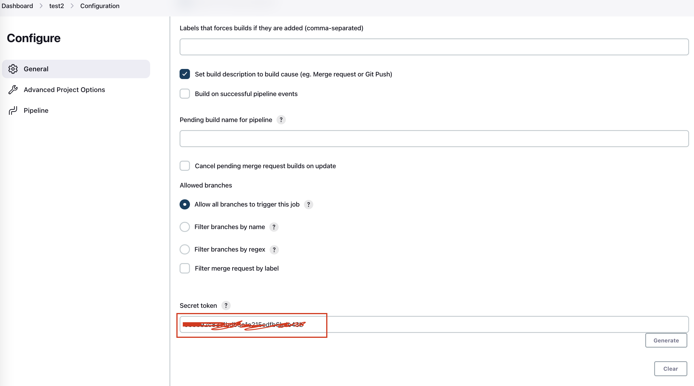


### 🐳 Git Lab 설정.

* repo > settings > Webhooks
    - Url: 위의 (1)에 해당하는 Url 기재.
    - Secret token : 위의 (2)에 해당하는 token 기재. 

* merge request events 를 표시하면 다른브랜치의 merge도 인식하여 webhook이 걸리기 때문에 -> 체크하지 않는다! 🎈

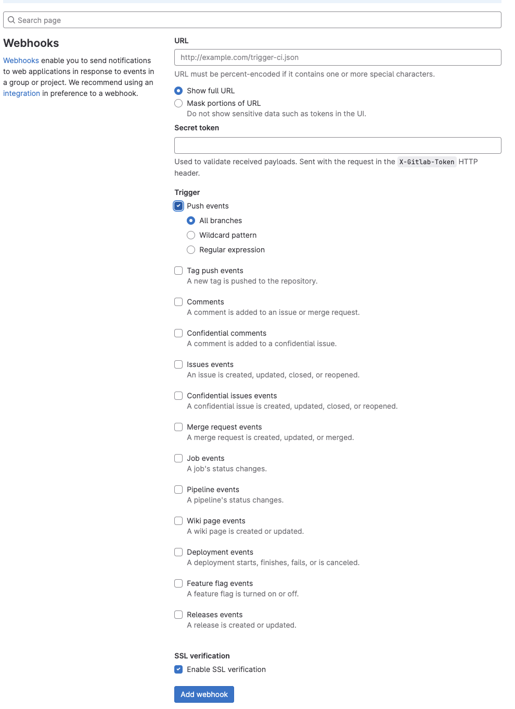


<br>
<br>

# 정상동작! ✌️

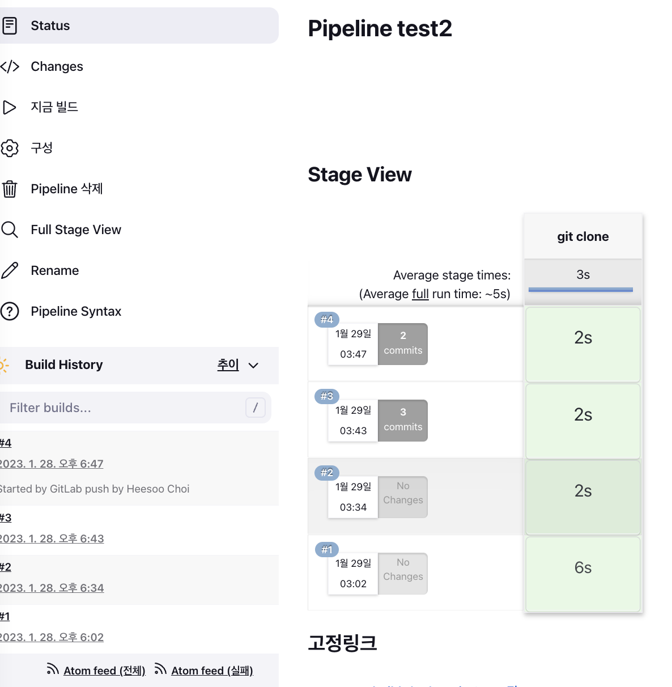
