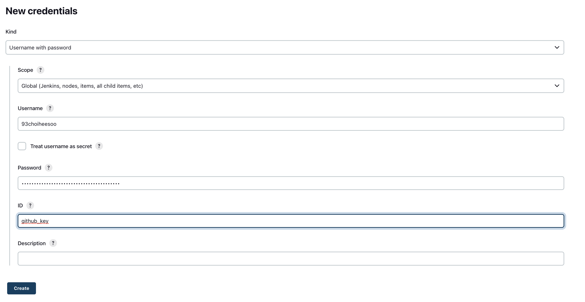
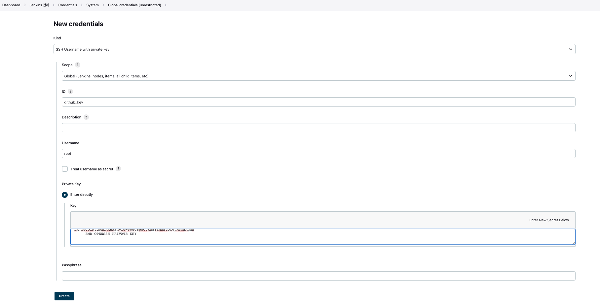

# jenkins credential 등록하기 - 여러 방법

## 🌈 git hub 연동시

### 🐳 Username with password 방법

* Username : 본인의 github 계정 ID.

* Password : github personal access token.

* ID : pipeline에서 명시할 이 credential의 alias.

[참고자료](https://kanoos-stu.tistory.com/54)

 
 
 

### 🐳 SSH uersname with private key

* ID : pipeline에서 명시할 이 credential의 alias.

* Username : root(default)

* Private key : enter directly -> 접속의 주체 com의 개인키.(id_rsa)

* github에 deploy key 등록
    - 접속 대상에 공개키를 등록한다.(id_rsa.pub)

