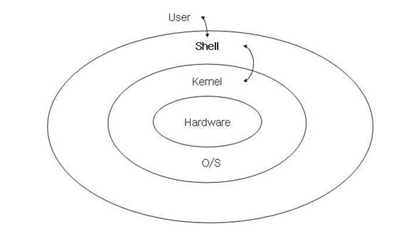

# LInux의 정확한 의미

 
 
 

## OS 자체가 아닌 OS의 핵심 소스코드 역할인 "커널"이다.
(커널 == 알맹이)

* OS = APP + shell + 커널로 구분될수 있음
* Linux는 Kernel이다!!!

## Linux에 App, Shell을 추가하여 만든 하나의 운영체제를 "리눅스 배포판"이라고 한다.

* 여러 다양한 리눅스 배포판 중 우리가 공부할 것은 Ubuntu!!
* Cent-os, Ubuntu, Mint등 여러 다양한 리눅스 배포판들이 존재.
    - 모두 커널은 리눅스이고, 그 위에 shell과 app을 어떤걸 붙혔냐의 차이!

## 우분투

* 사용하는 이유 : 무료
* 리눅스 배포한 중 가장 널리 쓰이는 배포판.

## virtual box에서 우분투 시작하기

 
 
 
 
 
 
 

## 리눅스 패키지 관리 시스템

* 만약 빌드 완료된 바이너리 패키지라면
    -> 그대로 실행 가능.

* 만약 소스코드 패키지를 받았다면
    -> 빌드 후 사용.

## 우분투 package 관리 시스템[암기하자!]

* APT 
  - Binary 형태로 배포
  - 소스코드 형태로 배포

* 우분투 소프트웨어(정식명칭 : Gnome Software)
  - Binary 형태로 배포

* 리눅스에서 불편한점!
    - 패키지 설치 도구끼지 독립적으로 관리.
    - 우분투 소프트웨어로 App을 설치하면, APT에서는 설치한 사실을 모른다. 
    (안드로이드에서도 play store가 설치한것을 ONE store가 모르는 것과 마찮가지. 서로 독립적으로 관리한다.)

## 추천하는 패키지 관리 도구

* 일반적으로 GUI를 많이 사용하는 크롬, visual studio Code등 은 "우분투 소프트웨어"에서 설치.

* 나머지는 Linux 전용 App
    - APT를 사용하여 설치.

## Linux 파일 시스템

* 윈도우와 달리 드라이브를 나누는 개념이 없다.

* 파일에 확장자가 따로 없으므로, 그냥 파일명만 적어도 가능.

