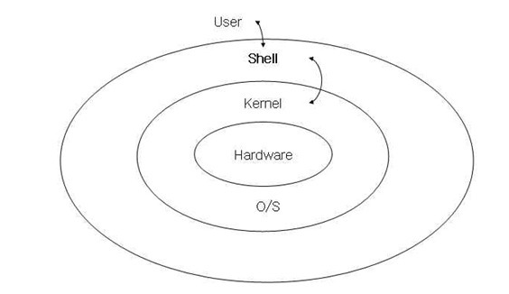

# Shell의 이해

## Shell ==> 인터페이스??

> 사용자가 쉽게 동작 및 사용하는데 도움을 주는 시스템.

### Kernel 이 관리하는 하드웨어 자원들

* CPU
    - task

* memory
    - segment
    - page

* network
    - socket

### Shell을 통해서 Kernel에 명령을 내릴 수 있고, Kernel의 자원을 관리하는데 도움을 준다.

### Shell은 시스템 사용자와 커널과의 인터페이스이다.

* 컴튜퍼를 켜면 OS가 부팅된 후, 실행되는 프로그램.

* 시스템 사용자는 Shell을 통해 명령을 커널에 던진다.

* 시스템 사용자는 Shell을 통해 명령에 대한 결과를 확인.

### Shell은 사용자와 커뮤니케이션을 하는 프로그램이다.

* 무조건 글자 기반이 아니다!!

* CLI Shell : 글자 기반 인터페이스

* GUI Shell : 그래픽 기반 인터페이스

 
 
 

## 쉘의 정확한 의미

* 쉘은 프로그램.

* 운영체제 내부에 접근하기 위한 프로그램이 쉘.

* "커널을 감싼다"라는 의미에서 "Shell(껍데기)"라는 용어를 사용.

* 쉘과 커널(H/w)사이에는 System call 을 통해서 전달함.

 
 
 

## 명령 프롬프트(cmd.exe) 

* 명령 프롬프트 App은 MS-DOS가 아니다.

* MS-DOS에서 사용하던 CLI Shell을 모방해서 만든 Windows의 CLI Shell이다.

### Windows Shell의 종류

* Windows Shell: 흔히 쓰는 GUI Shell.

* Power Shell: Unix처럼 System관리 가능한 다양한 기능이 붙은 쉘.
    - .net 기반 자동화 스크립팅 가능.
    - 리눅스 Shell 과 비슷한 윈도우의 CLI Shell.
      -  오픈 소스이며, .net Framework 기반
      -  스크립트 언어 제공으로 프로그래밍 가능.
      -  개인이 제작하는 App안에 Power Shell 내장할 수 있는 API 제공.

    - 단점.
      - 비공식으로 chocolatey프로젝트라는 설치 패키지 프로젝트 존재.

 
 
 

## 우분투 GUI 쉘

* LTS 기준 18.04 부터 "GNOME 3"
* GNOME3의 그래픽 라이브러리 이름: GTK

