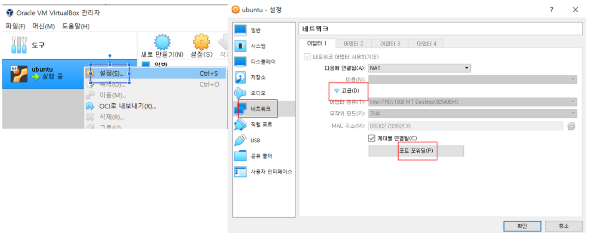
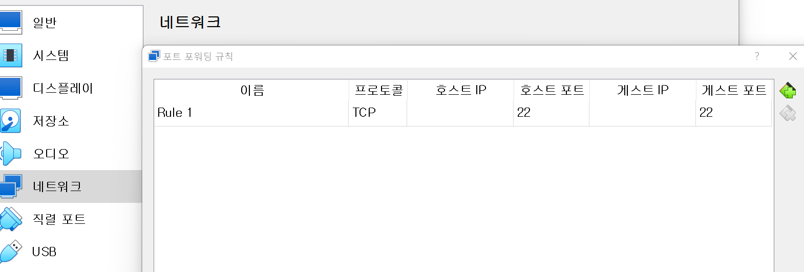
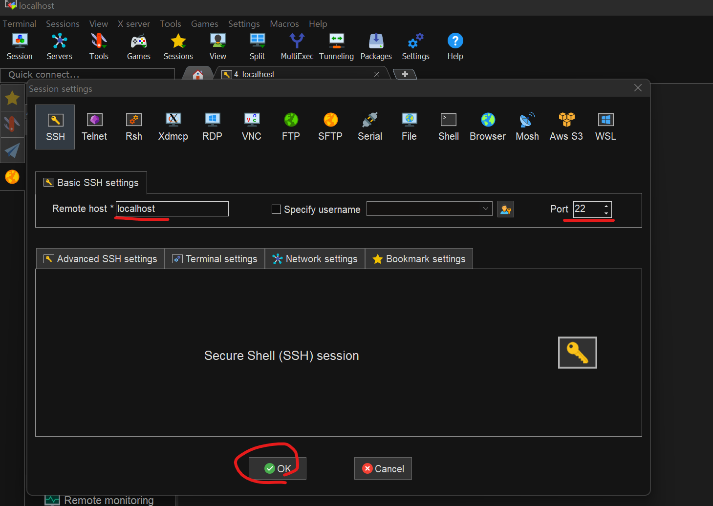
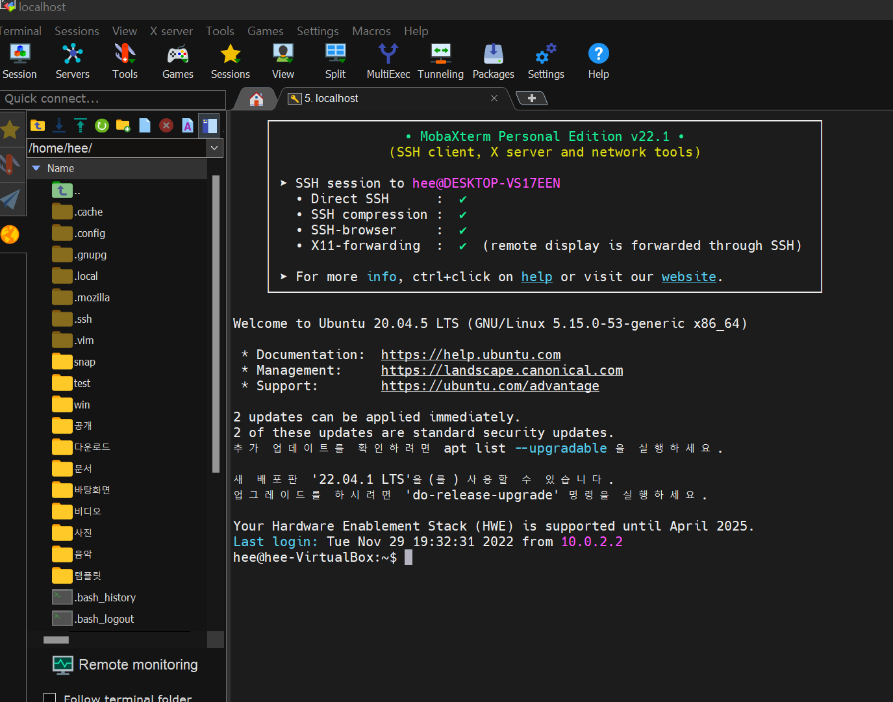

# 원격접속

<br>

> 임베디드 개발자는 주로 cli 환경에서 작업하고 cli 가 훨씬 깔끔하기 때문에 그에 맞춰 원격접속터미널을 이용하여 우분투를 제어하고자 한다.

<br>

### ubuntu 터미널에서 ssh 연결을 위해 서버프로그램을 설치해준다.

```vi
sudo apt install openssh-server
```

### 포트포워딩을 설정하여 우분투에서 포트를 지정해준다.

* 설정 > 네트워크 > 고급 > 포트포워딩



* 포트포워딩 규칙 추가.



* MobaXterm에서 세션을 추가하여 설정한대로 연결해준다
* Session > Remote host : localhost > Port : 22 > OK



* 우분투에서 등록한 사용자명(hee)와 비번(1)을 입력하고 원격접속 시작!




