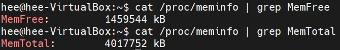
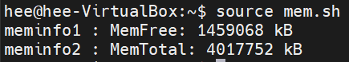
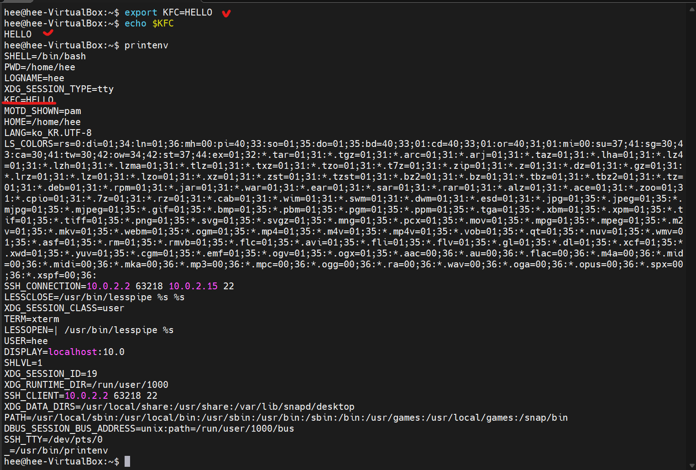
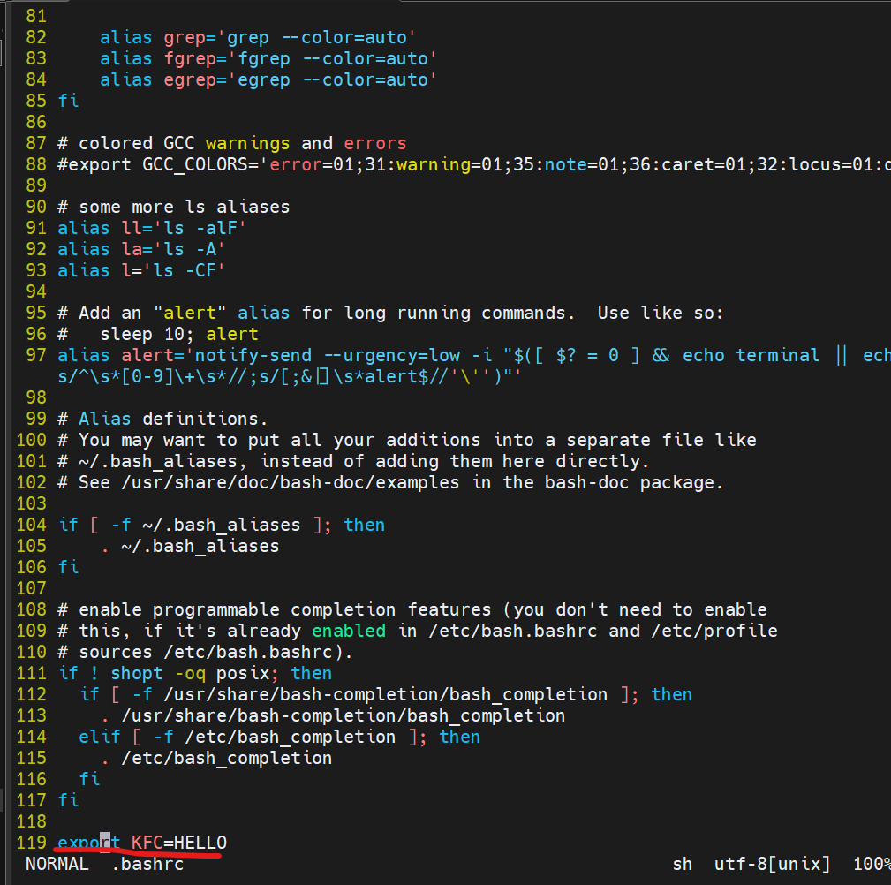
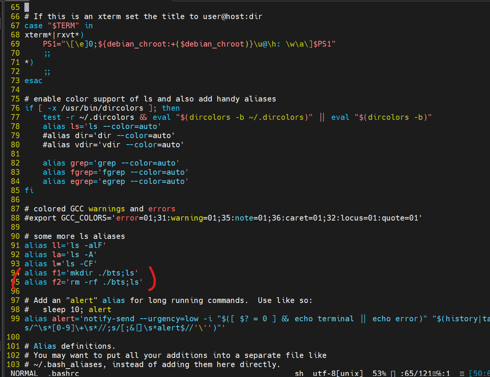
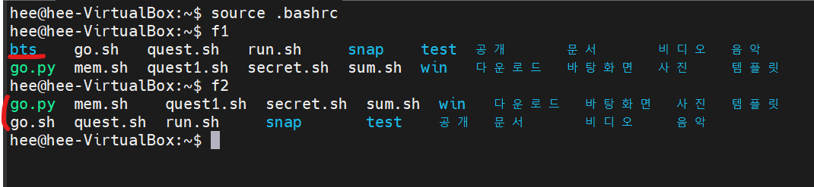

# Shell Programming


## 단계별 makefile 제작


## CLI 쉘

### 우리가 쓰고 있는 쉘은 무엇일까??

* 우분투 기본 CLI Shell : Bash
* 리눅스 사용자에게 가장 인기있는 CLI Shell

### 현재 어떤 쉘을 쓰고 있는지 확인해보자.

```vi
$ cat /etc/passwd | grep [hee](사용자명)
```

> :/bin/bash  -> bash 쉘을 사용중.

###  bash 쉘 설정 파일

* 이 또한 rc파일이다.(빔알씨 처럼)

```vi
vi ~/.bashrc
```

### bash shell script 실행기??

* bash shell script의 실행기는 bash이다.
    - python의 실행기가 pypy인것 처럼
    - javascript의 실행기가 node.js인 것처럼.

* bash shell script는 확장자가 sh이다.
* 파일명 : test.sh파일

<br>
<br>
<br>

## 쉘 스크립트란??

### 쉘 스크립트는 자동화 프로그램 만들 때 사용.

* 예시 1) 자동 script 만들기
    - 실행하자마자 폴더가 자동 생성되고, 기존 파일이 백업되고, 백업된 파일이 서버로 전송하는 스크립트. (파일명 : backup.sh)

* 예시 2) 자동 세팅 script 만들기
    - 매번 초기 세팅해야 하는 반복해야 하는 작업을 shell script로 자동화 시키기(파일명 : setup.sh)

* 예시 3) 자동 설치 script
    - 게임을 하나 제작함. 이것만 실행하면 PC 내 설치되게끔 shell script를 하나 만들기(파일명 : install.sh)


### bash script는 python으로도 모두 가능하다!

* bash shell script를 배우는 이유 : 단순히 여태까지 bash로 짜여진 자동 스크립트가 많기 때문!!

* 이제는 임베디드 분야라던지 bash shell을 많이 사용하는 분야에서 python을 점점 많이 사용한다.


<br>
<br>
<br>
<br>


## 쉘 스크립트 만들기

### 두가지 규칙을 지켜주며 스크립트를 만들어보자!!

* 모든 쉘 스크립트 확장자 : sh

* (권장사항) 파일 맨 위에는 #!/bin/bash를 적어줌("쉬뱅" 이라고 부름)
    - 이 문서는 bash 쉘스크립트 임을 알림
      - #! /bin/bash : bash쉘
      - #! /bin/sh  : dash쉘


* 쉘 스크립트 실행하기

```vi
$ source [파일명.sh]
```

* source 명령의 의미
    - 쉘 스크립트 처럼 초기 설정 파일을 수정한 뒤에는 항상 현재 쉘의 세션에 적용시켜주는 역할.

### 쉘 스크립트 과제!

0. go.sh 스크립트 만들기
1. shebang 추가하기
2. HI 메세지 띄우기
3. a.txt b.txt c.txt파일 생성
4. ls -al ./*.txt 수행
5. rm -r ./*.txt 수행
6. BYE 메세지 띄우기
7. $source go.sh 실행

```vi
$ vi go.sh

#! /bin/bash
echo "HI"
touch a.txt b.txt c.txt
ls -al ./*.txt
rm -r ./*.txt
echo "BYE"
```

* 파이썬 코드로 등록하기

```py
 #! /usr/bin/python3
from os import system
system("echo HI")
system("touch a.txt b.txt c.txt")
system('ls -al ./*.txt')
system('create!')
system('rm -r ./*.txt')
system('remove')
system('echo BYE')
```


### 쉘 스크립트 수행 방법

* 방법1. source go.sh
    - 현재 bash 에서 go 쉘 스크립트 수행하기
    - 가장 많이 사용되는 방법


* 방법2. ./go.sh
    - 실행권한만 주면 됨.($sudo chmod a+x ./go.sh)
    - 간헐적으로 사용되는 방법
    - 권장 안함(가독성이 떨어짐)


## 쉘 스크립트 제작

### 간단한 질의 응답 스크립트 프로그램.(quest.sh)

* 출력 : echo
* 입력 : read

```vi
#! /bin/bash
echo "HI"

echo "What is your name?"
read ans

echo $ans"<-- WOW"
```

> 입력으로 ans라는 변수로 받고, 그것을 사용하기 위해 $를 붙힘.


### 변수 만들기

* 변수이름 = 값
* 모든 갑들은 문자열로 취급. (수로 취급 X)
* 변수에는 스페이스(띄워쓰기)가 들어가면 안됨!!!

```vi
#! /bin/bash

bts=123
kfc=546

echo $bts + $kfc
```
> 출력결과 : <br>
> 123 + 546

<hr>

```vi
#! /bin/bash

bts=123
kfc=546

hot=$kfc
god=kfc

echo $hot
echo $god
```
> 출력결과 : <br>
> 546 <br> kfc

<hr>

```vi
#! /bin/bash

bts1=100
bts2="100"
bts3=HOHO
bts4="    HOHO"
bts5 = HAHA

echo $bts1
echo $bts2
echo $bts3
echo $bts4
echo $bts5
```

> 출력결과 <br>
>
> 100<br>
> 100<Br>
> HOHO<Br>
> HOHO<Br>
> 에러

* 따옴표 안에 띄워쓰기를 해도 효과가 X.

<hr>

```vi
#! /bin/bash

bts=100
echo $bts

bts=$bts+3
echo $bts

bts=bts+3
echo $bts

```
> 출력결과 <br>
>
> 100
> 100+3
> bts+3
>

<hr>

* Argument 변수
    - 수행동작에 바로 변수에 들어갈 수를 입력하여 출력하는데 사용되는 변수

```vi
#! /bin/bash

echo $1
echo $2
echo $3
```
 - 입력
```vi
$ source quest.sh 100 200 abc
```

> 출력결과<br>
> 100<br>
> 200<br>
> abc

<hr>

* test.sh
```vi
#! /bin/bash

$1 -$2
```
* 입력

```vi
source test.sh ls al
```

> 출력결과<br>
> ls -al 명령어가 실행됨.


## 산술연산 in 쉘스크립트

* $(())를 붙이면, 이 안에서 산술연산 처리됨.

```vi
#! /bin/bash

bts=123
abc=$(($bts + 123))

echo $abc
```

> 출력결과 <br>
> 246

<hr>

* sum.sh

```vi
#! /bin/bash

echo "SUM VALUES IS $(($1 + $2 + $3)) HAHA"
```

```vi
$ source sum.sh 100 200 50 
```

> 출력결과<br>
> SUM VALUES IS 350 HAHA


<hr>



* 위에 출력되는 결과들을 사용해서 쉘스크립트만들어보기

* commend에서 실행한 결과들을 가지고도 스크립트를 만들 수 있다.

```vi
#! /bin/bash

m1 = $(cat /proc/meminfo | grep MemFree)
m2 = $(cat /proc/meminfo | grep MemTotal)

echo "meminfo 1 :"$m1
echo "meminfo 2 :"$m2
```

>출력결과



<hr>

### 주석 사용하기

* 한줄 주석 : #을 사용.

### if 문 사용하기

* 띄워쓰기 조심하기!!
    - if다음과 대괄호, 변수와 = 사이도 띄워쓰기를 해줘야 함!

```vi
#! /bin/bash

a=BTS

if [ $a = "BTS" ] ; then
    echo "BTS GOGO"
else 
    echo "NO!!"
fi
```

> 출력결과<br>
> BTS GOGO

<hr>

###  수 비교 연산자

* -lt : less then
* -eq : "=" 문자열 비교, 수비교가 아니다.(==)
* -gt : greater then(>)
* -ne : not equal(!=)
* -ge : 같거나 크다.(>=)
* -le : 작거나 같다.(<=)
* || : or
* && : and

<hr>

* 문제
    - 수 하나 입력받기, 수가 10보다 크고 30보다 작으면 "good" 출력
    - 그렇지 않고 수가 40보다 크고 50보다 작으면 "omg" 출력
    - 전부 아니면, "wow"출력

```vi
  1 #! /bin/bash
  2
  3 read a
  4
  5 if [ $a -gt 10 ] && [ $a -lt 30 ];
  6 then
  7     echo "good"
  8 elif [ $a -gt 40 ] $$ [ $a -lt 50 ];
  9 then
 10     echo "omg"
 11 else
 12     echo "wow"
 13 fi

```

<hr>

### if문을 쓰는 두가지 방법으로 풀어봄.

* 문제
    - secret.sh 파일 생성
        - Arg1 : ID 문자열 입력
        - Arg2 : Pass 문자열 입력

    - ID가 "KFC"이고, 비밀번호가 "1234"인 경우만 다음 명령어를 실행.
        - kfc.txt 파일을 생성
        - kfc 내용에 "i love my eyes" 내용 입력
        - 화면 clear
        - cat으로 kfc 파일 세번 반복 출력
        - "sleep 1" 명령어 수행(1초 대기)
        - 화면 clear
        - echo 명령어로 "keep secret.Bye" 출력
        - kfc.txt 파일 삭제

```vi
  1 #! /bin/bash
  2
  3 id=$1
  4 pass=$2
  5
  6 if [ "$id" == "KFC" ] && [ "$pass" == "1234" ];
  7 then
  8     echo "i love my eyes" >> kfc.txt
  9     clear
 10     cat kfc.txt
 11     cat kfc.txt
 12     cat kfc.txt
 13     sleep 1
 14     clear
 15     echo "keep secret, BYE"
 16     rm kfc.txt
 17 fi
```

* 문제2
    - run.sh 파일 생성
      - argument에 type을 입력받음
    - type: "dd" 일때
      - date 명령어 수행
    - type: "sl"일때
      - sl 프로그램 설치 후 실행 (apt install -y && run)
      - sl 프로그램 삭제 (apt purge -y)

```vi
  1 #! /bin/bash
  2
  3 t=$1
  4
  5 if [[ $t == "dd" ]];
  6 then date
  7 elif [[ $t == "sl" ]];
  8 then
  9     sudo apt install $t -y && $t run
 10     sudo apt purge $t -y
 11 fi

```

### if문 옵션

* -n "문자열" : 문자열 길이가 0보다 클 때
* -z "문자열" : 문자열 길이가 0일 때
* -x : 파일이 존재하고, 권한이 실행(+x) 일 때
* -f : 파일이 존재하고, Regular 파일 일때


<br>
<br>
<br>
<br>
<br>


## 쉘 스크립트 - for문, 함수, 배열

### 쉘 스크립트는 기본적으로 자동 프로그램을 만들기 위함이므로, 자주 쓰이는 문법이 정해져있다.

* echo 출력
    - 개행이 자동으로 된다.
* 실행 파라미터
* if문

### 자주 쓰이지 않는 문법 - 쓱 한번씩만 보고 넘어가기

* printf()
  - echo와 달리 \n 개행문자를 넣어줘야만 개행이 된다.


* for문
    - () 소괄호가 두번씩 사용되고
    - 반복문이 실행될 문장은 do - done으로 감싸줘야 한다.

```vi
  1 #! /bin/bash
  2
  3 for((i = 0; i < 10; i++))
  4 do
  5     echo "HI"
  6 done
  7

```
> 출력<br>
> HI<br>
> HI<br>
> HI<br>
> HI<br>
> HI<br>
> HI<br>
> HI<br>
> HI<br>
> HI<br>
> HI<br>

* 함수
    - 함수 호출시, 함수 이름만 입력하면 됨.

```vi
  1 #! /bin/bash
  2
  3 abc()
  4 {
  5     printf "HIHI\n"
  6 }
  7
  8 printf "START\n"
  9 abc
 10 abc

```

> 출력<br>
> START<br>
> HIHI<br>
> HIHI<br>

* 배열
    - 배열을 만들때는 ()를 사용
    - 배열값을 출력할 때는 {} 괄호 필수

```vi
  1 #! /bin/bash
  2
  3 arr=(10 20 30 40)
  4
  5 echo ${arr[0]}
  6 echo ${arr[1]}
  7 echo ${arr[2]}
  8 echo ${arr[3]}
  9

```

> 출력<br>
> 10<br>
> 20<br>
> 30<br>
> 40


<br>
<br>
<br>

## 환경변수

* 환경변수 : 쉘에 저장되는 변수
    - 사용자, process, 리눅스 자체 등
    - 다 같이 사용하는 변수.
    - 이전경로(OLD PATH), 사용자명 등 모든곳에서 공유되어야 하는 것들이 저장되어 있다.

* 챕터의 목적
    - 환경변수 사용법을 익힌다.
    - 이 환경변수를 사용하는 스크립트를 제작해보자.

* 환경변수 전체 읽기
    - printenv 명령어
    - printenv 만 치면, 저장된 모든 변수내용들을 확인 가능하다.

* 하나만 읽기
    - echo $변수명
    - echo $SHELL
      - 현재 사용중인 쉘 경로를 저장한 변수
    - echo $PWD
      - 현재 디렉토리가 저장된 변수
    - echo $HOME
      - 홈 디렉토리 저장된 변수

* 값 저장하기
    - export[변수] = [값]
    - 저장한 값은 echo $[변수명]  으로 출력가능.
    - but, 터미널을 종료했다가 다시 켜면, 값이 유지가 안된다!!




* 값 유지시키기
    - 환경변수값을 지속적으로 유지하려면, ~/.bashrc 파일에 export를 추가한다.
    - 배시알씨에 추가된 변수는, 이후 다른 쉘 스크립트 작성시에도 $[변수명]으로 접근이 가능하다!

* ~/.bashrc
    - bash 쉘이 시작되자마자 자동으로 시작되는 bash 스크립트 파일.

```vi
export KFC=HELLO
```



> 배시알씨에 저장후에는 껏다켜도 잘 유지되는 걸 볼 수 있다.

<hr>

* 문제
    - 만약 환경변수값 KFC가 HELLO면 "OH GOOD HI"를 출력.
    - 그렇지 않으면, "OH MY GOD"을 출력하기.

```vi
  1 #! /bin/bash
  2
  3 if [ "$KFC" == "HELLO" ]
  4 then
  5     echo "OH GOOD HI"
  6 else
  7     echo "OH MY GOD"
  8 fi
  9

```

* 변수 제거하기

```vi
unset [변수명]
```

<br>
<br>
<br>

## 쉘 스크립트 분석하기.

### 시작전 상식
* ll을 입력 해보자.
    - ls -al 명령어를 쉽게 쓸 수 있다.

* ll은 bashrc 파일에서 만든 alias이다.
    - ~/.bashrc 스크립트 파일에서 ll관련 alias 를 검색해보자.

* alias 등록하기
    - ~/.bashrc에 alias 부분에 [변수명]=[수행할 명령]을 작성
    - source .bashrc 로 현재 쉘 세션에 반영시키기.


* 문제
  - alias를 ~/.bashrc에 등록하고 사용해보자.
  - alias f1='mkdir ./bts;ls'
  - alias f2='rm -rf ./bts;ls'






## case 문

* c 언어의 switch case 문과 동일한 구조이다.

```vi
case 문자열 in
문자열1 | 문자열2 )
    소스코드1
    ;;
문자열3)
    소스코드2
    ;;
esac
```


