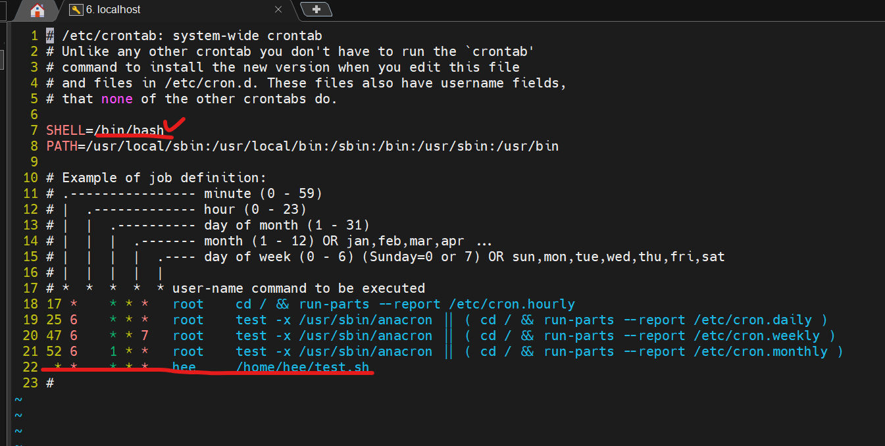

# 자동 백업 스크립트 만들기


### 3시간에 한번 씩 work 디렉토리를 백업하는 스크립트 만들기

1. ~/work 디렉토리를 압축 후, 특정 디렉토리에 백업하는 스크립트를 만든다.
    - 파일명 : backup.sh
2. crontab을 사용하여, 주기적으로 backup.sh 파일을 수행.

* crontab(크론탭)
    - 원하는 시간/조건에 특정 명령어를 수행시키기 위해 만들어야 하는 파일.

* cron 데몬 (크론)
    - crontab 문서에 적은 내용대로 수행해주는 데몬.

### crontab 테스트를 위한 스크립트 파일 하나 작성하기.
* 파일명 : ~/test.sh
* 실행 권한 부여 : chmod +x ~/test.sh

* date '+%H:%M:%S'  
    - 현재시간 출력 명령어
  
* 스크립트 내용
    - 홈 디렉토리에 기존에 생성된 파일을 삭제.
    - 홈 디렉토리에 빈 파일을 하나 생성.
    - 현재의 시간을 "it it $date" 라는 문구로 check_test.txt에 기록
    - ls 명령어로 현재 디렉토리 목록을 check_test.txt에 기록

> test.sh 내용
```vi
  1 #! /bin/bash
  2
  3 FILENAME=$HOME/test-$(date '+%H:%M:%S')
  4
  5 rm -rf $HOME/test-* 
  6 touch $FILENAME
  7 echo "hello, it is $(date)" >> check_test.txt
  8 ls >> check_test.txt

```

> vi /etc/crontab 으로 들어가서 cron 등록하기



> 1분 마다 실행되게 (* * * * *) 등록


