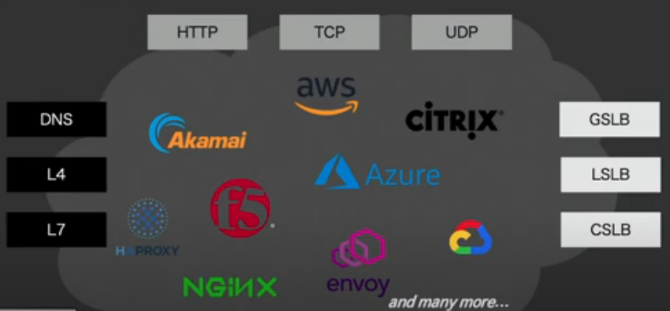

# Nginx 란??

 
 
 

## 🌈 로드 밸런서

 

### 🐳 로드밸런서가 해주는 일은??

* 클라의 요청이 들어왔을때 그 트래픽을 어떤 서버(어플리케이션)로 어떻게 보낼지 결정하고 통제하고 관리하는 역할.

* 여러 대의 서버를 운용하다 보면, 모든 서버가 동일한 균질/스펙을 가진 서버가 배포되는게 아닌데, 이런 경우에 각 서버가 소화할 수 있는 만큼의 트래픽을 전달해주는 역할.

* 글로벌 서비스를 하는 회사들(line등)의 입장에서는 글로벌적인 스케일에서 로드밸런싱을 해야할 일이 생기는 데, 이때는 nginx보다는 DNS기반의 로드밸런서를 많이 사용한다.(-> GSLB = Global scail Load Balancing)
    - 미국에 거주하는 클라는 미국의 서버로 보내고, 한국에 거주하는 클라는 한국의 서버로 보낸다.

* 트래픽의 우선순위(Priority)를 매긴다.
    - 트래픽이 감당할 수 없을 만큼 많이 들어올때는, 살려야 할 중요한 트래픽을 위주도 받을 수 있게 필터링을 하는 역할을 한다.

 
 

## 🌈 서비스 인프라를 위한 썬블록

 

### 🐳 썬블록의 역할

* More capacity
    - 서버를 늘려서 가용성 증가
* Caching response
    - 캐시로 되돌려주기
* Discard requests 
    - 중요하지 않은 요청들 버리기
    - nginx단에서 에러페이지를 보여줌으로써 부하를 막고, 사용자들 입장에서 기분이 나쁘지 않게 재요청시, 서버로 연결이 가능하게.

## 🌈 트러블이 생겼을때!

## 🌈 라인 트래픽 마스터의 제언

