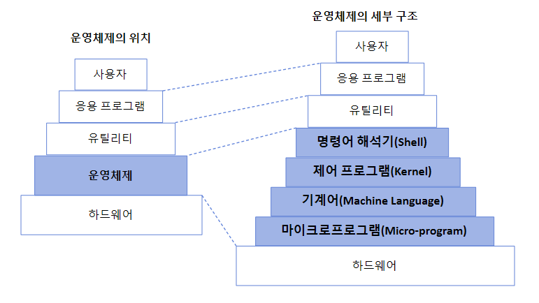

# 운영체제란

 
 

 
 

## 운영체제, Operating System, OS

> 컴퓨터 하드웨어 바로 위에 설치되어 사용자 및 다른 모든 소프트웨어와 하드웨어를 연결하는 소프트웨어 계층.

* 컴퓨터 시스템을 편리하게 사용할 수 있는 환경을 제공.
    - 운영체제는 동시 사용자/프로그램들이 각각 독자적 컴퓨터에서 수행되는 것 같은 환상을 제공.
    - 하드웨어를 직접 다루는 복잡한 부분을 운영체제가 대행.
    (사용자는 운영체제를 통해 하드웨어를 손쉽게 컨트롤.)

 * 컴퓨터 시스템의 <mark>한정된 자원을 효율적으로 관리</mark>
    - 프로세서(cpu), 기억장치(메모리), 입출력장치 등의 효율적 관리.
    - ex
        - 실행중인 프로그램들에게 짧은 시간씩 cpu를 번갈아 할당.
        - 실행 중인 프로그램들에 메모리 공간을 적절히 분배.

    

