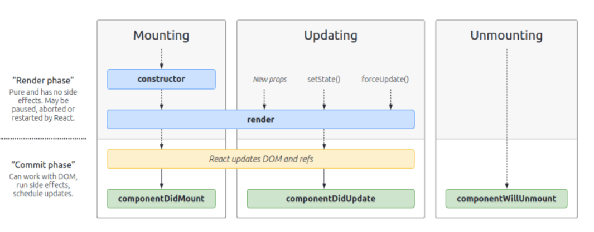

# component 생명주기

 
 
 

## 생명주기

## useEffect

* 기본적으로 useEffect는 componentWillUnmount때 발생.

* useEffect(() => {function, return}, [dependency])

    - dependency가 존재하지 않을 때

        - useEffect가 영원히 돌아감.

        - function은 componentDidMount, componentDidUpdate 때 호출. 

        - function은 componentDidMount일 때만 호출됨.

        - return 은 componentWillUnMount시에 호출.
    
    -  dependency가 존재할 때
        
        - function은 componentDidMount 때만 호출