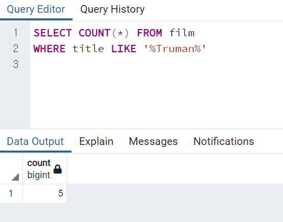

# SQL문 기초

<br>

## index

<br>


---


<br>

## SELECT

```SQL
SELECT column_name FROM table_name
```

* 여러열을 선택
```SQL
SELECT column1, column2 FROM table_name
```

* 전체 열 선택
```SQL
SELECT * FROM table_name
```
> 전체 테이블을 선택하는게 아니라면, * 를 사용하는건 좋지않다.

> *를 사용하면, DB서버와 app사이의 트래픽이 증가하고, 그로인해 검색 속도가 매우 느려질수 있기 때문!


### DB의 테이블 확인

> DB/schema/tables


 


## SELECT DISTINCT

> 가끔 테이블에 중복값이 있는 열이 포함되어 있는데, 그 상황에서 고유하거나 중복되자 않는 값만 조회하고 싶을 때가 있다.

> 해당 열에 고유한 객체명은 몇개인가? 를 묻고 싶을 때, 사용.

```SQL
SELECT DISTINCT column FROM table
SELECT DISTINCT (column) FROM table
```


## COUNT

> 특정 쿼리 조건에 맞는 입력 행의 갯수를 구함.
> 특정 대상에 작용하는 함수 이므로, 행에 괄호가 필수.
> 행의 갯수는 모든 행이 사실 동일하므로, 어떤 행을 넣어도 동일한 값이 반환된다.

```SQL
SELECT COUNT (column) FROM table
```

### SELECT 과 함께 사용

```SQL
SELECT COUNT (DISTINCT column) FROM table
```

> 구별되는 고유한 이름의 갯수.

### Ex


## SELECT WHERE

> 열에 조건을 지정하여, 그에 맞는 행을 반환하도록 함.
> 정확한 명칭에, 대소문자 구분 정확히
> 조건을 적용하여 필터링하므로, 조건에 맞는 행, 정보를 알고 싶은 행 -> 두개 이상의 열이 필요.
> 객체명은 조건문과 구별을 위해 ''(작은따음표)

> 조건에 사용하는 연산자들
* 비교 연산자 
* 논리 연산자 (AND, OR, NOT)


```SQL
SELECT col1, col2 FROM table WHERE conditions;
```

### Ex


* Q1 : 우리 상점의 지갑을 잃어버린 고객이 있는데, Nancy Thomas라는 고객이고, 그 고객의 email을 알려드리려한다.


* Q2 : 한 고객이 영화 "Outlaw Hanky"의 내용을 궁금해 한다.
그 내용에 대해 설명해줘라.


* Q3: 한 고객이 영화 반납을 연체해서, "259 Ipoh Drive"주소로 우편을 보냈고, 전화로도 이 내용을 알려야한다. 이 고객의 전화번호는 무엇인가?


## ORDER BY

> 결과를 특정한 순서로 표현.

> 쿼리의 마지막에 등장. 선택과 필터링을 한 후 선택

> 알파벳순, 숫자숫, 오름차순(ASC)/내림차순(DESC) 등.

> default 값은 오름차순.


```SQL
SELECT col FROM table ORDER BY col ASC/DESC
```

* 여러가지 행에 조건을 달때,

```SQL
SELECT col1,col2,col3 FROM table ORDER BY col1, col3 
```
> col1을 먼저 오름차순으로 정리한 후, 그 안에서 col3을 오름차순 정리.

* 개별로 조건 설정.


## LIMIT

> 쿼리에 대해 반환되는 행의 갯수를 제한할 수 있는 명령어.

> 쿼리문 중 가장 마지막에 붙는 조건문.

> ORDER BY와 함께 연결되어 잘 쓰인다.

```SQL
LIMIT 5
```


## LIMIT & ORDER BY questions

* Q1: 처음으로 결제한 10명의 고객에게 보상을 해야할때, 10명의 고객ID을 찾으시오.


* Q2: 점심시간에 볼 짧은 비디오를 대여하고픈 고객이 방문한 상황.
상영시간이 가장 짧은 영화 5편의 제목은??


* Q3: 50분 밖에 영화를 못보는 고객이 있다면, 그고객이 선택할 수 있는 영화는 몇 편일끼?


## BETWEEN

> 값의 범위를 지정하는 연산자 이므로, WHERE뒤에 사용됨.

> NOT 을 이용해, 범위를 벗어난 값을 구하는 것도 가능.

> low와 high의 값이 포함된다!!!

> 포함과 비포함을 설정하려면, AND 앞뒤로 직접 부등호를 사용!

> 날짜도 지정이 가능한데, ISO 8601표준 형식으로 작성.

> 날짜 지정할시, 타임스탬프 정보가 포함되므로, 날짜, 시간, 분 이하까지 모두 고려해서 작성해야한다.
> 날짜의 시작이 00:00이므로, 날짜만 잘 지정한다고, 해결되지 않는다.

```SQL
WHERE date BETWEEN '2007-01-01' AND '2007-02-01'
WHERE value BETWEEN 3 AND 10      # 3과 10 포함.
WHERE value NOT BETWEEN 3 AND 10      # 3과 10 미포함.
```

* ❄️❗ 날짜 지정 주의!!!

> 15일로 지정해보면, 대부분의 날짜들이 14일에 등록되어 있다.

> 하지만, 14로 지정하면, 아무것도 안나오는데, 14일 자정(즉, 13일에서 14로 넘어가는 자정)이하로 지정되게 됨으로, 그 이후 등록된 날짜는 아무것도 나오지 않게 된다.
> 🔥 14일 지정 -> 13일 24:00 == 14일 00:00 로 지정.


## IN

>  AND과 OR를 사용하는 것보다 간편하게 조건 붙힐때 사용.

> 많은 옵션을 빠르게 확장.

```SQL
WHERE value IN('con1','con2','con3')
WHERE value NOT IN('con1','con2','con3')
```


## Like % ILIKE

### LIKE
>  문자열 데이터에 대한 패턴 매칭을 수행.

> 대소문자를 구분

>  와일드카드 문자
* % : 숫자나 문자의 순서와 길이에 상관없이 사용.(%에 아무문자가 해당되지 않아도 검색됨)
* _ : 글자의 자릿수에 따라 설정.

### ILKIE

> 대소문자를 구분하지 않음.

```SQL
WHERE name LIKE '_her%'     # Cheryl, Theresa, Sherri
WHERE name NOT LIKE '_her%'     # NOT 사용
```

> PgAdmin은 정규표현식은 포함시키지 않는다.


> % 에 아무문자가 포함되지 않아도 검색!


* Q1: 5달러보다 큰 금액을 결제한 거래는 몇 건인가?


* Q2:  이름이(first_name) p로 시작하는 배우는 몇명인가?


* Q3: 고객주소에서 중복되지 않는 고유한 주소의 갯수는 몇개일까?


* Q4: 위의 중복되지 않는 주소들의 지역의 명단을 조회해라.


* Q5: R등급이고, 교환 비용이 5달러와 15달러 사이인 영화는 몇편일까?


* Q6: 제목 어딘가에 Truman이라는 단어가 들어간 영화는 몇 편일까?




