# GROUP BY 와 집계함수


## INDEX

<!-- TOC -->

- [GROUP BY 와 집계함수](#group-by-와-집계함수)
  - [INDEX](#index)
  - [Aggregate Functions(집계 함수)](#aggregate-functions집계-함수)
  - [GROUP BY](#group-by)
    - [Ex](#ex)
    - [타임스탬프는 날짜로 변경하는 함수를 사용해서 그룹화할 수 있다.](#타임스탬프는-날짜로-변경하는-함수를-사용해서-그룹화할-수-있다)
    - [Questions](#questions)
  - [HAVING](#having)
    - [Questions](#questions-1)

<!-- /TOC -->

<br>


---


<br>


## Aggregate Functions(집계 함수)

> 여러 조건을 입력하여 하나의 결과를 반환.

> 하나의 열에 대해서만 반환한다.(여러 행을 집어 넣으면 안됨)

> 두개의 함수를 사용하여, 두값을 반환받을 수 는 있다.

> GROUP BY 로 그룹화 되기 전까지는 사실상 실행되진 않는다.

> 가장 일반적인 집계함수들.
* AVG()
    - 소숫점 자리가 긴, 부동소숫점을 반환한다.
    - ROUND()함수를 이용하여, 소수점 뒤의 숫자를 명확히 지정 가능.
    - ROUND()
```SQL
ROUND(value, 반환받을 소수점 자리)
```
* COUNT() : 행의 갯수만 반환.
* MAX()
* MIN()
* SUM()

> 집계 함수는 SELECT잘과 HAVING절에서만 사용.

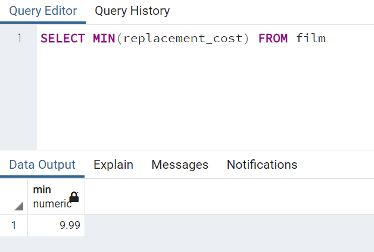

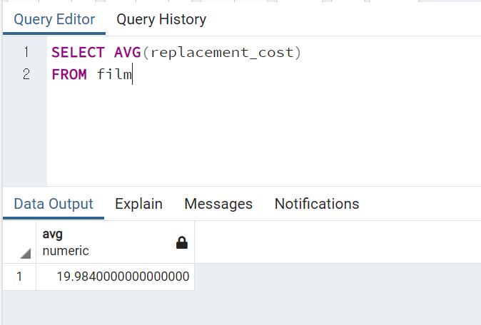
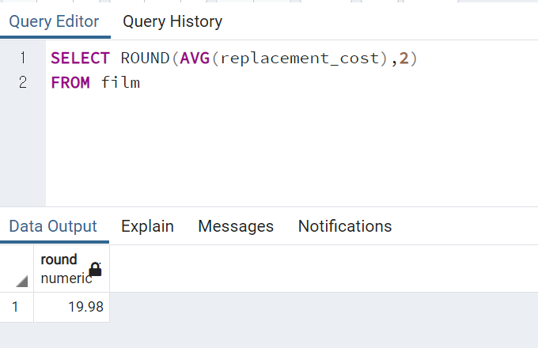
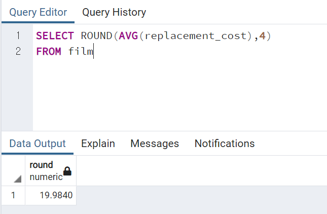
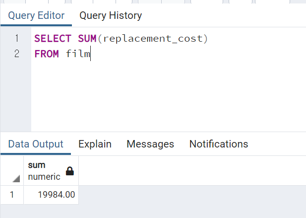

<br>
<br>
<br>

## GROUP BY
> 일정 카테고리별로 열을 집계.

* 고려할 점
    - GROUP BY할 열을 정한다.
    - 열에 숫자가 포함되도 무관.
    - 연속적으로 보여도, 카테고리로 취급해야함.

```SQL
SELECT category_col, AGG(data_col) 
FROM table 
WHERE category_col != 'A'
GROUP BY category_col
```
> AGG는 집계함수를 뜻함.

```SQL
SELECT company,division, SUM(sales) 
FROM finance_table 
WHERE division IN ('marketing', 'transport')
GROUP BY company,division
```
> 회사별, 부서별 판매총액을 구한다. 부서는 마케팅과 수송 부서만 필터.

> SELECT 에 담은 열과 GROUP BY에 담은 열은 동일해야 한다.

> WHERE문에는 집계 대상을 적으면 안됨. (sales는 WHERE문에 집어넣으면 안됨.)

```SQL
SELECT company,division, SUM(sales) 
FROM finance_table 
GROUP BY company
GROUP BY SUM(sales)
LIMIT 5
```
> ORDER BY로 정렬시에는, 총합의 순서가 알고싶기 때문에, 집계함수를 사용해서 적어줘야함.

### Ex

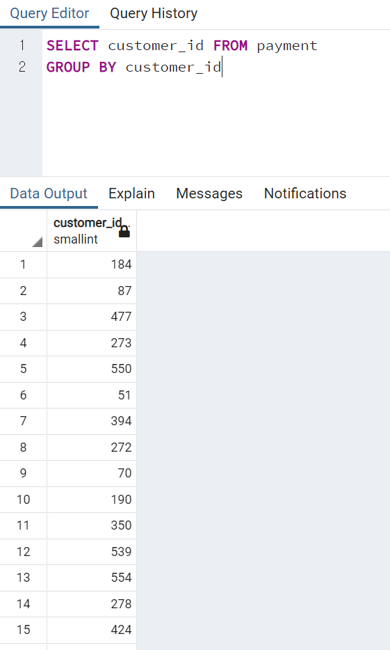
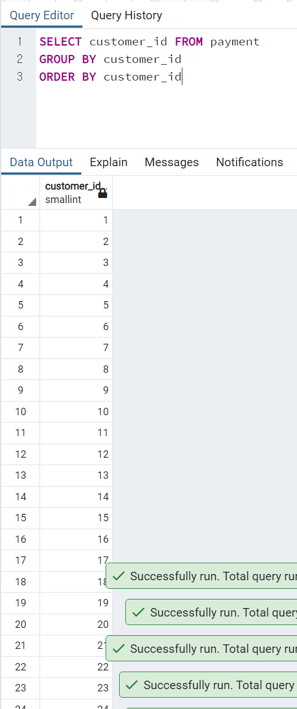

* 총액 기준으로 가장 많은 금액을 사용한 고객은 누구?
<br> =고객ID 별, 금액의 총합

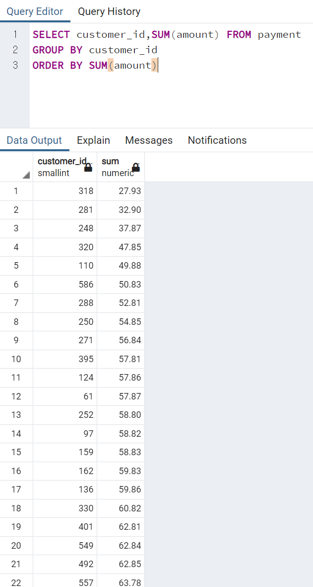


* 고객별 거래건수 


* 고객 별 직원과의 거래총합와 고객 id순으로 배열

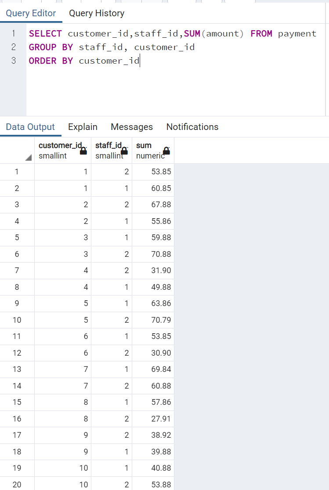

* 직원 별 고객과의 거래와 거래총합 - 순서는 무관

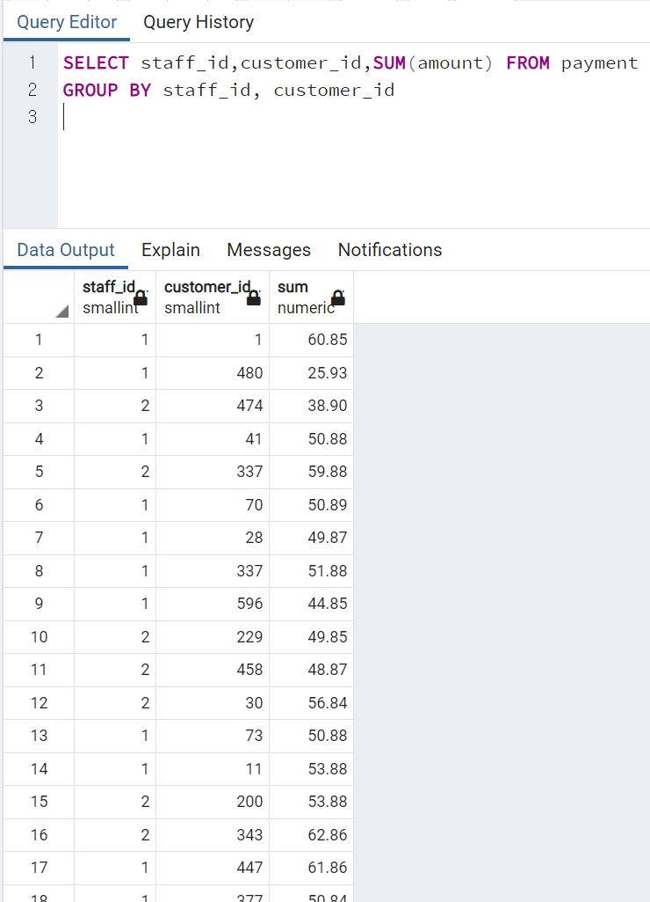

* 순서 정리

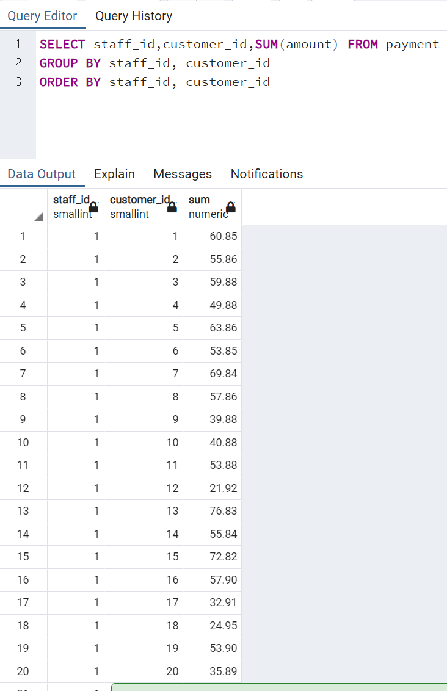


### 타임스탬프는 날짜로 변경하는 함수를 사용해서 그룹화할 수 있다.

> 모든 단위를 시간이나 분단위로 사용하지 않기때문에, 이렇게 타임스탬프 단위를 제거하고 사용도 많이 한다.

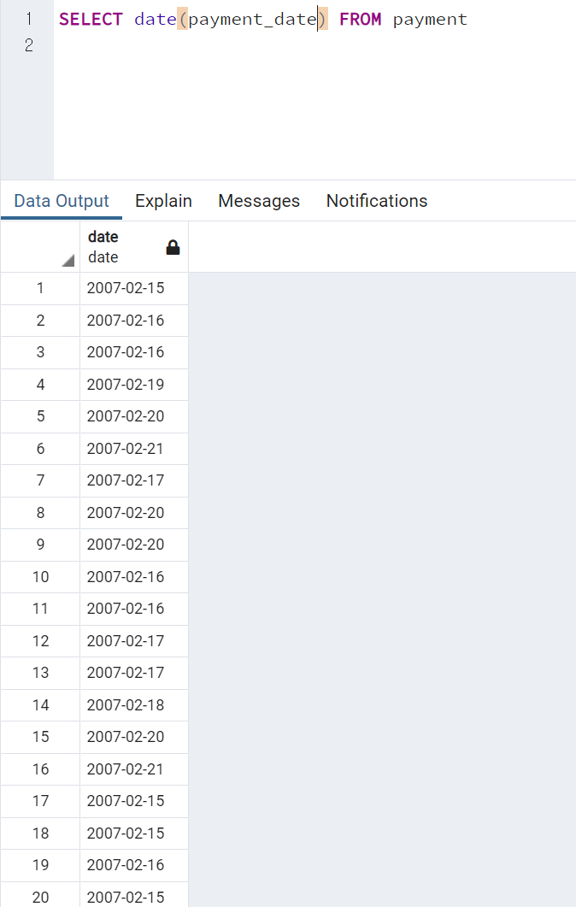

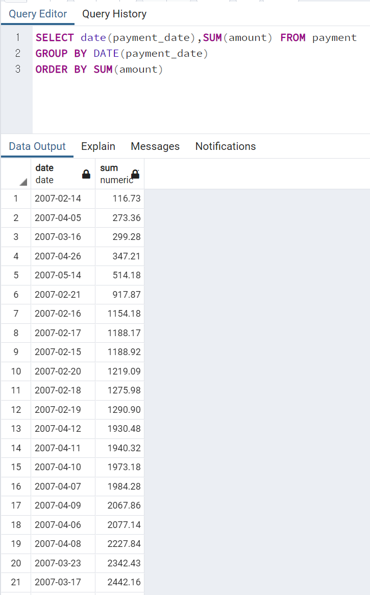


### Questions

* Q1: 스텝 1과 2가 있는데, 가장 많은 결제를 처리한 직원에게 보너스를 주려할때, 각 직원이 처리한 결제건수는 몇건이며, 누가 보너스를 받아야 할까?

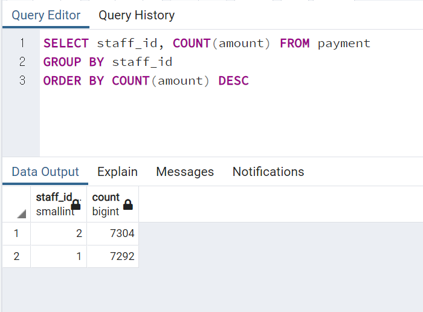

* Q2: 본사에서 교체비용과 영화의 MPAA등급 사이의 관계에 관한 연구를 수행하고 있다. 등급은 G, PG, R등입니다. MPAA등급별 평균 교체 비용은 얼마일까? (정확한 계산을 위해 AVG를 사용할 수 있다.)


* Q3: 상위 5명의 고객에게 쿠폰을 증정하는 행사를 진행중이다. 총 지출액 또는 총 사용을 기준으로 상위 고객 5명의 고객 ID는 뭘까?

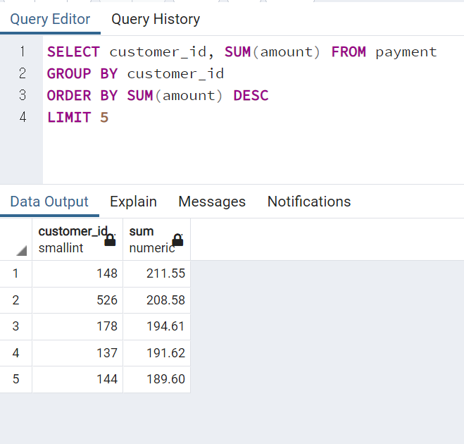


<br>
<br>
<br>


---


## HAVING

> 집계함수를 이용하여, 필터링을 하기위한 구문

> <mark>집계함수 특성상, GROUP BY가 진행되고, 그롭화 된 걸 기준으로 함수가 진행되서 , HAVING을 이용한 필터링은 그 이후에나 가능하다!!</mark>

> 집계가 이미 수행된 '이후에' 자료를 필터링.

> GROUP BY뒤에 위치.

```SQL
SELECT company, SUM(sales) FROM finance_table
WHERE company != 'Google'
GROUP BY company
```
> 이런 상황에서, company의 이름으로 필터링(WHERE)말고, SUM(sales)으로 필터링을 진행하고 싶다면, 어떻게야 할까. <br>
> 집계함수는 GROUP BY이후에 실행되어 값이 나오기 때문에,
> 이후에 추가적으로 필터링하기 위해, HAVING절을 사용.

```SQL
SELECT company, SUM(sales) FROM finance_table
WHERE company != 'Google'
GROUP BY company
HAVING SUM(sales) > 100
```

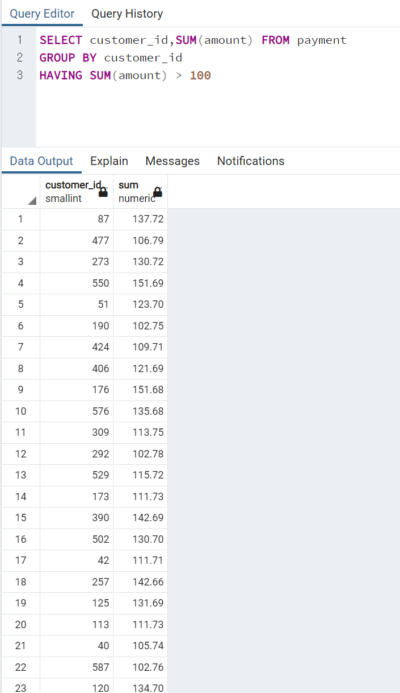


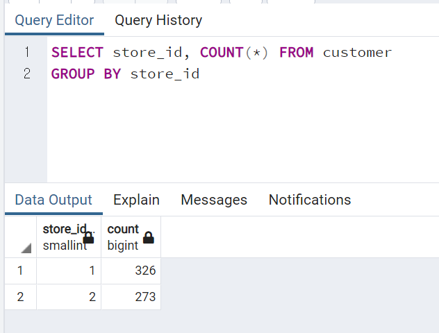
> store_id마다 행의 갯수가 COUNT(*) <br>
> 여기서, COUNT(*) = COUNT(customer_id)


### Questions

* Q1: 충성도가 가장 높은 고객을 위한, 플래티넘 서비스를 시작하려 한다. 결제 거래 건수가 40건 이상인 고객에게 플래티넘 지위를 할당하려고 한다. 플래티넘 자격이 있는 고객id는 누구일까?

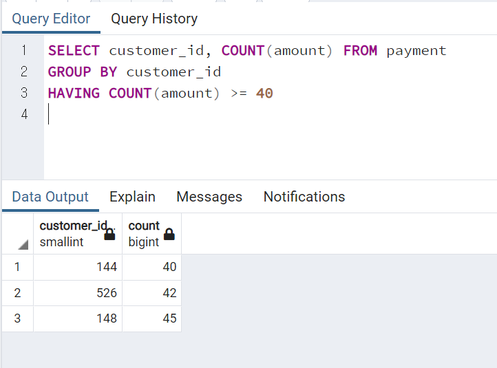

* Q2: 직원id 2와의 결제 거래에서 100달러를 초과하여 사용한 고객의 고객id는 무엇인가?

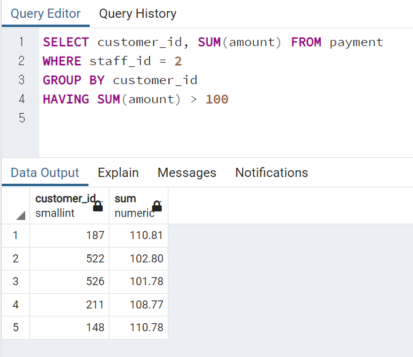

* Q3: ID가 2인 직원에게서 최소 110달러를 쓴 고객의 ID를 찾으세요.

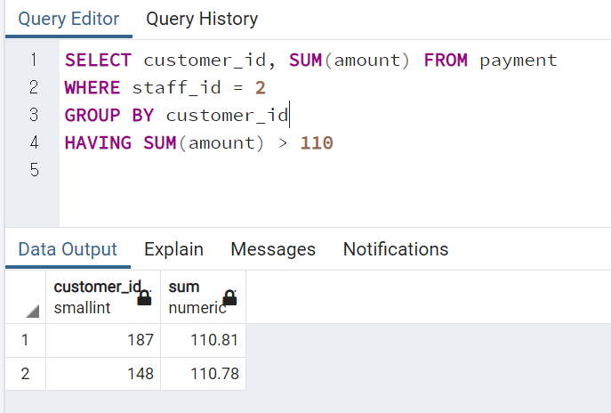

* Q4: J로 시작하는 영화는 몇 편인가?

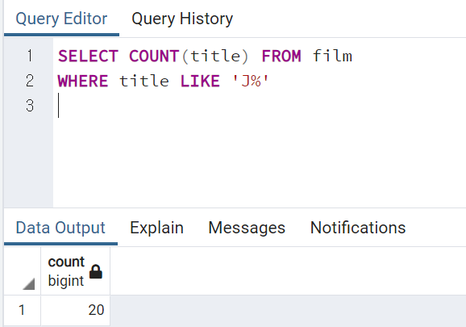

* Q5: 이름이 'E'로 시작하는 동시에 주소 ID가 500미만인 고객 중, ID번호가 가장 높은 고개긍 누구인가?

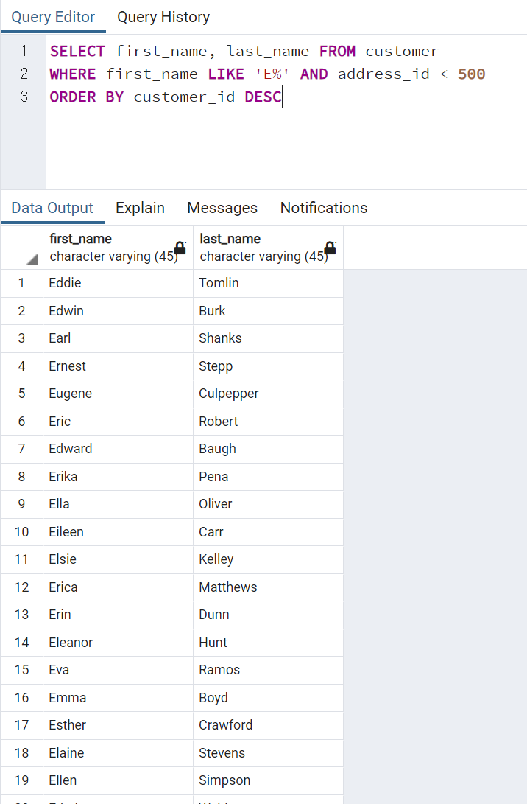


