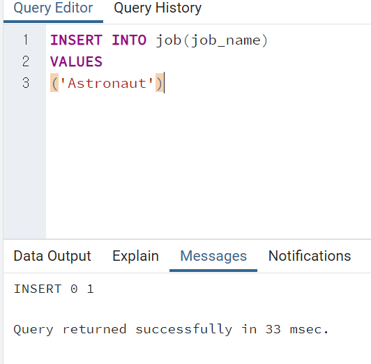
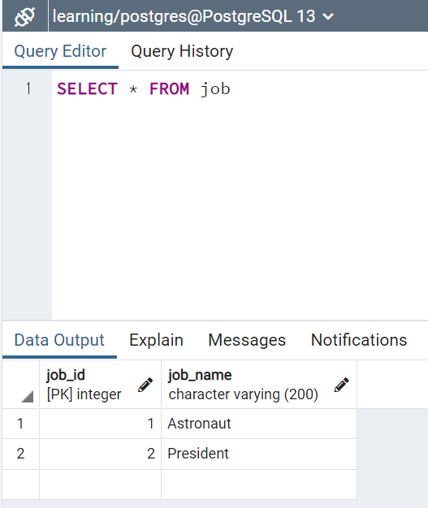
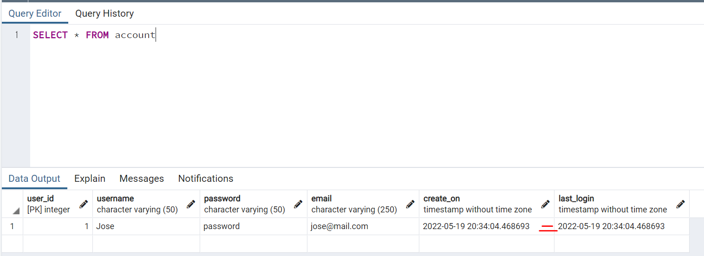

# 데이터베이스와 테이블 만들기

<br>

## index


<br>


---


<br>


## Data Types

[https://www.postgresql.org/docs/current/datatype.html](https://www.postgresql.org/docs/current/datatype.html)

* Boolean
* Character
* Numeric
* Integer
* Temporal : date time / timestamp / interval
* UUID : Univerally Unique Identidiers
* Array
* JSON
* Hstore key-value pair
* Special types such as network address and geometric data.


## 기본키(Primary key) 및 외래키(Forign key)

### Primary key [PK]

> 어떤 표와 함께 JOIN해야할지 쉽게 알려줄 수 있는게 바로 기본키.

> 모든 행이 독특한 고유의 키를 가지고, null일수 없다. 동일한 수 가없고, 각 객체가 모두 고유한 기본키를 가지고 있다 -> 구별가능

> 고유한 숫자를 자동으로 부여하는 시리얼 데이터 유형이 있다.


### Forign key[FK]

> 다른 표의 행을 고유하게 식별하는 표의 필드.

> 외래키는 다른 테이블의 PK에 대해 reference를 주도록 규정.

> FK를 포함하는 테이블을 "referecing table" 이나 "child table"이라고 함.

> FK가 레퍼런스하는 테이블을 "referenced table" 이나 "parent table"이라 함.


* payment_id : 기본키
* customer_id : customer table에서는 기본키/ 여기선 외래키.
* staff_id : staff table에서는 기본키/ 여기선 외래키.
* rental_id : retanl table에서는 기본키/ 여기선 외래키.

<br>

❄️ BUT, DB를 전부 확인하지 않고, 위의 _id 열이 외래키라는 걸 어떻게 알 수 있을까?! -> 종속성을 어떻게 확인할까?!


🔥 dvdrental / Schemas / public / Tables / payment / Constraints
-> 제약조건을 확인가능.


## Constraints

> 데이터베이스에 유효하지 않은 데이터가 쓰이지 않도록 방지할 수 있음.

> DB의 데이터에 대한 정확도와 신뢰도를 보장.

* Column Constraints : 열에만 적용되는
    - NOT NULL Constraints : 칸에 NULL입력 불가.

    - UNIQUE Constraints : 열의 모든 값이 구별되고, 달라야함.

    - Primary key

    - Forign key

    - CHECK Constraints : 행의 모든값이 특정 조건을 만족해야 함.

    - EXCLUSION Constraints : 특정 오퍼레이터를 사용한 특정 열이나 식에서  어떤 두 열이 비교될때, 모든 비교 값이 참으로 판명되지 않아야 한다는 조건.


* Table Constraints : 전체 테이블에 적용되는.

    - CHECK (condition)

    - REFERNECES

    - UNIQUE (col_list)

    - PRIMARY KEY (col_list) : 기본키가 다중일 수 도있다. (여러개가능)


## CREATE Table

```SQL
CREATE_TABLE table_name(
    column_name TYPE column_constraint,
    column_name TYPE column_constraint,
    table_constraint table_constraint
)INHERITS existing_table_name;
```

> 먼저 table의 이름과, 세로단을 만드는게 우선!

```SQL
CREATE_TABLE table_name(
    column_name TYPE column_constraint,     # pk를 먼저 만들기
    column_name TYPE column_constraint,
);
```

```SQL
CREATE_TABLE players(
    player_id SERIAL PRIMARY KEY,     
    age SMALLINT NOT NULL,
);
```

* SERIAL
> 시퀀스는 특별한 종류의 데이터베이스 오브젝트인데, 정수 시퀀스를 발생시킨다.
> serial은 시퀀스 오브젝트를 만들고, 열의 디폴트 값으로써 시퀀스에 의해 발생한 다음 값을 세팅. <br>
> 따라서, pk를 위해 자동으로 삽입되는 정수값을 세팅.

> 만약 객체 중 하나가 제거되었을때, 숫자가 하나 빠지게 되는데, 그 수를 찾아가서 제거되었는지 확인이 가능하다.

- smallserial
- serial
- bigserial

### DB 생성


> 생성 후,query tool!


> VARCHAR() : variable char로 여러가지 문자가 올 수 있다. <br>
> create_on TIMESTAMP NOT NULL : 테이블이 생성될떼, 자동으로 시간이 기록되게 <br>
> last_login TIMESTANP : NOT NULL을 안해준 이유는, 마지막 로그인한 사람이 없을 경우 에러가 나지 않게


> table 생성!


> table 하나 더 생성

> 누군가 고용이 되었을 때, job과 장부를 연결시키는 table을 만들어 보자.


> user_id 는 account의 user_id와 같은 것. 따라서 serial일 필요없음.
<br>

> SERIAL 은 INTEGER의 시퀀스일 뿐이다.

> 이 테이블에서는 user_id와 job_id가 외래키로 다른 테이블의 기본키들을 참조하고 있다.


## INSERT

```SQL
INSERT INTO table (col1, col2,...)
VALUES
(value1, value2,...),
(value1, value2,...),
```



> 하나더 삽입(대통령)



* 장부_직업 table 완성


## UPDATE

> 표의 값을 바굴 수 있도록 하는 키워드.

```SQL
UPDATE table
SET col1 = value1,
    col2 = calue2, ...
WHERE
    condition;
```

* Ex1 : 마지막 접속일이 null것들, 모두 현재시간으로 변경.
```SQL
UPDATE account
SET last_login = CURRENT_TIMESTAMP
    WHERE last_login IS NULL
```

* Ex2 : 모든 마지막 접속일을 현재 시간으로 변경.
```SQL
UPDATE account
SET last_login = CURRENT_TIMESTAMP
```  

* Ex3 : 다른 table를 이용하는 변경(UPDATE join)
```SQL
UPDATE tableA
SET original_col = tableB.new_col
FROM tableB
WHERE tableA.id = tableB.id
```

* Ex4 : 실제로 영향 받은 열을 도출시키기. -> 변경확인을 바로 할 수 있다.
```SQL
UPDATE account
SET last_login = create_on
RETURNING account_id, last_login
``` 




* join 명령어를 사용하진 않지만, 사실상 join을 해서, 다른 테이블의 객체로 변경시키기


* RETURNING :  비교할 열과 변경 사항등을 바로 출력해서 확인 가능!! (SELECT을 다시할 필요가 x)


## DELETE


```SQL
DELETE FROM table
WHERE row_id = 1
```

* 다른 표에 존재하는지 여부에 따라 삭제

> 조건을 확인하여, 조건에 맞으면 삭제

```SQL
DELETE FROM tableA
USING tableB
WHERE tableA.id = tableB.id
```

* 테이블의 모든 것을 삭제
```SQL
DELETE FROM table
```

* RETURNING : UPDATE와 마찮가지로, 삭제한 문장을 바로 확인할 수 있다.


## ALTER table

> 테이블을 


```SQL
ALTER TABLE table_name action
```

* Adding Column

```SQL
ALTER TABLE table_name 
ADD COLUMN new_col TYPE
```


* Removing Column

```SQL
ALTER TABLE table_name 
DROP COLUMN col_name
```

* Alter constraints

```SQL
ALTER TABLE table_name 
ALTER COLUMN col_name
SET DEFAULT value / SET NOT NULL / DROP NOT NULL 
/ ADD CONSTRAINT constraint_name
```

* 새로운 테이블을 만들고 실행해보자.


* table 이름 바꾸기


* column 이름 바꾸기


* 제약 조건 바꾸기
* 


## DROP TABLE

> DROP 을 사용하면, 특정 열을 완전히 삭제할 수 있는데, 삭제 하게되면, 그 열에 포함되있던, 인덱스와 제약조건도 모두 사라지게 된다.

> BUT, 다른 테이블에 있는 연관관계의 인덱스들 까지 삭제 되진 않는데, 그 기능은 CASCADE를 사용해야 한다.

```SQL
ALTER TABLE table_name
DROP COLUMN col_name
```

* 연결고리를 모두 끊으려면,
```SQL
ALTER TABLE table_name
DROP COLUMN col_name CASCADE
```

* 존재하지 않는 열을 삭제하려면, 에러가 나기 때문에 확인 후 삭제할 수 있다.
```SQL
ALTER TABLE table_name
DROP COLUMN IF EXISTS col_name
```

* 여러 열을 삭제 할시
```SQL
ALTER TABLE table_name
DROP COLUMN col_one,
DROP COLUMN col_two,
```


* 존재 확인 후 , 삭제 -> 없어도, 쿼리 성공으로 출력 (에러x)


## CHECK 제약조건

> CHECK로 특정 조건에 맞춤화한 제약 조건을 쓸 수 있습니다.


```SQL
CREATE TABLE example(
    ex_id SERIAL PRIMARY KEY,
    age SMALLINT CHECK(age > 21),       # 제약조건 커스텀
    parent_age SMALLINT CHECK(parent_age > age)      # 제약조건 커스텀
);
```


> 삽입시, 실패 했던 기록이 모두 id값으로 남게 된다. 
> 그래서, id가 1이 아니고, 3번 부터(2번 실패했다는 얘기)


