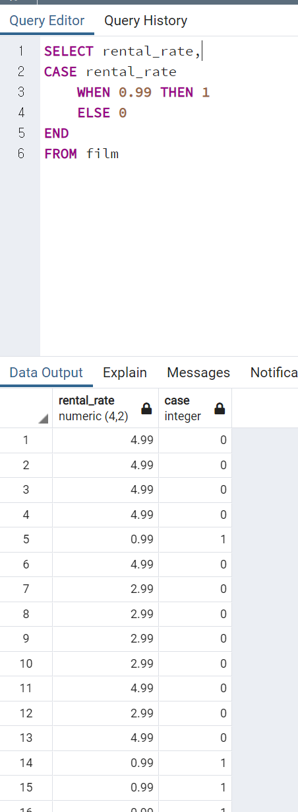
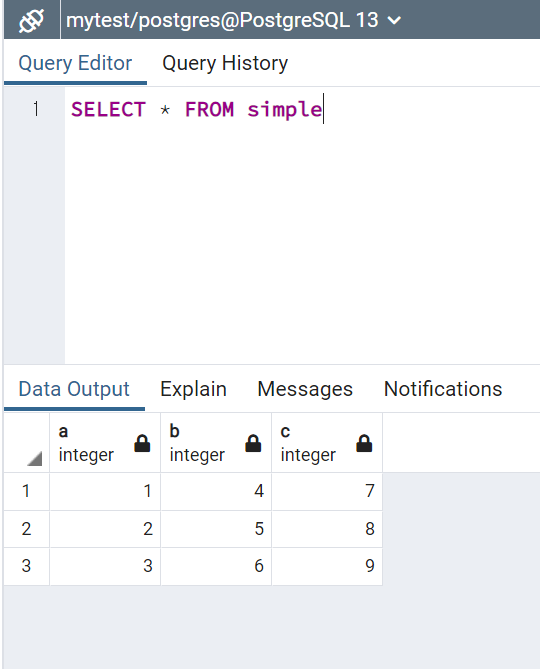

# 조건식과 프로시저

<br>


### index

<!-- TOC -->

- [조건식과 프로시저](#조건식과-프로시저)
    - [index](#index)
  - [CASE](#case)
  - [COALESCE](#coalesce)
  - [CAST](#cast)
  - [NULLIF](#nullif)
  - [Views](#views)
  - [가져오기(import) / 내보내기(export)](#가져오기import--내보내기export)
    - [import](#import)
    - [export](#export)

<!-- /TOC -->


<br>


---


<br>


## CASE

> 다른 프로그래밍 언어들의 if/else if 와 비슷.

```SQL
CASE
    WHEN condition1 THEN result1
    WHEN condition2 THEN result2
    ELSE some_other_result
END
```

* CASE Expression Syntax
```SQL
CASE expression
    WHEN value1 THEN result1
    WHEN vaule2 THEN result2
    ELSE some_other_result
END
```


* EX1 : 100번쨰 손님에게는 프로모션을 주고, 100에서 200사이의 손님들에게는 특별 대우를, 나머지에게는 일반 대우를 한다고 한다.


> 열 명칭 삽입.

* EX2 : 2번째 손님은 WINNER, 5번째 손님은 second place, 나머지는 normal


> 변수를 CASE에 지정함으로써, 동질성을 훨씬 간편하게 확인할 수 있다.


 * EX3 : film table에서, rental_rate에 따른 카테고리를 지정해보자.



> SELECT 절에 열이름, 유무에 따라서 새로운 열에 정리할지 안할지 결정.


> CASE도 SUM을 사용할 수 있다.

> CASE를 이용해서, 총 갯수를 이렇게 구할 수 있다.


## COALESCE

```SQL
SELECT COALESCE(1,2)    #->1
SELECT COALESCE(NULL,2,3)   #->2
```
 
> 무한한 수의 아규먼트를 쓸 수 있는 기능. NULL이 아닌 첫 아규먼트를 도출.

> 모든 아규먼트가 NULL이라면, COALESCE도 NULL이 도출.

> NULL을 가진 열을 다룰때, 매우 유용하다. 특히 그런 열을 가지고 연산을 해야 할시, NULL이 있다면, 다른 값으로 바꿔서 진행한다.

|Item|price|discount|
|---|---|---|
|A| 100 | 20|
|B| 300 | null|
|C| 200 | 10|

> 최종 결과를 만들어 내기위해, 연산을 해야할텐데, 0이 아닌 null을 가지고 있다면, 연산이 불가능하다.
```SQL
SELECT item,(price - COALESCE(discount,0))
AS final FROM table
```
> discount에 null이 있다면, 0으로 계산해라!

|item|final|
|--|--|
|A|80|
|B|300|
|C|190|


## CAST

> 데이터의 유형을 바꾸는 함수.(형변환)

> 모든 데이터 유형이 전부 바꿀 수 있는건 아니다.

```SQL
SELECT CAST('5' AS INTEGER)  
SELECT '5'::INTEGER
```


## NULLIF

```SQL
NULLIF(arg1, arg2)
NULLIF(10, 10)      # -> NULL
NULLIF(20, 10)      # -> 20
```

> 두 값이 같으면 NULL, 두 값이 다르면, 첫번째 값이 도출.

> 에러를 방지하기 위해 사용될 수 있다.


> 새 테이블 생성해서, 연습!


> 'A'와 'B'의 비율을 구함.


> 'B'가 없다고 생각해보자.


> 아까와 같은 비율을 구하면 어떻게 될까?


> 0으로 나누니 당연히 에러.


> 합이 0이라면, NULL값이 최종 도출되고, 아니라면, 수가 나와서 에러가 뜨지 않는다.


## Views

> 자주 수기로 작성해서 만들어지는 table들을 가상으로 view로 설정하고, 반복하기 쉽게 사용할 수 있다.

> view 는 데이터베이스 오브젝트로, 저장된 쿼리.

> 프로그램에서 시각화한 표로 볼 수 있다.

> 시각화라고 말하는 이유는, 실제로 데이터를 물리적으로 저장하지는 않음.

> 복잡한 쿼리를 계속 반복해서 쓴다면, 어떤 표인것 처럼 변환해줌.

> 이미 존재하는 view를 바꾸거나 업데이트도 할 수 있다.

```SQL
SELECT * FROM view
```


>이런 쿼리를 자주 불러서 사용한다고 예를 들어보자.


> view로 생성! (view이름 customer_info)


> 이로써,복잡한 쿼리를 단순화 시키고, 더 복잡한 구문들을 눈에 보기 쉽게 덧붙힐 수 있다.

* CREATE OR REPLACE : VIEW자체의 내용 변경


> 새로운 열 추가.

* view 존재하는지 확인 후, 제거
  


* view 이름 바꾸기


## 가져오기(import) / 내보내기(export)

### import


>> FILE / Download / 쉽표로 구분된 값(.csv)로 선택


> 다운받기


> 파일의 속성에서, 정확한 경로 파악 -> 경로가 젤 중요!!!


> 받아올 파일과 동일한 TABLE의 schema를 정확히 생성


> 해당 table에서 우클릭 -> import/export


> import 로 변경, 경로 설정


> column을 선택해서 집어 넣을수도 있다.


> header는 표의 첫행을 의미 하므로, yes로 선택 한다면, 이미 존재하니 그 행은 안 가져와도 된다는 의미.



> 불러오기 완료


### export

> 해당 table에서 우클릭 -> import/export


> 다운받을 경로 선택.


> 내보내기 완료.


