# JPA 영속성 관리 - 내부 동작 방식

<br>
<br>


## 🌈 영속성 컨텍스트 1


<br>
<br>

### 🐳 엔티티 매니저 팩토리와 엔티티 매니저

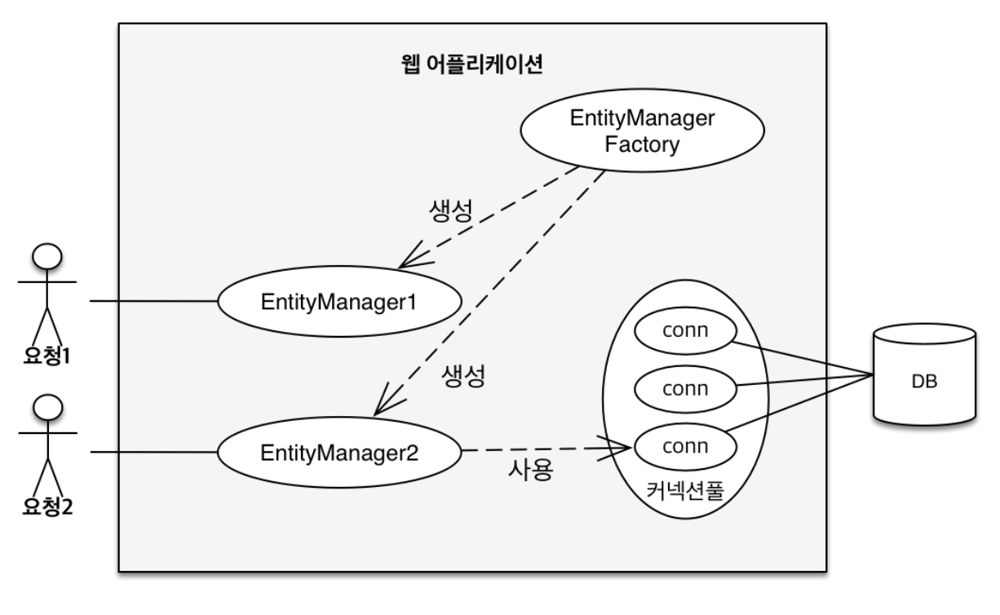

* 영속성 컨텍스트
    - 엔티티를 영구 저장하는 환경.
    - EntityManager.persist(Entity)
        - db에 저장한다 ❌
        - 영속성 컨텍스트에 잠시 저장, (1차 캐시에 저장하는 느낌).

* EntityManagerFactory
    - 요청이 들어올때마다 (transaction)이 생길때마다 EntityManager를 생성한다.

* EntityManager 
    - 모든 요청당 1개의 엔티티 매니저가 생성된다.
    - 모든 transaction은 각각의 엔티티 매니저를 가진다.
    - 엔티티 매니저는 connection pool를 통해 conect(conn)를 사용해서 db를 사용하게 된다.


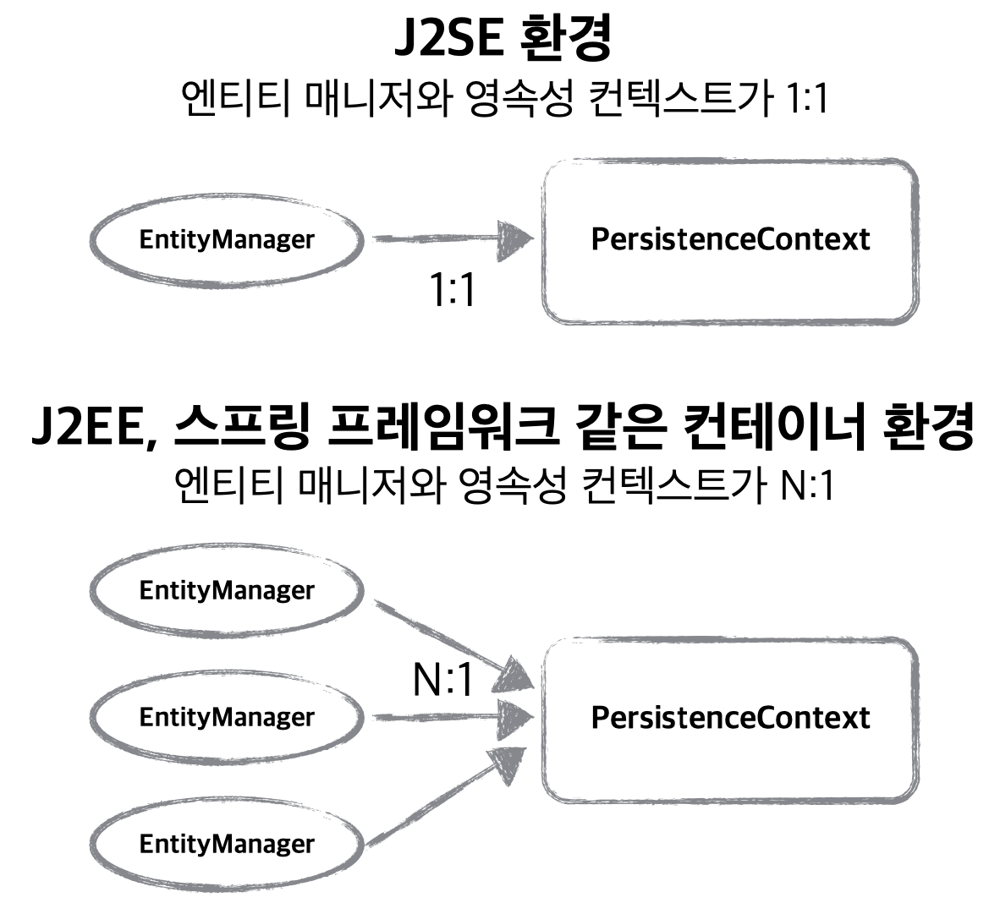


<br>
<br>
<br>
<br>


## 🌈 엔티티의 생명주기 

* 비영속 (new / transient)
    - 영속성 컨텍스트와 전혀 관계가 없는 새로운 상태.

* 영속(managed)
    - 영속성 컨텍스트에 관리되는 상태.

* 준영속(detached)
    - 영속성 컨텍스트에 저장되었다가 분리된 상태.

* 삭제(removed)
    - 삭제된 상태.

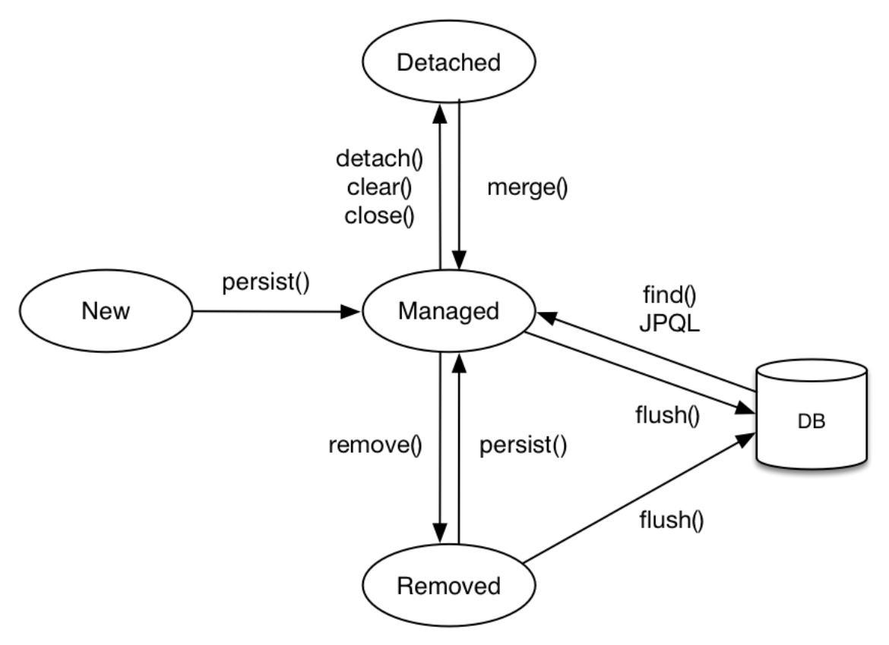

<br>
<br>
<br>
<br>

### 🐳 비영속

<br>
<br>

> 객체만 생성되고 영속성 컨텍스트에는 저장되지 않은 상태.

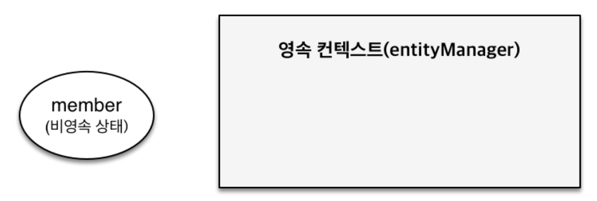

```java
// 객체를 생성한 상태(비영속)
Member member = new member();
member.setId("member1");
member.setUsername("회원1");
```


### 🐳 영속

> 영속성 컨텍스트에 엔티티 객체가 들어가게 되면서, 영속 상태로 들어감.

* 영속 상태 : entityManager 안에 있는 "영속성 컨텍스트" 라는 곳을 통해, 객체가 관리되는 상태.
    - 1차 캐시에 저장된 상태
    - 크게 두가지로 영속 상태가 될수 있는데,
        - 1. 엔티티를 저장할 때, 1차 캐시에 저장.
        - 2. db에서 조회할 때, 1차 캐시에 저장.

> db로 sql을 날리는 상태는 아니다!! -> db에 저장❌

> 실제 db에 저장되는 시점은 transaction이 commit되는 시점이다.

<br>
<br>

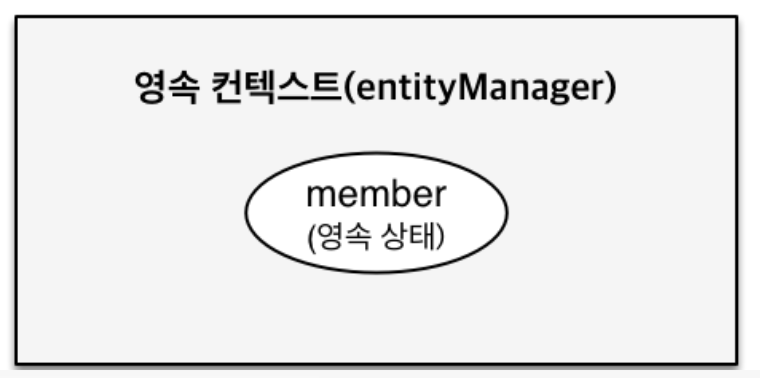

```java
// 객체를 생성한 상태(비영속)
Member member = new member();
member.setId("member1");
member.setUsername("회원1");

EntityManager em = mef.createEntityManager();
em.getTransaction().begin();

// 객체를 저장한 상태(영속)
em.persist(member);
```

<br>
<br>


### 🐳 준영속

> 영속성 컨텍스트에서만 지워지는 상태.

```java
em.detach(member);
```

<br>
<br>


### 🐳 삭제

> 실제 db에서도 삭제되는 상태.

```java
em.remove(member);
```


<br>
<br>


## 🐳 영속성 컨텍스트의 이점

> 어플리케이션과 db사이에 중간계층이 존재 함으로써, 버퍼링이나 캐싱 등의 작업을 추가할 수 있다.

* 1차 캐시
* 동일성(identity) 보장
* 트랜잭션을 지원하는 쓰기 지연 (transactional write-behind)
* 변경감지 (dirty checking)
* 지연 로딩(lazy loading)


<br>
<br>
<br>
<br>
<br>

## 🌈 영속성 컨텍스트 2

<br>
<br>

### 🐳 엔티티 조회, 1차 캐시

<br>
<br>

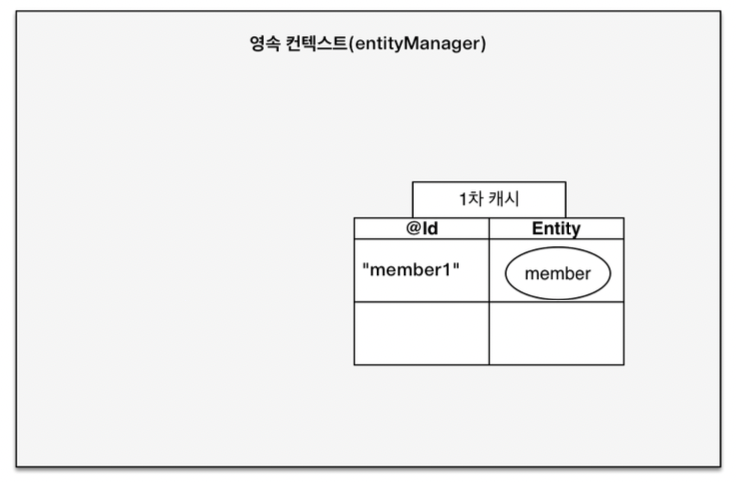

```java
EntityManager em = mef.createEntityManager();
em.getTransaction().begin();        // 트랜잭션에 기록 시작.

// 객체를 생성한 상태(비영속)
Member member = new member();
member.setId("member1");
member.setUsername("회원1");

// 객체를 저장한 상태(영속)
em.persist(member);
```


* 영속 컨텍스트안에는 1차 캐시로 객체들을 기록하는 mapping table이 존재.
    - 일단은 "영속 컨텍스트 == 1차 캐시" 라고 생각해도 무방. 
    - 키값 -> <mark>@Id</mark> 는 db의 pk로 설정한 id값이 저장됨.
    - 값 -> entity 객체 자체가 값.

<br>
<br>
<br>

### 🐳 1차 캐시에서 조회
<br>

> 이미 1차 캐시에 존재하는 객체를 조회할 때.

<br>

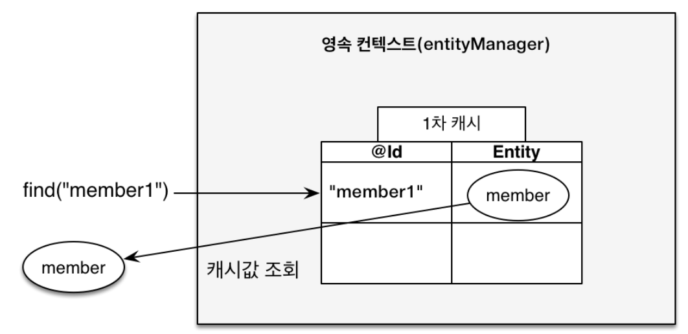

```java
 Member member = new Member();
 member.setId("member1");
 member.setUsername("회원1");

 //1차 캐시에 저장됨
 em.persist(member);

 //1차 캐시에서 조회
 Member findMember = em.find(Member)
```

<br>
<br>
<br>


### 🐳 데이터베이스에서 조회

<br>

> 1차 캐시에는 존재하지 않고, db에 저장되어있는 데이터 조회시.

> db 에서 member2 의 객체를 찾아오고 1차 캐시에 저장을 시킨뒤 반환.

> 이후 다시 member2를 조회한다면, 1차 캐시에 있는 member2를 반환.


<br>

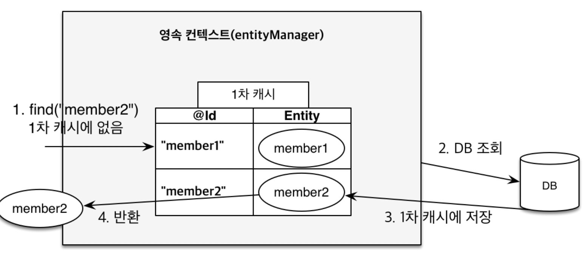

<br>

```java
Member findMember2 = em.find(Member.class, "member2");
```

<br>
<br>
<br>


> 🎯  보통 하나의 요청 (transaction)에는 하나의 entityManager -> 하나의 영속성 컨텍스트가 생성되고, 해당 요청의 비지니스 로직이 끝난다면 entityManager가 삭제되고, 1차 캐시 또한 사라지게 되므로, 여러명의 고객이 사용하는 캐시는 ❌ <br>
> 따라서 성능의 이점을 크게 가져갈수 있는 부분은 ❌ <br>
> 🎯 애플리케이션 전체에서 공유하는 캐시는 jpa에서는 <mark>"2차 캐시"</mark>라고 부름.


<br>
<br>
<br>


### 🐳 영속 엔티티의 동일성 보장.

<br>

> 1차 캐시로 반복 가능한 읽기 등급의 트랜잭션 격리 수준을 데이터베이스가 아닌 애플리케이션 차원에서 제공.

> 마치 자바 컬렉션에 저장된 객체를 꺼내서 비교하는 것과 유사.

<br>

```java
Member a = em.find(Member.class, "member1");
Member b = em.find(Member.class, "member1");

System.out.println(a == b); //동일성 비교 true
```


<br>
<br>
<br>


### 🐳 엔티티 등록 -  트랜잭션을 지원하는 쓰기 지연.

<br>

> 하나의 entity에 작업을 하는 모든 sql 명령을 하나의 transaction(하나의 작업단위)에 차곡차곡 저장을 한뒤, commit시점에 모든 명령을 수행.

* 이런 식으로 동작하는 이유!!
    - persist() 때마다 db에 쿼리문이 나간다면, 최적화할 수 있는 여지가 없다.
    - 버퍼링 기능을 사용가능 (모았다가 한방에 쭉!!~)

* `<property name = "hibernate.jdbc.batch_size" value = "10"/>` 에서 한번에 모아서 sql를 쏠 수 있는 명령의 갯수를 지정할 수 있음.

<br>

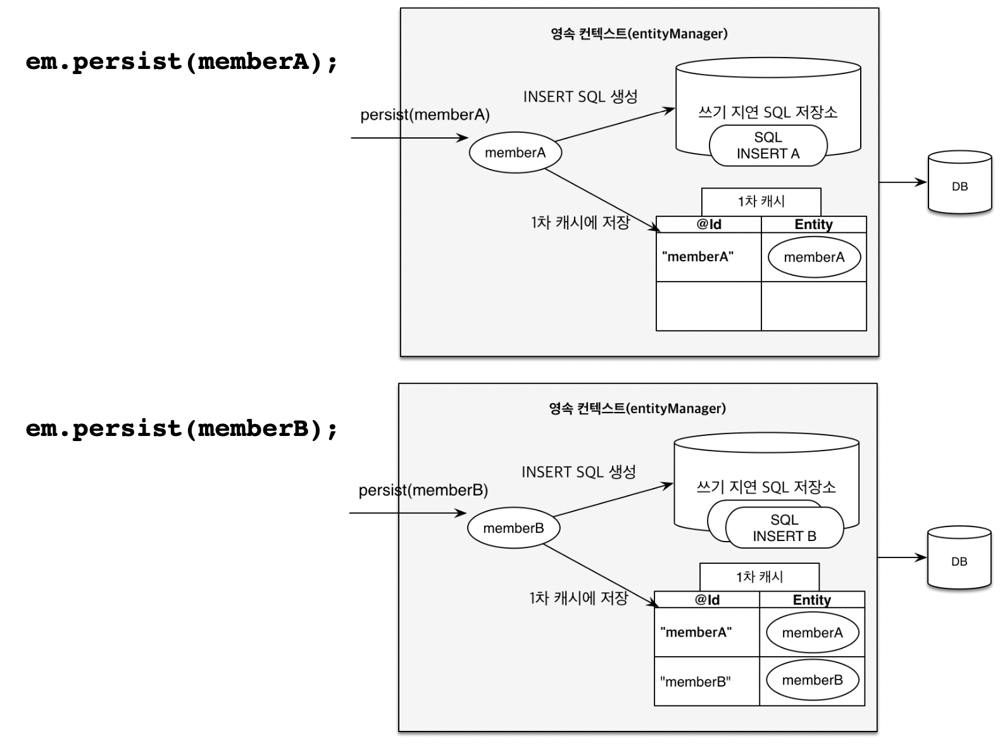
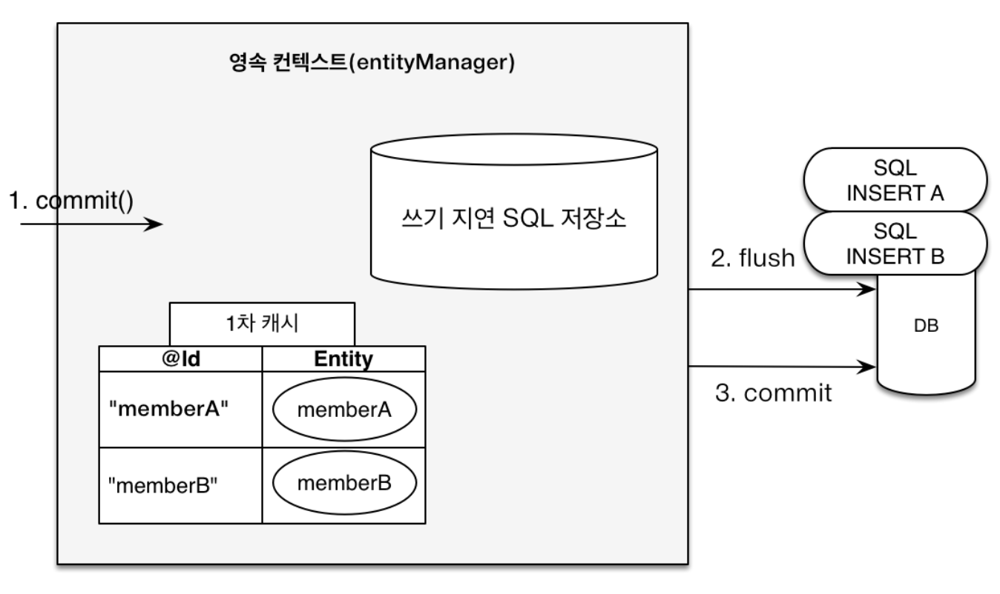
<br>


```java
EntityManager em = emf.createEntityManager();
EntityTransaction transaction = em.getTransaction();
//엔티티 매니저는 데이터 변경시 트랜잭션을 시작해야 한다.

transaction.begin(); // [트랜잭션] 시작
em.persist(memberA);
em.persist(memberB);
//여기까지 INSERT SQL을 데이터베이스에 보내지 않는다.

//커밋하는 순간 데이터베이스에 INSERT SQL을 보낸다.
transaction.commit(); // [트랜잭션] 커밋
```

<br>
<br>
<br>

### 🐳 엔티티 수정 - 변경 감지

<br>

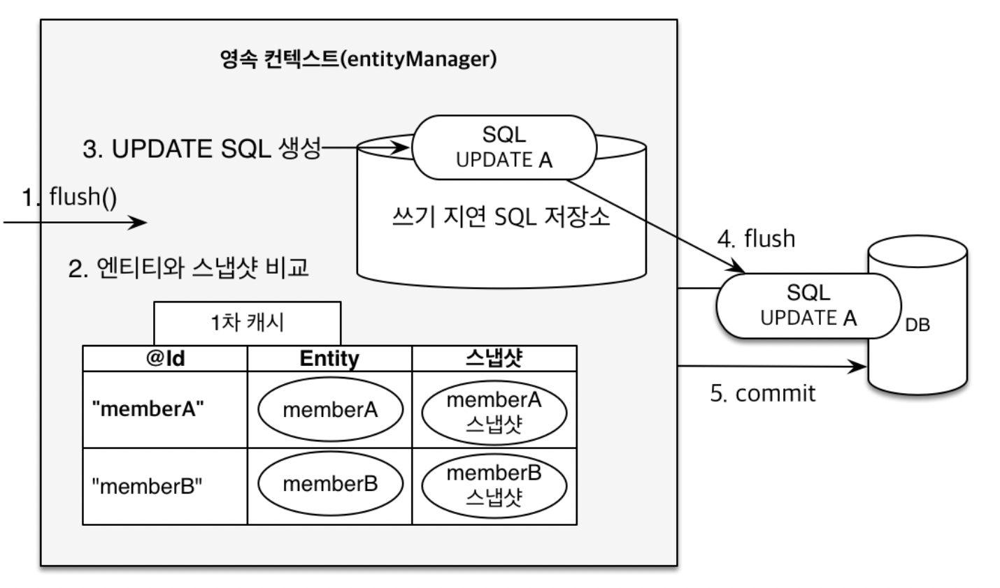

<br>

* 스냅샷 : 객체(값)을 db에서 읽어온 최초 시점에 값들을 저장해논다.

> 1. jpa transaction 이 commit 될 시점에 내부적으로 flush()함수가 호출됨.

> 2. 엔티티를 스냅샷과 비교. -> 변경 감지 부분

> 3. 변경된 부분이 있다면 sql문이 쓰기 지연 SQL저장소에 추가된다.

> 4. flush : 함수가 아니라, db로 sql를 모두 실행시킨다는 의미.

> 5. commit

> 자바 컬렉션을 다루듯이 생각하고 객체를 다뤄야 한다!!

<br>

```java
EntityManager em = emf.createEntityManager();
EntityTransaction transaction = em.getTransaction();
transaction.begin(); // [트랜잭션] 시작

// 영속 엔티티 조회
Member memberA = em.find(Member.class, "memberA");

// 영속 엔티티 데이터 수정
memberA.setUsername("hi");
memberA.setAge(10);

//em.update(member) 이런 코드가 있어야 하지 않을까?

transaction.commit(); // [트랜잭션] 커밋
```

<br>
<br>
<br>

### 🐳 엔티티 삭제

> 위의 매커니즘들과 동일하게 작용.

```java
//삭제 대상 엔티티 조회
Member memberA = em.find(Member.class, “memberA");

//엔티티 삭제
em.remove(memberA); 
```


<br>
<br>
<br>
<hr>
<br>
<br>
<br>


## 🌈 플러시

<br>

> 영속성 컨텍스트의 변경내용을 데이터베이스에 반영하는 작업.

### 🐳 플러시 발생

* 변경 감지.

* 수정된 엔티티 쓰기 지연 SQL 저장소에 등록.

* 쓰기 지연 SQL 저장소의 쿼리들을 데이터베이스에 전송.

<br>

### 🐳 영속성 컨텍스트를 플러시하는 방법

* em.flush() - 직접 호출.

* 트랜잭션 커밋 - 플러시 자동 호출.

* JPQL 쿼리 실행 - 플러시 자동 호출.


### 🐳 플러시 모드 옵션


```java
em.setFlushMode(FlushModeType.COMMIT)
```

* FlushmodeType.AUTO
    - 커밋이나 쿼리를 실행할 때 플러시 (기본값)

* FlushModeType.COMMIT
    - 커밋말 때만 플러시

> 🎯 그냥 기본값을 변경하지 말자!!!


### 🐳 플러시의 중요 특징

* 영속성 컨텍스트를 비우지는 않는다!!

* 영속성 컨텍스트의 변경내용을 데이터베이스에 동기화

* 트랜잭션이라는 작업 단위가 중요! -> 커밋 직전에만 동기화 하면 됨.


<br>
<br>
<br>
<br>


## 🌈 준영속 상태

* 영속 -> 준영속

* 영속 상태의 엔티티가 영속성 컨텍스트에서 분리(detach)
    - 커밋시점에 해당 엔티티의 변경이 되었어도 반영이 되지않음.

* 영속성 컨텍스트가 제공하는 기능을 사용 ❌

### 🐳 준영속 상태로 만드는 방법

* em.detach(entity)
    - 특정 엔티티만 준영속 상태로 전환

* em.clear()
    - 영속성 컨텍스트를 완전히 초기화
    - 전부 날려버림.

* em.close()
    - 영속성 컨텍스트를 종료.