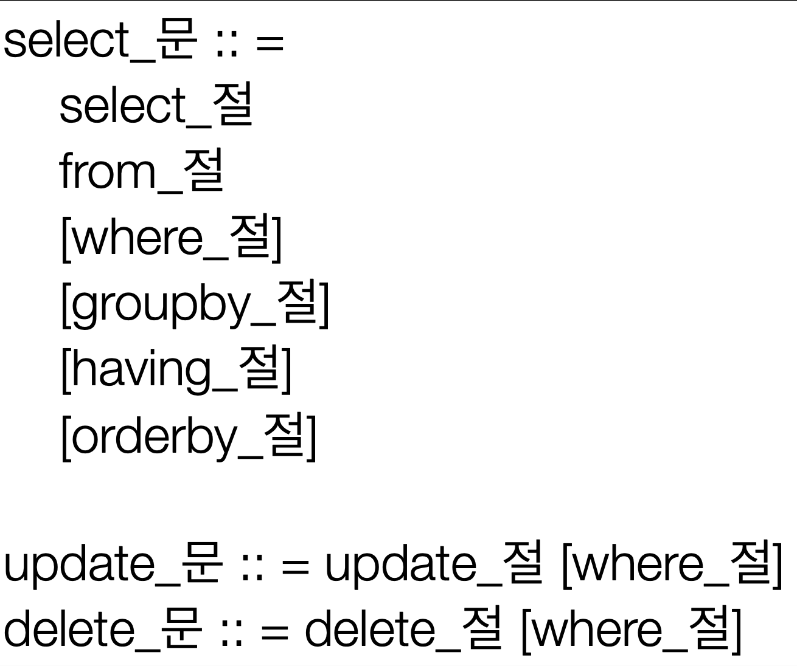

# JPQL 기본문법과 기능


<br>
<br>
<br>
<br>

## 🌈 JPQL 소개

* JPQL은 객체 지향 쿼리 언어다.  따라서 테이블 대상으로 쿼리 하는 것이 아니라 엔티티 객체를 대상으로 쿼리한다.

* JPQL은 SQL을 추상화해서 특정 데이터베이스 SQL에 의존하지 않는다.

* 🍀 JPQL은 결국 SQL로 변환됨. 

<br>
<br>
<br>


## 🌈 JPQL 문법과 쿼리 API(기본 문법)




> select m from Member as m where m.age > 18<br>
    - Member가 객체.

* 엔티티와 속성은 대소문자 구분 ⭕️. (Member, age)

* JPQL 키워드는 대소문자 구분 ❌. (SELECT, FROM, where)

* 엔티티 이름 사용. 테이블 이름이 아님.(Member)

* 🍀 별칭은 필수(m) (as는 생략 가능.)


<br>
<hr>

<br>
<br>


### 🐳 집합과 정렬

```java
select 
    COUNT(m),       // 회원 수
    SUM(m.age),     // 나이 합
    AVG(m.age),     // 평균 나이
    MAX(m.age),     // 최대 나이
    MIN(m.age),     // 최소 나이
from Member m
```

* GROUP BY, HAVING
* ORDER BY


<br>
<hr>

<br>
<br>

### 🐳 쿼리의 종류

* TypeQuery: 반환 타입이 명확할 때 사용.
```java
TypedQuery<Member> query = em.createQuery("SELECT m FROM Member m", Member.class);
```
* Query : 반환 타입이 명확하지 않을 때 사용.
    - 두 가지를 가져올때, 그 둘의 타입이 다를 경우(String, int) -> 아래의 예
```java
Query query = em.createQuery("SELECT m.username, m.age from Member m");
```

<br>
<hr>

<br>
<br>


### 🐳 결과 조회 API

* query.getResultList(): 결과가 하나 이상일 때, 리스트 반환
    - 결과가 없으면 리스트 반환.

* query.getSingleResult(): 결과가 정확히 하나, 단일 객체 반환.
    - 결과가 없으면 : javax.persistence.NoResultException
    - 둘 이상이면 : javax.persistence.NonUniqueResultException

<br>
<hr>

<br>
<br>


### 🐳 파라미터 바인딩

* 🍀 이름 기준 
```java
em.createQuery("select m from Member m where m.username = :username");
query.setParameter("username", usernameParam);
```

* ❌ 위치 기준 - 쓰지말자.  ❌
```java
em.createQuery("select m from Member m where m.username =? 1");
query.setParameter(1, usernameParam);
```

<br>
<hr>

<br>
<br>


### 🐳 프로젝션 - 하나의 값타입 조회

* SELECT 절에 조회할 대상을 지정하는 것 => 단순히 어떤 데이터를 가져올지 지정하는 것.


* 프로젝션 대상: 엔티티, 임베디드 타입, 스칼라 타입(숫자, 문자등 기본 데이터 타
입)
    - 관계형 db는 기본형 데이터 타입만 가능한데, 얘는 다 가능!


* SELECT m FROM Member m -> 엔티티 프로젝션 
    - 쿼리문에 의해서 나온 엔티티 객체들은 모두 영속성 컨텍스트에 의해 관리됨!!

<br>

* SELECT m.team FROM Member m -> 엔티티 프로젝션
    - team을 꺼내올꺼면 타입도 member가 아닌 team으로.
    - list를 뽑은 여러 엔티티 객체들도 모두 영속성 컨텍스트로 관리 대상이 됨.
    - 조인을 명시적 조인으로 써는 이유는, 조인은 튜닝을 해서 성능 최적화를 시킬요소가 많기 때문에 명확히 써서 가독성을 높히는 방향이 좋다.

    ```java
    List<Team> result = em.createquery("select m.team from Member m", Team.class).getResultList();
    // 위의 코드는 "묵시적 조인"이라고 하는데 사실은 join은 sql과 똑같이 사용하는 "명시적 조인"을 사용하는게 좋다. ("명시적 조인" => join 을 기존의 sql문처럼 명확히 적어주기)
    ```

<br>


* SELECT m.address FROM Member m -> 임베디드 타입 프로젝션
    ```java
    em.createquery("select m.address from Member m", Address.class).getResultList();
    ```

<br>

* SELECT m.username, m.age FROM Member m -> 스칼라 타입 프로젝션 DISTINCT로 중복 제거
    ```java
    em.createquery("select dinstinct m.username, m.age from Member m").getResultList();
    // 자유롭게 써버리는 타입
    ```

<br>


* DISTIMCT로 중복 제거 가능.

<br>

<hr>

<br>
<br>

### 🐳 프로젝션 - 여러값 조회.

* 1. Query 타입으로 조회

<br>

* 2. Object[] 타입으로 조회.

    ```java
    List<Object[]> resultList = em.createQuery("select m.username, m.age from Member m").getResultList();

    Object[] result = resultList.get(0);            // 여러 객체중 첫번째 객체만 확인
    System.out.println("username = " + result[0]);
    System.out.println("age = " + result[1]);
    ```

<br>

* 3. new 명령어로 조회. 🍀(제일 깔끔한 방법)
    - 단순 값을 DTO로 바로 조회.
    - 패키지 명을 포함한 전체 클래스 명을 입력 (이게 단점 ㅠㅠ 너무 길어짐)
        - 🍀 결국 이런 부분은 추후 QueryDSL를 통해 모두 해결이 가능!
    - 순서와 타입이 일치하는 dto생성자 필요 -> 직접 dto 만들어서 사용.

    ```java
    List<MemberDTO[]> result = em.createQuery("select new jpabook.jpql.MemberDTO(m.username, m.age) from Member m").getResultList();

    MemberDTO memberDTO = result.get(0);
    System.out.println("username = " + memberDTO.getUsername());
    System.out.println("age = " + memberDTO.getAge());
    ```

<br>
<hr>

<br>
<br>


### 🐳 페이징

* JPA는 페이징을 다음 두 API로 추상화.
    - 매우 깔끔하게 해결 가능!!

* setFirstResult(int startPosition) : 조회 시작 위치 (0부터 시작).

* setMaxResults(int maxResult) : 조회할 데이터 수.

```java
String jpql = "select m from Member m order by m.name desc";
List<Member> resultList = em.createQuery(jpql, Member.class)
                            .setFirstResult(0)
                            .setMaxResults(10)
                            .getResultList();
// 0번째 데이터부터 10개 가져옴.
```

<br>
<hr>

<br>
<br>

### 🐳 조인

* 내부 조인 
    - SELECT m FROM Member m [INNER] JOIN m.team t

* 외부 조인
    - SELECT m FROM Member m LEFT [OUTER] JOIN m.team t

* 세타 조인 ("막 조인")
    - 카타시안 곱으로 모두 곱한뒤에 해당 절만 뽑아오기.
    - select count(m) from Member m, Team t where m.username = t.name


<br>
<br>
<br>


#### 🚀 ON절

> 연관관계가 없는 엔티티들도 모두 외부 조인이 가능!!

> native Query사용을 완전히 배재 할 수 있게 만듬.

* 1. 조인 대상 필터링.
    - 예) 회원과 팀을 조인하면서, 팀 이름이 A인 팀만 조인.
    ```java
    // JPQL
    SELECT m, t FROM 
    Member m LEFT JOIN m.team t ON t.name = 'A';

    // SQL
    SELECT m.*, T.* FROM 
    Member m LEFT JOIN Team t ON TEAM_IN = t.id and t.name = 'A';
    ```

* 2. 🍀 연관관계 없는 엔티티 외부 조인.(라이버네이트 5.1부터)
    - 물론 내부조인도 가능!!
    - 예) 예) 회원의 이름과 팀의 이름이 같은 대상 외부 조인

    ```java
    //JPQL
    SELECT m, t FROM
    Member m LEFT JOIN Team t ON m.username = t.name 
    //SQL
    SELECT m.*, t.* FROM 
    Member m LEFT JOIN Team t ON m.username = t.name
    ```

<br>
<br>
<br>
<hr>


### 🔥 [JOIN의 ON절] VS [WHERE절] 의 차이

* [참고 블로그](https://okimaru.tistory.com/m/251#:~:text=%EA%B0%84%EB%8B%A8%ED%95%98%EA%B2%8C%20%EC%96%98%EA%B8%B0%ED%95%98%EB%A9%B4%20LEFT,%EB%8F%84%20%EA%B2%B0%EA%B3%BC%EA%B0%92%EC%97%90%20%EB%82%98%EC%98%A8%EB%8B%A4.&text=JOIN%20ON%20%EC%A0%88%EC%97%90%20AND%20%EC%A1%B0%EA%B1%B4%EC%9D%84%20%EC%A4%AC%EB%8D%98%EA%B2%83%EA%B3%BC%20%EA%B2%B0%EA%B3%BC,%EB%A7%8C%20%EA%B2%B0%EA%B3%BC%EA%B0%92%EC%97%90%20%EB%82%98%EC%98%A8%EB%8B%A4.)


<hr>

<br>
<br>
<br>


### 🐳 서브쿼리

* 나이가 평균보다 많은 회원

    ```java
    select m from Member m
    where m.age > (select avg(m2.age) from Member m2)
    ```

> 본 쿼리와 서브쿼리의 같은 테이블이여도 다른 이름으로 매칭 시켜야 성능이 잘나옴.(m, m2)

<br>

* 한 건이라도 주문한 고객

    ```java
    select m from Member m
    where (select count(o) from Order o where m = o.member) > 0
    ```

> 위의 코드처럼 본쿼리의 테이블 이름을 그대로 끌거서 서브쿼리에서 사용하면 성능이 잘 안나옴.

<br>


#### 🚀 서브쿼리 지원 함수


* [NOT] EXISTS (subquery): 서브쿼리에 결과가 존재하면 참 
    ```java
    // 팀A 소속인 회원
    select m from Member m
    where exists (select t from m.team t where t.name = '팀A');
    ```

<br>

* {ALL | ANY | SOME} (subquery)
    ```java
    // 전체 상품 각각의 재고보다 주문량이 많은 주문들
    select o from Order o 
    where o.orderAmount > ALL (select p.stockAmount from Product p);
    ```
<br>


* ALL 모두 만족하면 참
    ```java
    //어떤 팀이든 팀에 소속된 회원 
    select m from Member m 
    where m.team = ANY (select t from Team t)
    ```
<br>

* ANY, SOME: 같은 의미, 조건을 하나라도 만족하면 참.

* [NOT] IN (subquery): 서브쿼리의 결과 중 하나라도 같은 것이 있으면 참.

<br>


#### 🚀 JPA 서브 쿼리 한계

* JPA는 WHERE, HAVING 절에서만 서브쿼리 사용 가능.

* SELECT 절도 가능(하이버네이트에서 지원)

* FROM 절의 서브쿼리는 현재 JPQL에서 불가능
    - 조인으로 풀 수 있으면 풀어서 해결.

<br>
<br>
<hr>
<br>
<br>

### 🐳 JPQL 타입 표현과 기타식

<br>
<br>


#### 🚀 JPQL 타입 표현

* 문자: ‘HELLO’, ‘She’’s’ 

* Boolean: TRUE, FALSE

* 숫자: 10L(Long), 10D(Double), 10F(Float)

* ENUM: jpabook.MemberType.Admin (패키지명 포함해서 다 적어줘야 함.) 
    - 🍀 QeuryDSL 사용시, 모두 자바 코드를 이용해 간편하게 해결 가능.
    ```java
    "SELECT m.username FROM MEMBER m WHERE m.type = jpql.MemberType.ADMIN";
    ```

* 엔티티 타입: TYPE(m) = Member (상속 관계에서 사용)

#### 🚀 JPQL 기타

* SQL과 문법이 같은 식

* EXISTS, IN

* AND, OR, NOT

* =, >, >=, <, <=, <> 

* BETWEEN, LIKE, IS NULL


<br>
<br>
<hr>

<br>
<br>

### 🐳 조건식(CASE 식)

* 기본 CASE 식

    ```java
    select 
        case when m.age <= 10 then '학생요금'
            when m.age >= 60 then '경로요금'
            else '일반요금'
        end
    from Member m
    ```

* 단순 CASE 식

    ```java
    select 
        case t.name
            when '팀A' then '인센티브 110%'
            when '팀B' then '인센티브 120%'
            else '인센티브 105%'
        end
    from Team t
    ```

* COALESCE: 하나씩 조회시, null이 아니면 반환.

    - 하나씩 조회해서 null이 아니면 반환 사용자 이름이 없으면 "이름 없는 회원"을 반환
    ```java
    // 사용자 이름이 없으면 '이름 없는 회원'을 반환
    select coalesce(m.username,'이름 없는 회원') from Member m
    ```

* NULLIF: 두 값이 같으면 null 반환, 다르면 첫번째 값 반환

    ```java
    // 사용자 이름이 ‘관리자’면 null을 반환하고 나머지는 본인의 이름을 반환 
    select NULLIF(m.username, '관리자') from Member m
    ```

<br>
<br>
<br>

### 🐳 JPQL 기본 함수

* CONCAT - 문자열 더하기

* SUBSTRING - 문자열 자르기

* TRIM - 공백없애기

* LOWER, UPPER

* LENGTH

* LOCATE - 문자열안에서 문자열 인덱스 찾기

* ABS, SQRT, MOD - 절대값, 제곱 ,나머지

* SIZE, INDEX(JPQ 용도) - 컬렉션의 크기, (index는 거의 사용안함..)

#### 🚀 사용자 정의 함수

* 하이버네이트는 사용전 방언에 추가해야 한다.
* 사용하는 DB 방언을 상속받고, 사용자 정의 함수를 등록한다.

    ```java
    select function('group_concat', i.name) from Item i
    ```

