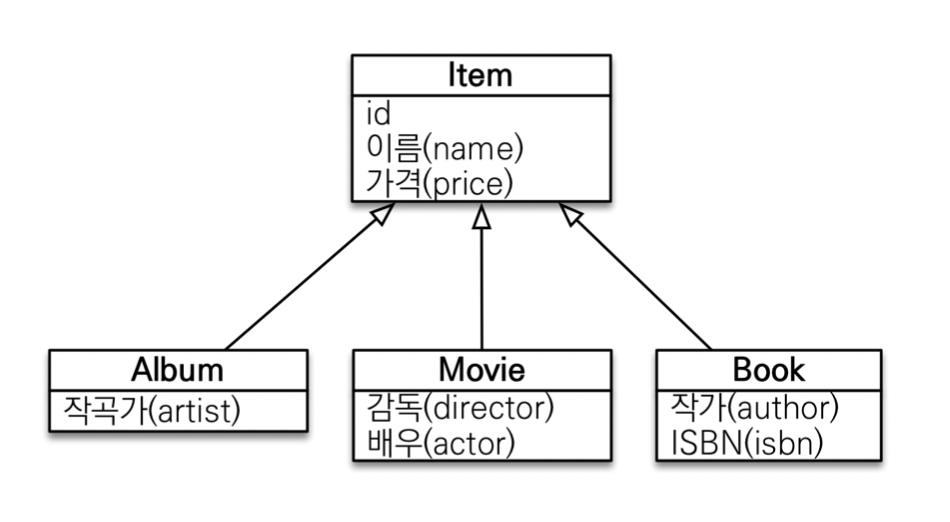

# JPQL 

<br>
<br>
<br>

## 🌈 중급 문법

<br>
<br>
<br>

### 🐳 경로 표현식

> 점(.)을 찍어서 객체 그래프를 탐색하는 것.

```java
select m.username       // 상태 필드
    from Member m
        join m.team t       // 단일 값 연관 필드
        join m.orders o     // 컬렉션 값 연관 필드
    where t.name = '팀A'
```

* 경로 표현식 용어 정리

    - 상태 필드(state field): 단순히 값을 저장하기 위한 필드.(ex: m.username)
    - 연관 필드(association field) : 연관관계를 위한 필드
        - 단일 값 연관 필드: @ManyToOne, @OneToOne, 대상이 엔티티(ex:m.team)
        - 컬렉션 값 연관 필드: @OneToMany, @ManyToMany, 대상이 컬렉션(ex: m.orders)

* 경로 표현식 특징

    - 상태 필드: 경로 상태의 끝, 탐색 ❌(더이상 점을 찍어서 탐색이 불가능 하다)
    - 단일 값 연관 경로: 묵시적 내부 조인 발생, 탐색 ⭕️
    - 컬렉션 값 연관 경로: 묵시적 내부 조인 발생, 탐색 ❌
        - 탐색은 불가. size 정도는 가져올 수 있음.
        - FROM 절에서 명시적 조인을 통해 별칭을 얻으면 별칭을 통해 탐색 가능.

<br>


#### 🎯 상태 필드 경로 탐색

```java
// jpql
select m.username, m.age from Member m

//sq;
select m.username, m.age from Member m
```
<br>


#### 🎯 단일 값 연관 경로 탐색.

* 항상 묵시적 조인이 발생하기 때문에, 튜닝이 어렵다.

* 1 + N 문제가 발생할 수 있으므로, 매우 위험!

```java
//jpql
select o.member from Order o

// sql
SELECT m.* FROM Orders o INNER JOIN Member m ON o.member_id = m.id
```
<br>


#### 🎯 경로 표현식 예제

```java
SELECT o.member.team from Order o       // 가능
SELECT t.members from TEam        // 가능
SELECT t.members.username from Team t       // 불가
SELECT m.username from Team t join t.members m      //가능
```

<br>


#### 🍀 경로 탐색을 사용한 묵시적 조인 시 주의사항

* 항상 내부 조인
    - 외부 조인은 명시적 조인으로 가능.

* 컬렉션은 경로의 끝, 명시적 조인을 통해 별칭을 얻어야 함.

* 경로 탐색은 주로 SELECT ,WHERE 절에서 사용하지만, 묵시적 조인으로 인해 SQL의 FROM(JOIN)절에 영향을 줌.

<br>
<br>

#### 🍀 실무 조언 

* 가급적 묵시적 조인 대신에 명시적 조인 사용.

* 조인은 SQL 튜닝에 중요 포인트.

* 묵시적 조인은 조인이 일어나는 상황을 한누에 파악하기 어려움.


<br>
<br>
<hr>
<br>
<br>


### 🐳 패치 조인 🍀🍀🍀

* SQL 조인 종류 ❌.

* JPQL 에서 성능 최적화를 위해 제공하는 기능.

* 연관된 엔티티나 컬렉션을 SQL 한번에 함께 조회하는 기능.

* join fetch 명령어 사용.

* 페치 조인 ::=[LEFT[OUTER] | [INNER]] JOIN FETCH 조인경로.

* 🍀 사실상 즉시 로딩과 같은 방식으로 동작하지만, 내가 가져오고 싶은 엔티티의 값을 동적으로 설정하여, 가져오고 싶을 때만 가져올 수 있음!! 🍀

* 기존의 모든 (fetch = fetchType.LAZY) 설정으로 인해 실제 엔티티가 아닌 프록시 객체가 들어온 상황이고, 실제적으로 get이용해 값을 뽑아낼 때만, db에 쿼리를 날리는 순서인데, 
 
 <br>


#### 🎯 엔티티 페치 조인

* 회원을 조회하면서 연관된 팀도 함께 조회.(SQL 한번에)

* SQL을 보면 회원 뿐만 아니라 팀(T.*) 도 함께 SELECT

```java
// jpql
SELECT m FROM Member m JOIN FETCH m.team

//sql
SELECT M.*, T.* FROM Member m INNER JOIN Team t ON m.TEAM_ID = T.ID
```


#### 🎯 컬렉션 패치 조인

* 일대다 관계, 컬렉션 페치 조인.

```java
// JPQL
SELECT t
FROM Team t JOIN FETCH t.members WHERE t.name = '팀A'

// SQL
SELECT T.*, M.*
FROM TEAM T
INNER JOIN MEMBER M ON T.ID=M.TEAM_ID WHERE T.NAME = '팀A'
```

🍀 일대다 연관 매핑에서는 중복이 발생할 수 밖에 없음!! -> 아래 [TEAM JOIN MEMBER] 표를 참고.(JOIN 되고 난 후의 표를 상상하자.)

🍀 회원이 많게 되면, 수많은 중복이 발생함! -> distinct로 해결해야 함.


<br>

#### 🎯 페치 조인과 DISTINCT

* 🍀 <mark>일대다 조인</mark>에서는 데이터가 뻥튀기 된다!! 암기!🍀

* SQL의 DISTINCT는 중복된 결과를 제거하는 명령.

* JPQL의 DISTINCT 2가지 기능 제공.
    - SQL에 DISTINCT를 추가.(SQL DISTINCT로만으로 위의 중복을 해결하기 힘듬.)
        ```java
        select distinct t
        from Team t join fetch t.members where t.name = ‘팀A’
        ```
        
        - SQL에 DISTINCT를 추가하지만 데이터가 다르므로 SQL 결과에서 중복제거 실패.
            
        - column의 모든 값들이 같아야 sql로 중복이 제거될수 있기 때문.

    - 애플리케이션에서 엔티티 중복 제거.
        - 같은 식별자를 가진 Team 엔티티 제거.

            


#### 🎯 페치조인과 일반 조인의 차이!!

* 일반 조인
    - 연관된 엔티티를 함께 조회하지 않는다.
    - select에서 가져오라고 한 엔티티에 해당하는 테이블만 퍼올린다.
    - 따라서 연관매핑된 엔티티를 가져올때마다 sql이 따로 나가게됨.
    - 연관 엔티티는 (fetchType = LAZT)시 프록시 객체로 가져오므로, 실제적으로는 데이터가 없는셈.

* 페치조인
    - 쿼리 한번으로 연관매핑된 엔티티까지 한번에 퍼올린다.(즉시 로딩)
    - 객체 그래프를 SQL 한번에 조회하는 개념.


#### 🎯 페치 조인의 특징과 한계

* 페치 조인 대상에슨 별칭을 줄 수 없다.
    - 하이버네이트는 가능. 가급적 사용 ❌

* 둘 이상의 컬렉션(일대다대다 같은 느낌)은 페치 조인 할 수 없다.

* 컬렉션을 페치 조인하면 페이징 API사용할 수 없다.
    - 일대일, 다대일 같은 단일 값 연관 필드들은 조인 페치해도 페이징 가능.
    - 하이버네이트 경고 로그를 남기고 메모리에서 페이징(매우 위험.)


* 엔티티에 직접 적용하는 글로벌 로딩 전략(fetch = FetchType.LAZY)보다 우선함.

* 실무에서 글로벌 로딩 전략은 모두 지연 로딩.

* 최적화가 필요한 곳은 페치 조인 적용.


#### 🎯 페치조인 - 정리

* 모든 것을 페치 조인으로 해결할 수는 없음.

* 페치 조인은 객체 그래프를 유지할 때 사용하면 효과적.

* 여러 테이블을 조인해서 엔티티가 가진 모양이 아닌 전혀 다른 결과를 내야 하면, 페치조인 보다는 일반 조인을 사용하고 필요한 데이터들만 조회해서 DTO로 반환하는 것이 효과적.


<Br>
<Br>
<Br>
<Br>


### 🐳 다형성 쿼리
<br>

 

#### 🎯 TYPE 
    
* 조회 대상을 특정 자식으로 한정.

* 예) Item 중에 Book, Movie를 조회해라.

```java
// jpql
select i from Item i where type(i) IN (Book, Movie)

// sql
select i from Item i where i.DTYPE in ('B', 'M')
```

#### 🎯 TREAT

* 자바의 타입 캐스팅과 유사.

* 상속 구조에서 부모 타입을 특정 자식 타입으로 다룰 때 사용.

* FROM, WHERE, SELECT(하이버 네이트 지원) 사용.

```java
// jpql
select i from Item i 
where treat(i as Book).author = 'Kim'

//sql
select i.* from Item i
where i.DTYPE = 'B' and i.auther = 'Kim'
```


<br>
<br>
<br>

### 🐳 엔티티 직접 사용 - 기본 키 값

* JQPL 에서 엔티티를 직접 사용하면, SQL에서 해당 엔티티의 기본 키값을 사용.

```java
// jpql
select count(m.id) from Member m        // 엔티티를 직접 사용.
select count(m) from Member m           // 식별자를 직접 전달.
// 위의 두 jpql은 동일한 방식

// sql
select count(m.id) as cnt from Member m
```


* 외래 키 값도 동일

    


<br>
<br>
<br>


### 🐳 Named 쿼리

* 미리 정의해서 이름을 부여해두고 사용하는 JPQL

* 정적 쿼리.

* 어노테이션, XML에 정의.

* 애플리케이션 로딩 시점에 초기화 후 재사용.

* 🍀 애플리케이션 로딩 시점에 쿼리를 검증.
    - 쿼리도 결국 문자열인데, 네임드 쿼리로 설정을 해놓으면, 로딩시점에 파싱할 때 오류를 잡아줄 수 있다.

* 🍀 추후 데이터 JPA에서 "이름 없는 Named 쿼리"가 결국 이 Named 쿼리가 되는 것.

* XML에서도 정의가 가능한데, 그러면 XML이 우선권을 가진다. 

```java
@Entity
@NamedQuery(
    name = "Member.findByUsername",     // 쿼리에 대한 이름 부여
    query = "select m from Member m where m.username = :username"
)
public class Member{

}

List<Member> resultList =
    em.createNamedQuery("Member.findByusername", Member.class)
        .setParameter("username", "회원")
        .getResultList();
```


<br>
<br>
<br>

### 🐳 벌크 연산

* pk조건이 없는 SQL의 update와 delete문이라고 생각하자.
    - 여러 row 를 변경하거나 삭제.

* 예) 재고가 10개 미만인 모든 상품의 가격을 10% 상승하려면?
    - JPA 변경 감지 기능으로 실행하려면 너무 많은 SQL 실행.
        - 1. 재고가 10개 미만인 상품을 리스트로 조회.
        - 2. 상품 엔티티의 가격을 10% 증가.
        - 3. 트랜잭션 커밋 시점에 변경 감지가 동작.

    - 변경된 데이터가 100건이라면 100번의 UPDATE SQL 실행.

* JPA가 벌크성보다는 실시간성에 좀더 최적화되어 있기 때문에, 벌크 연산이 따로 존재.

* 쿼리 한 번으로 여러 테이블 로우 변경(엔티티)

* excuteUpdate()의 결과는 영향받은 엔티티 수 반환.

* UPDATE, DELETE 지원

* INSERT()

```java
String qlString = "update Product p " +
                    "set p.price = p.price * 1.1 " +
                    "where p.stockAmount < :stockAmount";

int resultCount = em.createQuery(qlString)
                    .setParameter("stockAmount", 10)
                    .executeUpdate();
```


#### 🎯 벌크 연산의 주의

* 벌크 연산은 영속성 컨텍스트를 무시하고, 데이터베이스에 직접 쿼리를 날림.
    - 벌크 연산후 영속성 컨텍스트를 갱신하지 않고, 데이터를 불러오면, 변경 전 데이터가 불러와질수 있다.

* 해결책
    - 벌크 연산을 먼저 실행.

    - 벌크 연산 수행 후 영속성 컨텍스트 초기화.
        - 초기화 시키면, 이후 데이터를 불러올 때 자동으로 갱신되기 때문!!


