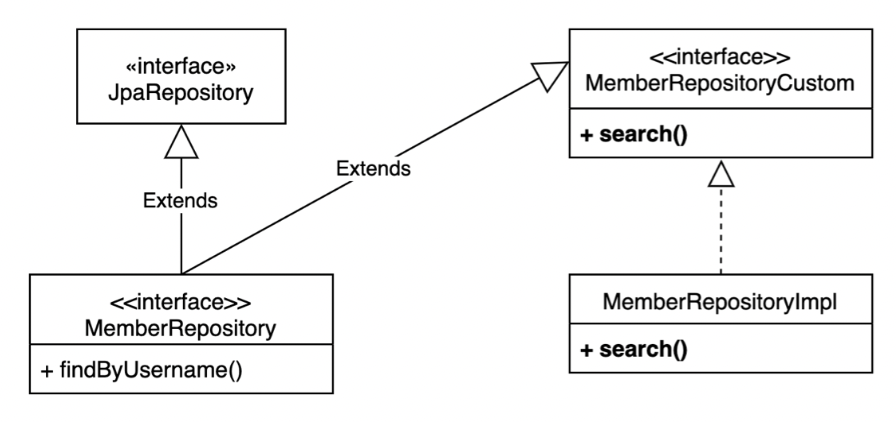

# 스프링 데이터 JPAdhk Querydsl


<br>

## 🌈 스프링 데이터 JPA 리포지토리로 변경

<br>


* 스프링 데이터 JPA 생성    
    - 인터페이스인거 주의!!

```java
package study.querydsl.repository;
import org.springframework.data.jpa.repository.JpaRepository;
import study.querydsl.entity.Member;
import java.util.List;

public interface MemberRepository extends JpaRepository<Member, Long> {
    List<Member> findByUsername(String username);
}
```

* 스프링 데이터 JPA 테스트

```java
@SpringBootTest
@Transactional
class MemberRepositoryTest {
    @Autowired
    EntityManager em;
    @Autowired
    MemberRepository memberRepository;
    
    @Test
    public void basicTest() {
        Member member = new Member("member1", 10);
        memberRepository.save(member);
        
        Member findMember = memberRepository.findById(member.getId()).get();
        assertThat(findMember).isEqualTo(member);
        
        List<Member> result1 = memberRepository.findAll();
        assertThat(result1).containsExactly(member);
        
        List<Member> result2 = memberRepository.findByUsername("member1");
        assertThat(result2).containsExactly(member);
    }
}
```


<br>
<br>
<hr>
<br>
<br>

## 🌈 사용자 정의 리포지토리

<br>

> 기존의 순수 JPA 리포지토리는 class 기반으로 생성되므로, Querydsl을 주입받아서 원하는 메서드(검색조건  등)를 만들기 수월했지만, 스프링 데이터 JPA는 인터페이스 기반으로 생성하므로, 원하는 메서드를 곧바로 만들 수가 없다. 따라서 사용자 정의 레포지토리를 따로 만들어서 주입하는 방법을 사용해야 한다.


* 사용자 정의 리포지토리 사용법 (아래 구성 사진과 함께 보기)
    - 1. 사용자 정의 인터페이스 작성. (MemberRepositoryCustom)
    - 2. 사용자 정의 인터페이스 구현. (MemberRepositoryCustomImpl)
    - 3. 스프링 데이터 리포지토리에 사용자 정의 인터페이스 상속. 
        - (MemberRepository가 JpaRepository와 MemberRepositoryCustom를 상속)

* 사용자 정의 리포지토리 구성.

    

<br>
<br>

### 🐳 사용자 정의 리포지토리 만드는 과정.

* 사용자 정의 인터페이스 작성
    - 인터페이스명은 아무거나 상관 없음.
    - 내가 커스텀해서 사용할 메서드를 정의.

```java
package study.querydsl.repository;

import study.querydsl.dto.MemberSearchCondition;
import study.querydsl.dto.MemberTeamDto;
import java.util.List;

public interface MemberRepositoryCustom {
    List<MemberTeamDto> search(MemberSearchCondition condition);
}
```


* 사용자 정의 인터페이스 구현.
    - 규칙: 위에서 만든 "사용자 정의 인터페이스명 + Impl"로 만들어함.

```java
import static org.springframework.util.StringUtils.isEmpty;
import static study.querydsl.entity.QMember.member;
import static study.querydsl.entity.QTeam.team;

public class MemberRepositoryImpl implements MemberRepositoryCustom {
    private final JPAQueryFactory queryFactory;
    
    public MemberRepositoryImpl(EntityManager em) {
        this.queryFactory = new JPAQueryFactory(em);
    } 

    @Override
    //회원명, 팀명, 나이(ageGoe, ageLoe)
    public List<MemberTeamDto> search(MemberSearchCondition condition) {
    return queryFactory
            .select(new QMemberTeamDto(
                    member.id,
                    member.username,
                    member.age,
                    team.id,
                    team.name))
            .from(member)
            .leftJoin(member.team, team)
            .where(
                    usernameEq(condition.getUsername()),
                    teamNameEq(condition.getTeamName()),
                    ageGoe(condition.getAgeGoe()),
                    ageLoe(condition.getAgeLoe()))
            .fetch();

    private BooleanExpression usernameEq(String username) {
        return isEmpty(username) ? null : member.username.eq(username);
    }
    private BooleanExpression teamNameEq(String teamName) {
        return isEmpty(teamName) ? null : team.name.eq(teamName);
    }
    private BooleanExpression ageGoe(Integer ageGoe) {
        return ageGoe == null ? null : member.age.goe(ageGoe);
    }
    private BooleanExpression ageLoe(Integer ageLoe) {
        return ageLoe == null ? null : member.age.loe(ageLoe);
    }
}

```


* 스프링 데이터 리포지토리에 사용자 정의 인터페이스 상속.
    - 인터페이스는 여러개의 인터페이스를 상속 가능.

```java
package study.querydsl.repository;
import org.springframework.data.jpa.repository.JpaRepository;
import study.querydsl.entity.Member;
import java.util.List;

public interface MemberRepository extends JpaRepository<Member, Long>,MemberRepositoryCustom {
    List<Member> findByUsername(String username);
}
```


* 커스텀 리포지토리 동작 테스트

```java
@Test
public void searchTest() {
    Team teamA = new Team("teamA");
    Team teamB = new Team("teamB");
    em.persist(teamA);
    em.persist(teamB);

    Member member1 = new Member("member1", 10, teamA);
    Member member2 = new Member("member2", 20, teamA);
    Member member3 = new Member("member3", 30, teamB);
    Member member4 = new Member("member4", 40, teamB);
    em.persist(member1);
    em.persist(member2);
    em.persist(member3);
    em.persist(member4);

    MemberSearchCondition condition = new MemberSearchCondition();
    
    condition.setAgeGoe(35);
    condition.setAgeLoe(40);
    condition.setTeamName("teamB");

    List<MemberTeamDto> result = memberRepository.search(condition);

    assertThat(result).extracting("username").containsExactly("member4");
}
```

<br>
<br>
<hr>
<br>
<br>

## 🌈 스프링 데이터 페이징 활용1 - Querydsl 페이징 연동.

<br>

* 스프링 데이터의 Page, Pageable을 활용해보자.
    - Querydsl에서 어떻게 활용할까?

* 전체 카운트를 한번에 조회하는 단순한 방법.

* 데이터 내용과 전체 카운트를 별도로 조회하는 방법.

<br>
<br>

### 🐳 사용자 정의 인터페이스에 페이징 2가지 추가.

<br>

```java
public interface MemberRepositoryCustom {
    List<MemberTeamDto> search(MemberSearchCondition condition);
    
    Page<MemberTeamDto> searchPageSimple(MemberSearchCondition condition,
    Pageable pageable);
    
    Page<MemberTeamDto> searchPageComplex(MemberSearchCondition condition,
    Pageable pageable);
}
```


### 🐳 전체 카운트를 한번에 조회하는 단순한 방법

<br>

* searchPageSimple(), fetchResults() 사용.
    - pageable.getOffset() 사용 : 몇번째 부터 시작할지
    - pageable.getPageSize() 사용 : 몇개씩 가져올지
    - fetchResults() 사용 :
        - fetch()를 사용할시, 반환타입이 List로 단순히 MemberDTO들만 조회하게 되는데.
        - fetchResults()를 사용할시, 반환타입이 QueryResults로 카운트 갯수도 조회하고, MemberDTO들도 조회하게 됨.(쿼리가 실제도 2번 나가게 됨.) | 카운트 쿼리 실행시, 필요없는 Order by는 제거함.

* 매개변수
    - condition : 검색 조건 설정.
    - pageable : 페이징 정보 설정.

```java
/**
* 단순한 페이징, fetchResults() 사용
*/

@Override
public Page<MemberTeamDto> searchPageSimple(MemberSearchCondition condition,
Pageable pageable) {
    QueryResults<MemberTeamDto> results = queryFactory
                                            .select(new QMemberTeamDto(
                                                    member.id,
                                                    member.username,
                                                    member.age,
                                                    team.id,
                                                    team.name))
                                            .from(member)
                                            .leftJoin(member.team, team)
                                            .where(
                                                usernameEq(condition.getUsername()),teamNameEq(condition.getTeamName()),
                                                ageGoe(condition.getAgeGoe()),
                                                ageLoe(condition.getAgeLoe()))
                                            .offset(pageable.getOffset())  //👈 몇번째 부터 시작?
                                            .limit(pageable.getPageSize())  //👈 몇개씩?
                                            .fetchResults();
    
    List<MemberTeamDto> content = results.getResults();     // getResults() : 실제 데이터를 뽑아내기
    long total = results.getTotal();                    // getTotal() : 데이터의 갯수 뽑아내기
    return new PageImpl<>(content, pageable, total);
    // 스프링데이터의 Page 구현체를 반환.
```

* test 코드 
    - pageable <= pageRequest로 페이징할 설정정보를 생성뒤 사용.
    - condition <= 이전에 만들어 놓은 MemberSearchCondition (검색 조건 설정정보는 class로 만듬)을 사용.

```java
@Test
public void searchTest() {
    Team teamA = new Team("teamA");
    Team teamB = new Team("teamB");
    em.persist(teamA);
    em.persist(teamB);

    Member member1 = new Member("member1", 10, teamA);
    Member member2 = new Member("member2", 20, teamA);
    Member member3 = new Member("member3", 30, teamB);
    Member member4 = new Member("member4", 40, teamB);

    em.persist(member1);
    em.persist(member2);
    em.persist(member3);
    em.persist(member4);

    MemberSearchCondition condition = new MemberSearchCondition();
    PageRequest pageRequest = PageRequest.of(0, 3);
    
    Page<MemberDto> result = memberRepository.searchPageSimple(condition, pageRequest);

    assertThat(result.getSize()).isEqualTo(3);
    assertThat(result.getContent()).extracting("username").containsExactly("member1", "member2", "member3");
}
```

* 데이터 내영과 전체 카운트를 별도로 조회하기
    - fetchCount : 카운트용 쿼리만 반환.
    - 카운트용 쿼리를 따로 만드는 이유 
        - leftjoin같은게 필요없는 경우가 있다. 그런경우에 최적화를 위해, 카운트 쿼리는 효율적으로 짜는게 좋다.


```java
**
* 복잡한 페이징
* 데이터 조회 쿼리와, 전체 카운트 쿼리를 분리 */
@Override
public Page<MemberTeamDto> searchPageComplex(MemberSearchCondition condition,
Pageable pageable) {
    List<MemberTeamDto> content = queryFactory
                                    .select(new QMemberTeamDto(
                                            member.id,
                                            member.username,
                                            member.age,
                                            team.id,
                                            team.name))
                                    .from(member)
                                    .leftJoin(member.team, team)
                                    .where(
                                        usernameEq(condition.getUsername()),
                                        teamNameEq(condition.getTeamName()),
                                        ageGoe(condition.getAgeGoe()),
                                        ageLoe(condition.getAgeLoe()))
                                    .offset(pageable.getOffset())
                                    .limit(pageable.getPageSize())
                                    .fetch();

    // 카운트용 쿼리를 따로 만듬.
    long total = queryFactory
                .select(member)
                .from(member)
                .leftJoin(member.team, team)
                .where(
                    usernameEq(condition.getUsername()),
                    teamNameEq(condition.getTeamName()),
                    ageGoe(condition.getAgeGoe()),
                    ageLoe(condition.getAgeLoe()))
                .fetchCount();

    return new PageImpl<>(content, pageable, total);
}
```


<br>
<br>


### 🐳 스프링 데이터 페이징 활용2 - CountQuery 최적화


* count 쿼리가 생략 가능한 경우 생략해서 처리
    - 페이지 시작이면서 컨텐츠 사이즈가 페이지 사이즈보다 작을때.
    - 마지막 페이지 일때 (offset + 컨텐츠 사이즈를 더해서 전체 사이즈 구함)


<br>
<br>


### 🐳 스프링 데이터 페이징 활용3 - 컨트롤러 개발

* 컨트롤러

```java
@RestController
@RequiredArgsConstructor
public class MemberController {
    
    private final MemberJpaRepository memberJpaRepository;
    private final MemberRepository memberRepository;
    
    @GetMapping("/v1/members")
    public List<MemberTeamDto> searchMemberV1(MemberSearchCondition condition){
        return memberJpaRepository.search(condition);
    }

    @GetMapping("/v2/members")
    public Page<MemberTeamDto> searchMemberV2(MemberSearchCondition condition, Pageable pageable) {
        return memberRepository.searchPageSimple(condition, pageable);
    }

    @GetMapping("/v3/members")
    public Page<MemberTeamDto> searchMemberV3(MemberSearchCondition condition, Pageable pageable) {
        return memberRepository.searchPageComplex(condition, pageable);
    }
}
```


* 요청
    - http://localhost:8080/v2/members?size=5&page=2


