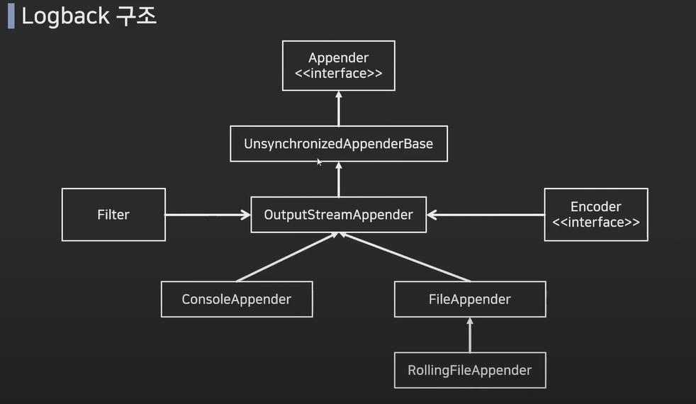
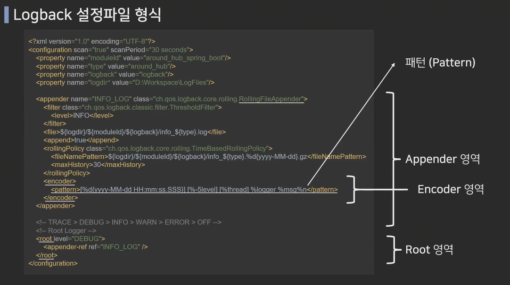

# Logback 설정


<br>
<br>


## 🌈 로그를 사용하는 이유

<br>

* System.out.print()는 IO 리소스를 많이 잡아먹어 속도가 느리기 때문에, 로그툴을 따로 사용함.

* 로그는 파일로 잘 남겨놔야 개발단계에서나 추후 운영단계에서 문제가 발생시 쉽게 발견/해결이 가능하므로, 로그툴을 따로 사용함.

<br>
<br>


## 🌈 Logback 이란?

<br>

* Log4J를 기반으로 개발된 로깅 라이브러리

* Log4J에 비해 약 10배 정도 빠른 퍼포먼스, 메모리 효율성 증대.

* 출시 순서: Log4j -> logback -> log4j2(아직 많이 사용 안함)

<br>



<br>


### 🐳 Logback의 특징

* 로그에 특정 레벨을 설정할 수 있음
    - Trace -> Debug -> Info -> Warn -> Error

* 실운영과 테스트 상황에서 각각 다른 출력 레벨을 설정하여 로그를 확인할 수 있음.

* 출력 방식에 대해 설정 가능.
    - 출력을 콘솔창/파일로 저장/ 메일로 떨굼 등 설정이 가능.

* 설정 파일을 일정 시간마다 스캔하여 애플리케이션 중단 없이 설정 변경 가능.

* 별도의 프로그램 없이 자체적으로 로그 압축을 지원.

* 로그 보관 기간 설정 가능.

<br>

### 🐳 Logback의 설정

> 일반적으로 Classpath에 있는 logback 설정 파일을 참조하게 됨.

* Java Legacy, Spring의 경우에는 logback.xml 파일을 참조.

* SpringBoot의 경우에는 Logback-spring.xml 파일을 참조.
    - application.yml 설정에 특별한 설정 없이, src/main/resources에 "Logback-spring.xml"이름으로 로그 설정 파일을 만들시 자동으로 인식. (starter-web 패키지에서 들고있음)
    - 배포되는 환경에서는 application.yml에 아래와 같은 설정을 해야 인식 가능.
        ```yml
        logging:
          config: classpath:Logback-spring.xml
        ```

<br>


<br>

## 🌈 logback-spring.xml 분석

<br>

### 🐳 configuration 태그로 시작!

* scan = "true"
    - logback 구현체가 설정한 파일을 주기적으로 확인해서 추가.

* scanPeriod = "30 seconds"
    - 30초 마다 설정 파일을 비교해보도 추가된 내용 적용.

<br>

<hr>

<br>

### 🐳 property 

> logback-spring.xml 내에서 사용할 변수 설정.

<br>

<hr>

<br>

### 🐳 appender 영역

<br>

```xml
<appender name="INFO_LOG" class="ch.qos.logback.core.rolling.RollingFileAppender">
    <filter class="ch.qos.logback.classic.filter.ThresholdFilter">
        <level>INFO<level>
    </filter>
    <file>${logdir}/${moduleId}/${logback}/info_${type}.log</file>
    <append>true</append>
    <rollingPolicy class="ch.qos.logback.core.rolling.TimeBasedRollingPolicy">
        <fileNamePattern>${logdir}/${moduleId}/${logback}/info_${type}.%d{yyyy-MM-dd}.gz
        </fileNamePattern>
        <maxHistory>30</maxHistory>
    </rollingPolicy>
    <encoder>
        <pattern>[%d{yyyy-MM-dd HH:mm:ss.SSS}][%-5level][%thread]%logger %msg%n</pattern>
    </encoder>
</appender>
```

<hr>
<br>

#### 🎯 appender 설정

> Log의 형태 및 어디에 출력할지 설정하기 위한 영역.

* ConsoleAppender : 콘솔에 로그를 출력.
* FileAppender : 파일에 로그를 저장.
* RollingFileAppender : 여러 개의 파일을 순회하며 로그를 저장.
    - 여러개 파일의 기준은 "로그의 레벨!"
* SMTPAppender: 로그를 메일로 보냄.
* DBAppender: 데이터베이스로 로그를 저장.


<br>

#### 🎯 filter

> 임계값(level)보다 낮은 레벨의 경우는 로그 출력이 거부가 되는 설정이 가능.

> 로그 출력의 범위 설정!
 
> 위의 코드와 같이 INFO로 level이 잡혀있다면, 그 아래 영역인 Trace와 Debug레벨의 로그는 출력되지 않음.


<br>

#### 🎯 file

> 어떤위치에, 어떤 파일 제목으로 저장할 것인지 지정.

<br>

#### 🎯 append

> 추가 내용이 있으면, "추가한다"는 의미.

<br>

#### 🎯 RollingPolicy

> appender의 설정이 RollingFileAppender이므로, 사용한 태그.

* fileNamePattern : 압축시킬 파일의 경로와 파일명 설정.

* maxHistory : 저장할 일수 지정(단위: 일)
    - 위와 같은 경우 30일동안 저장.

<br>

#### 🎯 encoder

> pattern 태그를 사용하여 원하는 형식으로 로그를 표현 가능.

    📚 pattern 정리

    %Logger{length}: Logger Name
    %-5level: 로그 레벨, -5는 출력의 고정폭 값.
    %msg : 로그 메세지 영역.(==%message)
    ${PID:-} : 프로세스 id
    %d : 로그 기록 시간
        - {} 출력 형식 지정
        - [%d{yyyy-MM-dd HH:mm:ss, ${logback.timezone:-Asia/Seoul}}] : 한국 시간대로 설정
    %p : 로깅 레벨
    %F : 로깅이 발생한 프로그램 파일명.
    %M : 로깅이 발생한 메소드의 이름.
    %I : 로깅이 발생한 호출지의 정보.
    %L : 로깅이 발생한 호출지의 라인 수.
    %thread : 현재 Thread명.
    %t : 로깅이 발생한 Thread명
    %c : 로깅이 발생한 카테고리
    %C : 로깅이 발생한 클래스 명.
    %m : 로그 메시지
    %n : 줄바꿈
    %% : %출력
    %r : 애플리케이션 실행 후 로깅이 발생한 시점까지의 시간.


<br>
<br>

### 🐳 root 영역

<br>

```xml
<root level="DEBUG">
    <appender-ref ref="INFO_LOG"/>
</root>
```

<br>

#### 🎯 root 설정

* 설정한 Appender를 참조하여 로그의 레벨을 설정 가능.

* root는 전역 설정이며, 지역 설정을 하기 위해서는 logger를 사용.

<br>

#### 🎯 appender-ref

> 참조할 appender를 명시.

* ref에 들어가는 "INFO_LOG"는 appender에서 명시한 name이다.

<br>
<br>
<br>

<hr>


## 🌈 로그 레벨

> TRACE > DEBUG > INFO > WARN > ERROR

* ERROR: 로직 수행 중에 오류가 발생한 경우, 시스템적으로 심각한 문제가 발생하여 작동이 불가한 경우.

* WARN : 시스템 에러의 원인이 될 수 있는 경고 레벨, 처리 가능한 사항.

* INFO : 상태변경과 같은 정보성 메시지.

* DEBUG : 애플리케이션의 디버깅을 위한 메시지 레벨.

* TRACE : DEBUG레벨보다 더 디테일한 메시지를 표현하기 위한 레벨.

<br>
<br>
<br>


## 🌈 로그 사용

* 로그에 변수값 출력.
    - 중괄호를 이용해서 쉽게 변수값을 대입할 수 있다.
    
    ```java
    int test = 10;
    log.info("info log :: test quantity is {}", test);
    ```

* 로그를 이용해 시간 측정

    - 하나의 비지니스 로직이 수행되는데 걸리는 시간 측정

        ```java
        @RestController
        @Slf4j
        public class welcome {
            @GetMapping("/welcome")
            public String check() throws InterruptedException {

                Long startTime = System.currentTimeMillis();
                Thread.sleep(1000); // 1초 일시정지
                log.info("info log :: this method used {} time", System.currentTimeMillis() - startTime);

                return "welcome to user server";
            }
        }
        ```


## 🌈 로그 글씨색 적용

* 예시 코드

    ```xml
    <Pattern>
        %highlight([%-5level]) %cyan([%d{yyyy-MM-dd HH:mm:ss, ${logback.timezone:-Asia/Seoul}}]) %magenta([%thread]) : %green(%logger{2}) - %msg%n
    </Pattern>
    ```


<br>
<br>
<br>
<br>
<br>
<br>

<hr>

🚀 참고 자료 🚀

["어라운드 허브" 유투브 강의](https://www.youtube.com/watch?v=fkwb8coxBJM&t=11s)


