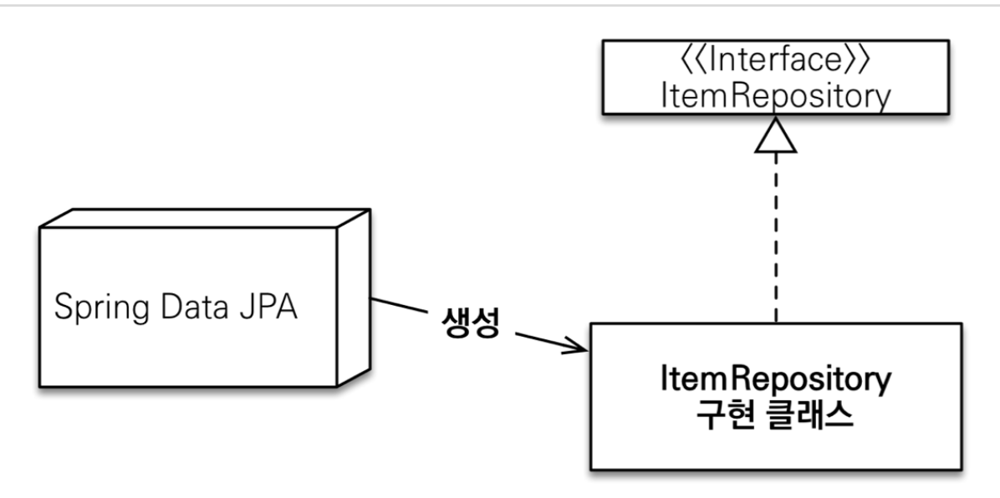

# JPA 레포지토리

<br>
<br>
<br>


## 🌈 Repository 개념

* Spring Data Repository

* DB에 접근하는 모든 코드를 작성하는 장소.
    - EntityManager를 주입받아 직접 트랜잭션을 관리하고, 엔티티 기반으로 짜여진 DB테이블에 직접적으로 관여하는 로직을 짜는 곳.

* Service단은 비지니스 로직을 모아 놓는 곳이고, DB에 관련된 모든 코드는 레포지토리로 위임한다.

* 로직이 명확히 분리되어 있으므로, 에러를 잡기 용이
    - Service : 비지니스 로직의 에러.
    - Repostiroy : DB 관련 로직의 에러.


<br>
<br>
<br>

## 🌈  Spring Data JPA

* 개념 : JPA에서 Repository를 제작할 때마다, 반복적으로 작성되는 CRUD메서드를 제공하는 인터페이스.

<br>

### 🐳  순수 JPA기반 Repository VS Spring Data JPA

<br>

* 순수 JPA기반 Repository
    - class 파일로 생성.
    - @Repository 어노테이션을 이용하여 정의한다.
    ```java
    @Repository
    public class MemberJpaRepository {}
    ```

<br>

* Spring Data JPA Repository
    - interface 기반으로 생성.
    - JpaRepository<엔티티타입, Pk타입> 을 상속하여 생성.
    - 어노테이션이 필요없다.
    ```java
    public interface MemberRepository extends JpaRepository<Member, Long> {}
    ```


<br>
<br>
<hr>
<br>
<br>

## 🌈 공통 인터페이스 설정

<br>
<br>

### 🐳 스프링 사용시.(스프링 부트 ❌)

* 1. JavaConfig로 설정하기
    ```java
    @Configuration
    @EnableJpaRepositories(basePackages = "jpabook.jpashop.repository")
    public class AppConfig {}
    ```

* 2. MainApplication에 설정하기
    ```java
    @SpringBootApplication
    @EnableJpaRepositories(basePackage = "jpabook.jpashop.repository")
    public class MainApplication{
    }
    ```

<br>
<br>

### 🐳 스프링부트 사용시

* 스프링부트는 MainApplicaion에 있는 @SpringBootApplication 위치를 기준으로 해당 패키지보다 하위 패키지에 존재한다면 모두 인식을 하므로, 따로 설정할 필요 ❌


<br>
<br>
<br>

## 🌈 공통 인터페이스 적용

<br>
<br>



<br>

* 위의 그림처럼 item 엔티티가 존재하고, 그에 해당하는 ItemRepository로 Spring Data JPA Repository를 만들어서 사용한다고 생각해보자.

    - ItemRepository 생성
    ```java
    public interface ItemRepository extends JpaRepository<Member, Long> {}
    ```
    - ItemRepository 사용
    ```java
    @Autowired ItemRepository itemRepository;
    // 주입 받아서 사용.
    ```

<br>

* 우리는 ItemRepository 인터페이스를 구현하지 않았는데 어떻게 사용할 수 있을까??

    > 위의 그림에서와 같이 우린 ItemRepository 인터페이스를 상속만 받으면, Spring Data JPA가 application로딩시점에 JpaRepository를 상속받은 인터페이스를 확인하고, ItemRepository구현체를 생성해준다. 그리고 사용시에, Autowired 된 곳에 ItemRepository구현체를 주입해준다.

    > JpaRepository에 적은 <엔티티 명, Pk타입>을 기반으로 엔티티를 정의해서 기본적인 CRUD를 만들게 된다.

<br>

* 실제로 주입받은 itemRepository 출력해보기

    > class com.sun.proxy.$ProxyXXX <br>

    > Spring Data Jpa가 자바의 기본적인 프록시 기술로 가짜 클래스 구현체를 만든 후, 주입을 해주었기 때문에 주입받은 itemRepository는 프록시로 출력된다.


<br>
<br>
<hr>
<br>
<br>


## 🌈 공통 인터페이스 분석

<br>
<br>


* 스프링 데이터
    - spring-data-commons 라이브러리에 속함.
    - jpa가 아닌 mongoDB나 레디스 등 다른 DB에서 모두 사용되는 라이브러리.

<br>

* 스프링 데이터 JPA
    - spring-data-jpa 라이브러리에 속함.
    - jpa에 특화된 기능들만 제공하는 라이브러리.

<br>

* 주요 메서드 (T : 엔티티 / ID : 엔티티의 식별자 타입 / S : 엔티티와 그 자식 타입)
    - save(S) : 새로운 엔티티는 저장. 이미 있는 엔티티는 병합(merge).
    - delete(T) : 엔티티 하나를 삭제. 내부에서 EntitiyManager.remove() 호출.
    - findById(ID) : 엔티티 하나를 조회. 내부에서 EntitiyManager.find() 호출.
    - getOne(ID) : 엔티티를 프록시로 조회. 내부에서 EntitiyManager.getReference() 호출.
    - findAll(...) : 모든 엔티티를 조회. 정렬(sort)이나 페이징(Pagable) 조건을 파라미터로 제공.
    - Optional<T> findById(ID) : ID로 조회
    - boolean existsById(ID) : 존재 여부


