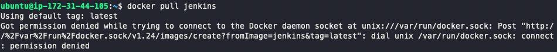

# aws에서 docker 사용시 권한 문제.


<br>

## 🧨 문제

* aws EC2에서 docker 을 설치하고, docker 명령어를 실행하는데 모든 명령어에 권한 문제가 발생했다. (sudo를 붙히면 가능하긴 했다.)

* 명령어마다 sudo를 붙히는 귀찮음 좀 해결해보자.




> 해당 문제는 현재 사용자인 ubuntu가 /var/run/docker.sock 파일에 접근이 불가해서 발생한 문제이다.


<br>
<br>
<br>

## 💡 해결

```zsh
sudo chmod 666 /var/run/docker.sock
```

> 현재 사용자가 /var/run/docker.sock에 접근할 수 있도록 설정.