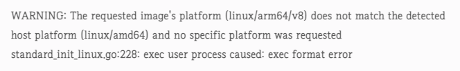

# m1과 ec2 ubuntu 호환성 문제.

<br>
<br>
<br>
<br>

## 🧨 문제

> m1 노트북으로 만든 spingboot image를 docker hub으로 올리고, ec2 ubuntu로 들어가서 해당 image를 pull 했더니 다음과 같은 오류가 떳다.




> 구글링 해본 결과 m1과 ec2 ubuntu 간의 호환성 문제로 보는 사람들이 많았다... 아직 잘 이해는 안되서 더 공부가 필요할듯..


<br>
<br>
<br>


## 💡 해결

* 애초에 스프링 부트에서 이미지를 빌드 할떄, 옵션으로 "--platform linux/amd64"을 추가 했더니 해결되었다.
    - 이런식으로 빌드한 image는 m1에서는 다시 안돌아가고 ec2 ubuntu에서만 돌아간다.

```zsh
docker build --platform linux/amd64 -t heesootory/springboot_test .
```


