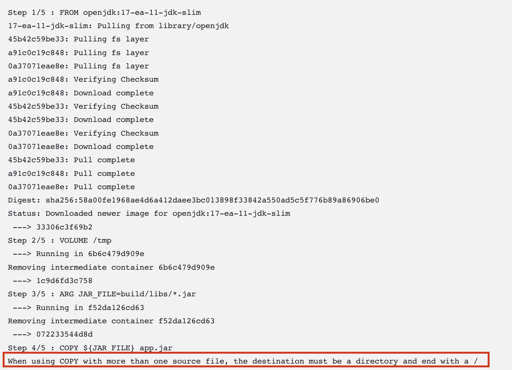
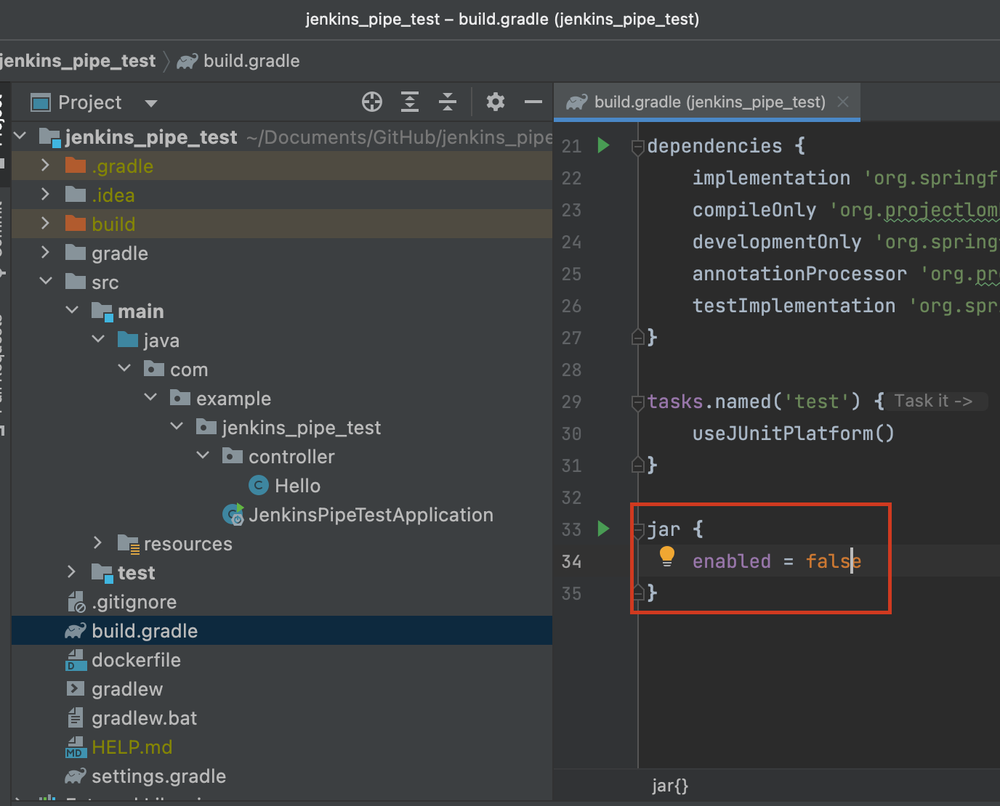

# Jenkins 내에서 docker Image 생성시 문제.(springboot)


<br>
<br>

## 🧨 문제

> springboot 를 gradle 빌드시, jar파일이 두개 만들어져서 CI/CD 프로세스에서 jenkins가 어떤 jar파일을 Image로 만들지 몰라서 생기는 문제가 발생.




<br>

## 💡 해결

> build.gradle 에서 설정을 통해 jar 파일을 하나만 생성되도록 설정하면 해결!

```gradle
jar{
    enabled = false
}
```





## 💡 jar 파일은 왜 두개가 생성될까?


