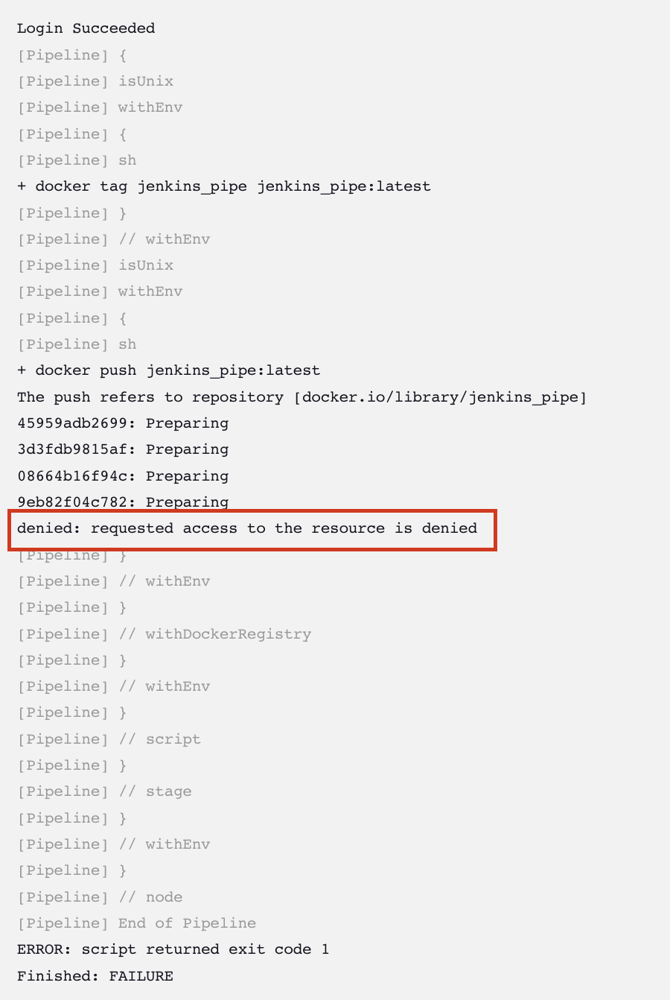

# Jenkins 내에서 docker Image 빌드 후, docker hub에 push 할때 생기는 권한 문제.

 

## 🧨 문제

> jar 파일 빌드 후, dockerfile에 의해 생성된 docker Image를 docker hub에 push 하는 과정에서, 권한 문제가 발생했다.

## 💡 문제 원인

* docker에 로그인 되어있지 않을 경우.

* credential 을 잘못 설정.

* dockerImage 파일의 이름을 잘못 설정.
    -> 내문제!!

 
 

## 💡 해결

> 난 계속 credentials 문제로 생각하고, key를 다시 생성했는데... 문제는 그 부분이 아니라 docker Image의 이름이 문제였다!!! 

> docker Image 의 이름은 기본적으로, "[내계정ID]/[설정할Image이름]:[tag명]"으로 지어야한다.(tag명은 필수는 아니고, 앞의 두 명은 필수!)

