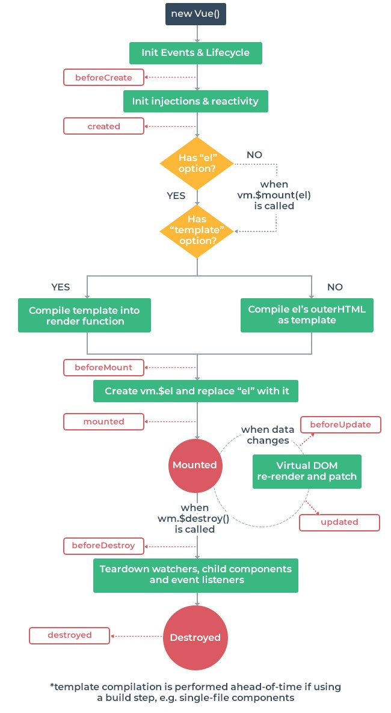

# Vue Life Cycle

<br>
<hr>
<br>

## 🌈 Instance Life Cycle Hooks



<br>

- 각 Vue 인스턴스는 생성될 때 일련의 초기화 단계를 걸친다.

  - 데이터 관찰 설정이 필요한 경우.
  - 템플릿을 컴파일하는 경우.
  - 인스턴스를 DOM에 마운트 하는 경우.
  - 데이터가 변경되어 DOM을 업데이트 하는 겨우 등.

- 그 과정에서 사용자 정의 로직을 실행할 수 있는 Life Cycle Hooks도 호출.

- 크게 4개의 파트(생성, 부탁, 갱신, 소멸)로 나뉜다.

- 모든 Life Cycle Hooks은 자동으로 this컨텍스트를 인스턴스에 바인딩하므로 데이터, 계산된 속성(computed) 및 메소드에 접근 가능.(화살표 함수를 사용해 라이프 사이클 메소드를 정의하면 X)

| life cycle hooks | 설명                                                                                                                                                                  |
| ---------------- | --------------------------------------------------------------------------------------------------------------------------------------------------------------------- |
| beforeCreate     | 인스턴스가 방금 초기화 된 후 데이터 관찰 및 이벤트/ 감시자 설정 전에 동기적으로 호출                                                                                  |
| created          | 인스턴스가 작성된 후 동기적으로 호출. <br> 데이터 처리, 계산된 속성, 메서드, 감시 / 이벤트 콜백 등과 같은 옵션 처리 완료. 마운트가 시작되지 않았으므로, DOM요소 접근X |
| beforeMount      | 마운트가 시작되기 전에 호출                                                                                                                                           |
| mounted          | 지정된 엘리먼트에 Vue 인스턴스 데이터가 마운트 된 후에 호출                                                                                                           |
| beforeUpdated    | 데이터 변경될 때 virtual DOM이 렌더링, 패치 되기 전에 호출 (가상 DOM을 생성하여 일단 청사진으로 만들어 놈.)                                                           |
| updated          | Vue에서 관리되는 데이터가 변경되어 DOM이 업데이트 된 상태 (가상 DOM에서 만들어진 청사진으로 업데이트)                                                                 |
| beforeDestroy    | Vue인스턴스가 제거되기 전에 호출.                                                                                                                                     |
| destroyed        | Vue 인스턴스가 제거된 후 호출.                                                                                                                                        |

```js
<body>
    <div id="app">
      <div>{{count}}</div>
      <button @click="count++">증가</button>
    </div>

    <!-- 인스턴스의 유효범위가 아님.!!!! -->
    <div>
      <div>{{count}}</div>
    </div>

    <script>
      const app = new Vue({
        el: '#app',
        data() {
          return {
            count: 0,
          };
        },
        beforeCreate() {
          console.log('beforeCreate count : ' + this.count);
        },
        created() {
          console.log('created count : ' + this.count);
          console.log('created에 연결된 DOM : ' + this.$el);
        },
        beforeMount() {
          console.log('beforeMount count : ' + this.count);
          console.log('beforeMount에 연결된 DOM : ' + this.$el);
        },
        mounted() {
          console.log('mounted count : ' + this.count);
          console.log('mounted에 연결된 DOM : ' + this.$el);
        },
        beforeUpdate() {
          console.log('beforUpdate 호출');
        },
        updated() {
          console.log('updated 호출');
          console.log('updated count : ' + this.count);
        },
        // 파괴는 따로 하지는 않겠다.
      });
    </script>
  </body>
```
