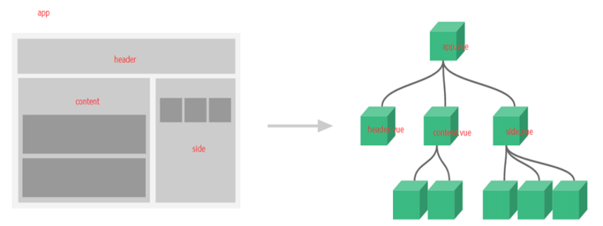

# Vue Component

## 🌈 Vue Component

- Vue의 가장 강력한 기능 중 하나.

- 기본 HTML 엘리먼트를 확장하여 재사용 가능한 코드를 캡슐화 하는데 도움이 됨.

- Vue Component는 Vue Instance 이기도함.
  (루트에서만 사용하는 옵션을 제외하고 모든 옵션 객체 사용가능)

- Life Cycle Hook 사용가능

- 전역 컴포넌트와 지역 컴포넌트 사용.
  - el 은 root component에서 사용한다 -> 최종적인 component를 element에 연결하기 위한 수단이므로.



<br>
<br>
<br>

## 🌈 Vue Component(전역)

- 전역이란? Vue자체에 등록을 해놓는 개념으로, Vue객체 각각에 등록을 하지않고도 여러 Vue 객체에서 가져다 쓸 수 있도록 만드는 것.

* 전역 컴포넌트를 등록하려면 Vue.Component(tagName, options)를 사용

* 권장하는 컴포넌트 이름 : 케밥 케이스

```js
<body>
    <div id="app">
      <my-global></my-global>
      <my-global></my-global>
    </div>

    <div id="app2">
      <my-global></my-global>
    </div>

    // "전역 컴포넌트" -> 3개 출력

    <script>
      //Vue.component('tagname', {'options'}) -> 전역으로 설정
      // app과 app2, Vue 객체 모두 사용가능
      Vue.component("my-global", {
        template: "<h2>전역 컴포넌트</h2>",
      });

      const app = new Vue({
        el: "#app",
      });

      const app2 = new Vue({
        el: "#app2",
      });
    </script>
  </body>
```

<br>
<br>
<br>

## 🌈 Vue Component(지역)

- 모든 컴포넌트를 전역으로 등록할 필요 X.

- 컴포넌트를 components 인스턴스 옵션으로 등록함으로써 다른 인스턴스/컴포넌트의 범위에서만 사용할 수 있는 컴포넌트 생성 가능.

```js

```

<br>
<br>
<br>

## 🌈 Vue Component Template

- DOM을 템플릿으로 사용할 때, Vue는 템플릿 콘텐츠만 가져올 수 있기 때문에 HTML이 작동하는 방식에 고유한 몇 가지 제한 사항이 적용됨.

- 따라서 가능한 경우 항상 문자열 템플릿을 사용하는 것이 좋음.

<br>
<br>
<br>

## 🌈 Vue Component data

- data는 반드시 함수여야 한다.

- data 객체를 공유하는 문제를 막고 새로운 데이터 객체를 반환해서 해결한다.

  - data에 일반객체를 사용하면 모든 vue의 component 객체가 공유하는 값이 된다.

    ```js
    // 🚀 컴포넌트에서 객체 형태로 data를 사용하면 안됨!!🚀
    Vue.component("my-comp", {
      template: "#mycomponent",
      data: {
        msg: "hello",
      },
    });
    // 🚀 컴포넌트에서 data는 항상 함수형태로!!🚀
    Vue.component("my-comp", {
      template: "#mycomponent",
      data() {
        return {
          msg: "hello",
        };
      },
    });
    ```

* template태그 안에 모든 요소를 감싸는 루트 태그는 하나여야 한다!!

```js
// 🚀 이런식으로 작성 NO !!🚀
<template id="mycomponent">
  <div> // 루트 태그 1
    <h2>{{ msg }}</h2>
  </div>
  <div></div> // 루트 태그 2
</template>

// 🚀 루트 태그는 하나 !!🚀
<template id="mycomponent">
  <div> // 루트 태그 1
    <h2>{{ msg }}</h2>
  </div>
</template>
```
