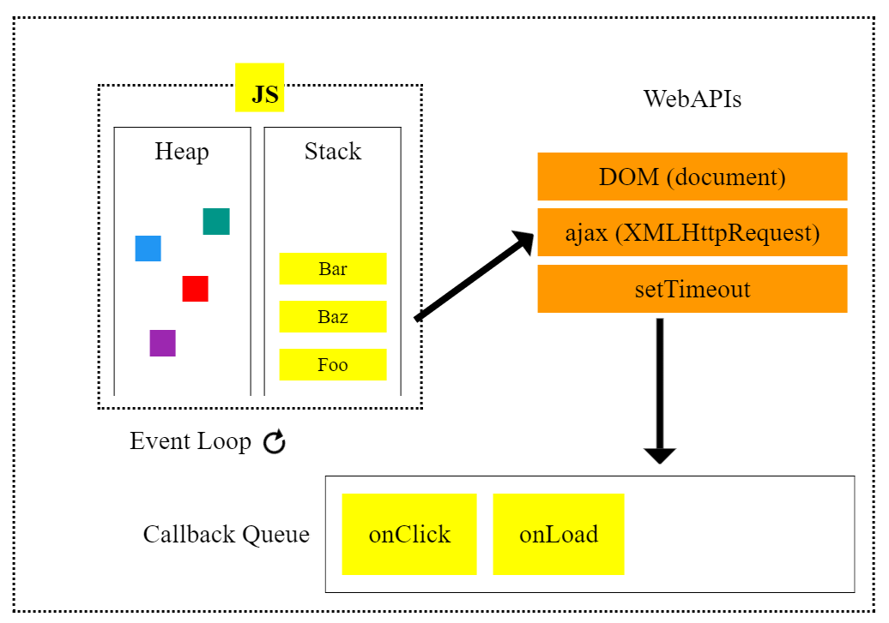

# AJAX

## 🌈 동기 비동기 정리

> 브라우저 상의 구조 관계를 기본으로 살펴보기

- Stack(system stack) : 요청들을 받아서 처리하는 영역.

* Web Api: 요청이 처리되는 동안 기다리는 영역.

* event loop: stack - wab api - task queue의 과정이 원활하게 돌아가는 걸 감시하는 역할.

* task Queue: 요청의 일정 부분이 완료되면, 나머지 부분이 다시 stack으로 들어가기 위해 대기하는 공간.

> 🚀 JavaScript는 Single thread



### 🐳 비동기 처리 과정

- 이벤트를 처리하는 Call Stack이 하나

- 즉시 처리하지 못하는 이벤트들을 (Web API)로 보내서 처리

- 처리된 이벤트들은 처리된 순서대로 (Task queue)에 저장

  - 요청의 일부분이 해결되면, 나머지 부분이 task queue에 저장.

- Call Stack이 공백이 되면 (Event Loop)가 대기 줄에서 가장 오래된 이벤트를 Call Stack으로 보냄.

- 위의 과정이 계속 반복.

### 🐳 동기 vs 비동기 코드 비교

#### 🔎 동기

```js
function doStep1(init) {
  return init + 1;
}
function doStep2(init) {
  return init + 2;
}
function doStep3(init) {
  return init + 3;
}

function doOperation() {
  let result = 0;
  result = doStep1(result);
  result = doStep1(result);
  result = doStep1(result);
  console.log(`result: ${result}`);
}
```

#### 🔎 비동기

```JS
function doStep1(init, callback) {
  const result =  init + 1;
  callback(result);
}
function doStep2(init, callback) {
  const result =  init + 2;
  callback(result);
}
function doStep3(init, callback) {
  const result =  init + 3;
  callback(result);
}

// 콜백 함수가 깊어지다 너무 깊어지면 -> 콜백 지옥
function doOperation(){
    doStep1(0, result1 => {
        doStep2(result1, result2 => {
            doStep3(result2, result3 => {
                console.log(`result : ${result3}`);
            });
        });
    });
}
```

## 🌈 AJAX(Asynchronous JavaScript and XML)

- 비 동기식 JavaScript와 XML
- 서버와 통신을 하기 위해서 XMLHttpRequset 객체를 활용
- JSON, XML, HTML 그리고 일반 텍스트 형식 등을 포함한 다양한 포맷을 주고 받을 수 있음.
- 페이지 전체를 ‘새로고침’ 하지 않고서도 수행 되는 “비동기성” (일 부분만 업데이트 가능)


### 🐳 XMLHttpRequest 객체

- JavaScript Object
- 서버와 상호작용하기 위해 사용
- 전체 페이지의 새로고침 없이도 URL로 부터 데이터를 받아 올 수 있음.
- 사용자의 작업을 방해하지 않고 페이지의 일부를 업데이트 할 수 있음.
- AJAX 프로그래밍에 주로 사용
- XML이라는 이름과는 다리 모든 종류의 데이터를 받아 오는데 사용 가능
- http 이외의 프로토콜도 지원 (file, ftp 포함)
- 대부분의 브라우저에서 지원

### 🐳 순자적인 비동기 처리하기

- Web API로 들어오는 순서는 중요하지 않고, 어떤 이벤트가 먼저 처리되느냐가 중요. (실행 순서 불명확)

#### 1. Async Callbacks

- 백그라운드에서 실행을 시작할 함수를 호출할 때 인자로 지정

- ex) addEventListener() 의 두 번째 인자

#### 2. Promise-Style

- Modern Web APIs에서의 새로운 코드 스타일

- XMLHttpRequest 객체를 사용하는 구조보다 조금 더 현대적인 버전

### 🐳 Promise Object

- 비동기 작업을 마치 동기 작업처럼 값을 반환해서 사용 형태

- 미래의 완료 또는 실패와 그 결과 값을 나타냄.

- 미래의 어떤 상황에 대한 약속

- new Promise(function (resolve, reject) { } )

- resolve (성공 시 사용)

- reject (실패 시 사용)

### 🐳 참고) async & await

- Promise 더욱 편하게 사용할 수 있는 문법

- then 체이닝을 제거하고 비동기 코드를 동기 코드처럼 표현 하는 방법

#### 🎯 async

- function 앞에 위치

- 항상 Promise 반환

#### 🎯 await

- await 키워드를 만나면 Promise가 처리될 때까지 기다린다.
