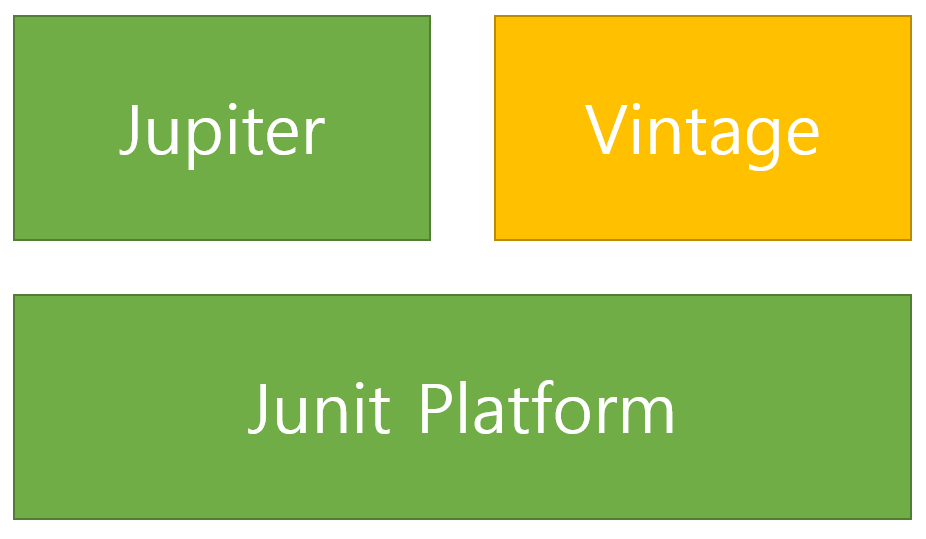

# 단위 테스트

> 인프런 백기선님의 강의 정리.

<br>
<br>
<hr>
<br>
<br>


## 🌈 Junit5 소개

<br>

* 자바 개발자가 가장 많이 사용하는 테스팅 프레임워크.

* springboot 2.2부터 기본 Junit 버젼을 5를 채택.
    - 2.2+ 버젼으로 스프링 부트 프로젝트를 만든다면, 기본으로 Junit5 의존성이 추가됨.

<br>

### 🐳 Junit 구조



* Junit Platform : 테스트를 실행해주는 런처 제공. TestEngine API 제공.

* Jupiter: TestEngine API 구현체로 Junit 5를 제공.

* Vintage : Junit 3과 4를 지원하는 TestEngine 구현체.

> 따라서, 우리가 사용하는 Junit5는 Jupiter를 사용하게 됨.

```java
import org.junit.jupiter.api.*;
```

* spring boot 프로젝트를 사용하지 않는다면?

```yml
<dependency>
    <groupId>org.junit.jupiter</groupId>
    <artifactId>junit-jupiter-engine</artifactId>
    <version>5.5.2</version>
    <scope>test</scope>
</dependency>
```


<br>
<br>
<hr>
<br>
<br>


## 🌈 Junit5 시작하기

<br>

### 🐳 Junit5 기본 어노테이션

* @Test

* @BeforeAll / @AfterAll
    - 해당 전체 test의 이전과 이후에 오는 부분.

* @BeforeEach / @AfterEach
    - 단위 test마다 이전과 이후에 오는 부분.

* @Disables
    - 해당 단위 test를 실행시키고 싶지 않을때.
    - @Test 아래에 추가.

<br>
<br>

### 🐳 Junit5 테스트 이름 표시하기.

* @DisplayNameGeneration
    - Method와 Class 레퍼런스에서 모두 사용가능한 테스트 이름을 표기하는 방법 설정.
    - 
    - 기본 구현체로 ReplaceUnderscores 제공.
        - test는 기본적으로 함수명으로 표기되는데, 함수명 자체를 스네이크 케이스로 적었을 경우, 언더바가 모두 띄워쓰기로 바뀌게 되서 가독성이 올라감.
        ```java
        @DisplayNameGeneration(DisplayNameGenerator.ReplaceUnderscores.class)
        class StudyTest{

        }
        ```

* DisplayName
    - Method 레퍼런스에서 사용하는 표기법.
    - 어떤 테스트인지 테스트 이름을 보다 쉽게 표현할 수 있는 방법을 제공하는 애노테이션.
    - @DisplayNameGeneration보다 우선순위가 높음.


## 🌈 Junit5 소개


<br>