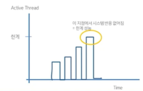
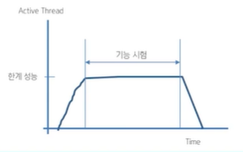

# 부하테스트 도구를 이용한 웹 페이지 성능 측정.

 
 
 

## 부하테스트란?

> 부하테스트란 특수한 상황(수강신청 등)에서 정상적으로 시스템이 동작하는지 보증하기 위한 테스트이며, 구체적인 목적은 다음과 같음.

* 목표 부하 도달 여부 확인

* 한계 부하 측정

* 부하 중에서 기능 수행 정상 여부 체크

 
 

## 부하테스트에서 사용하는 주요 용어

* 트랜잭션 
    - 한 번 처리해야하는 논리적 단위 (DB에 다녀오는 한번의 수행으로 봐둬 무방)

* TPS
    - 초당 발생하는 트랜잭션 수.
    - 모든 부하테스트 도구들의 기본 단위.

* 응답 시간

> 가장 많이 보는 부분이 "TPS"와 "응답시간"

 
 

## 부하 테스트 종류

 

### 부하테스트(Load Test)

* 목표 부하 도달 여부 확인이 목적

* 목표 부하에 도달하고 기능이 문제없이 작동하면 테스트 종료

 
 

### 스파이크 테스트(spike text)

 

* 부하가 일시에 몰릴 때 견디는지 체크
    - 예시) 수강신청 기간

* 시스템의 한계 부하 체크

 
 

### 신뢰성 테스트

 

* 시스템의 신뢰성을 측정하기 위함.

* 부하가 걸린 상황에서 주요 기능이 원활히 수행되는지 체크

 
 

## 부하테스트 절차

 

* 테스트 목적 확인
    - 한계 부하 측정?
    - 목표 부하 하에서 동작 확인?

* 테스트 대상 결정
    - 테스트 대상 페이지 선정
    - 테스트 시나리오 선정

* 테스트 환경 구축
    - 테스트 서버 준비
    - 테스트 서버에 대상 설치

* 테스트 수행
    - 테스트 결과 정리
    - 테스트 결과 분석

 
 

